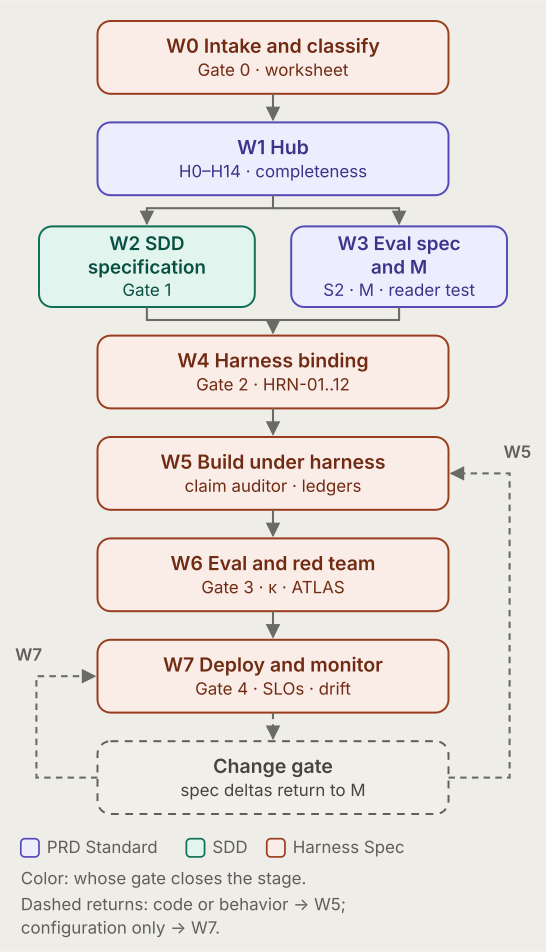
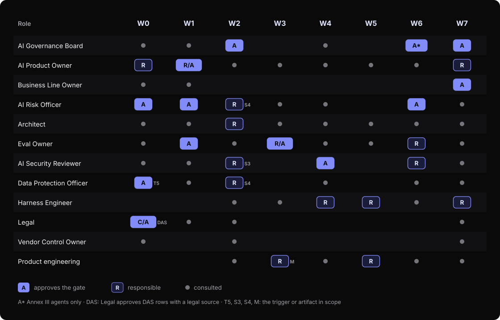
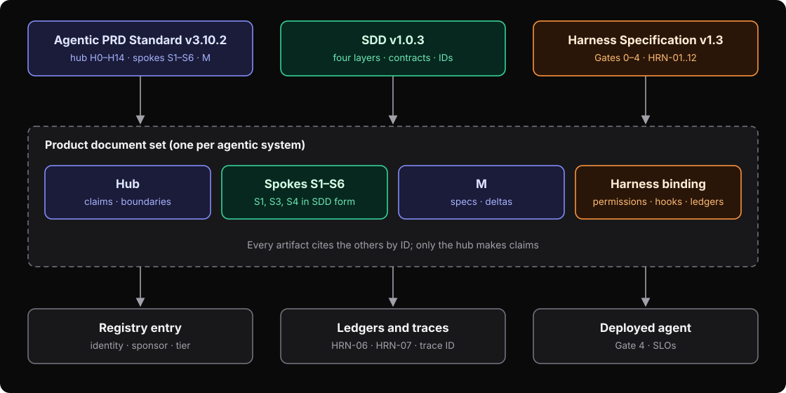
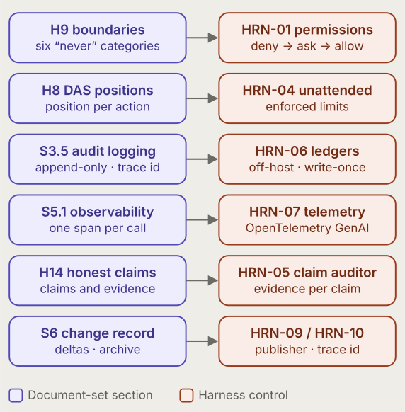
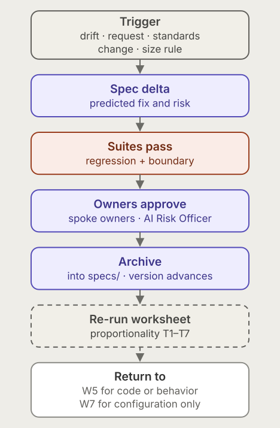
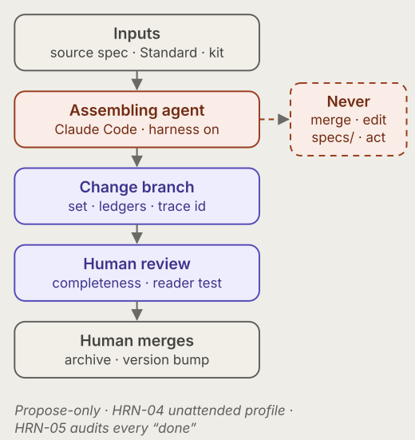

# Agentic Delivery Workflow

<p class="paper-dek">An eight-stage, gate-closed path from request to monitored production for enterprise agentic AI</p>

<p class="paper-meta"><strong>Version 1.10</strong> · October 2026 · David Reed, PhD</p>

<nav class="series-nav" aria-label="Series"><p><strong>Agentic AI Governance in Practice</strong> — Part&nbsp;7&nbsp;of&nbsp;7</p><ol><li><a href="/papers/crisp-ag/">CRISP-AG</a></li><li><a href="/papers/agentic-prd-standard/">Agentic PRD Standard</a></li><li><a href="/papers/specification-driven-design/">Specification-Driven Design</a></li><li><a href="/papers/agentic-harness-specification/">Harness Specification</a></li><li><a href="/papers/agentic-security-specification/">Security Specification</a></li><li><a href="/papers/vendor-control-specification/">Vendor Control Specification</a></li><li><span class="current" aria-current="page">Agentic Delivery Workflow</span></li></ol></nav>

## Abstract

Enterprise agentic AI is governed today by documents that each own one part of the problem. A governance framework defines autonomy positions and impact artifacts; a requirements standard defines what a product's document set must contain; a design method defines how a specification becomes enforceable; a harness specification defines runtime controls and lifecycle gates. Each is coherent on its own. Read together, they present three gate numberings, two role vocabularies, and no executable path from a request to a monitored production system.

This paper presents the Agentic Delivery Workflow: an eight-stage spine, W0 to W7, that binds those documents without restating them. Every stage has typed inputs and outputs, an exit checklist in which each item names its evidence, a responsible role, an approver, and a return path when its gate fails. The workflow unifies eleven roles in one RACI, compiles sections of the product requirements document into harness controls, fixes the point at which a claim moves from *specified* to *demonstrated*, and records twenty-one conflicts between its source frameworks together with the resolution and the owning document. It is generated from a machine-readable definition so that an agent can execute it. The worked example is an assembling agent that drafts document sets for other agents while living inside the same boundaries it writes.

**Keywords:** agentic AI; AI governance; delivery workflow; lifecycle gates; RACI; harness engineering; EU AI Act; NIST AI RMF; OWASP Agentic Top 10

## Key contributions

- **One spine, eight stages.** W0 to W7 replace three incompatible gate numberings; each stage records the named gate it closes, so nothing in the source frameworks is lost.
- **Exit criteria as evidence, not opinion.** Every exit check names the artifact or run identifier that proves it; a failed gate without a logged exception is a stop, not a warning.
- **One RACI for eleven roles.** The roles of the requirements standard and the harness specification are reconciled, with Legal and a Vendor Control Owner added where the governance framework requires them.
- **PRD-to-control compilation.** Sections of the product's document set compile into harness controls by explicit rules, so a boundary written in the requirements becomes a deny rule in the runtime.
- **A precedence rule and a conflicts register.** When the sources disagree, the non-owning document is edited to cite the owner; twenty-one resolved conflicts are recorded with their reasons.
- **Agent-executable by construction.** The stage table and stage specifications are generated from a YAML definition; the assembling agent that executes the workflow is itself governed by it.

<!-- toc -->
## Contents

- [1. Introduction](#1-introduction)
- [2. Background: the documents this workflow binds](#2-background-the-documents-this-workflow-binds)
- [3. The spine — eight stages](#3-the-spine--eight-stages)
- [4. Roles — one RACI, eleven roles](#4-roles--one-raci-eleven-roles)
- [5. Artifact flow — three frameworks, one document set](#5-artifact-flow--three-frameworks-one-document-set)
- [6. Stage specifications](#6-stage-specifications)
  - [W0 — Intake and classify](#w0--intake-and-classify)
  - [W1 — Hub](#w1--hub)
  - [W2 — SDD specification](#w2--sdd-specification)
  - [W3 — Evaluation specification and machine-readable spec](#w3--evaluation-specification-and-machine-readable-spec)
  - [W4 — Harness binding](#w4--harness-binding)
  - [W5 — Build under harness](#w5--build-under-harness)
  - [W6 — Evaluation and red team](#w6--evaluation-and-red-team)
  - [W7 — Deploy and monitor](#w7--deploy-and-monitor)
- [7. Harness binding — the PRD compiles into controls](#7-harness-binding--the-prd-compiles-into-controls)
- [8. The change gate](#8-the-change-gate)
- [9. Worked example: the assembling agent](#9-worked-example-the-assembling-agent)
- [10. Evidence and claims](#10-evidence-and-claims)
- [11. Conflicts resolved](#11-conflicts-resolved)
- [12. Discussion and limitations](#12-discussion-and-limitations)
- [13. Conclusion](#13-conclusion)
- [Acknowledgements](#acknowledgements)
- [How to cite](#how-to-cite)
- [References](#references)
- [Appendix A — Unified RACI](#appendix-a--unified-raci)
- [Appendix B — Stack columns for HRN-01 to HRN-12](#appendix-b--stack-columns-for-hrn-01-to-hrn-12)
- [Appendix C — Illustrative skeleton hub for the assembling agent](#appendix-c--illustrative-skeleton-hub-for-the-assembling-agent)
- [Appendix D — CRISP-AG phases mapped to workflow stages](#appendix-d--crisp-ag-phases-mapped-to-workflow-stages)
- [Appendix E — Glossary](#appendix-e--glossary)
- [Appendix F — Excerpt from the machine-readable definition](#appendix-f--excerpt-from-the-machine-readable-definition)
<!-- /toc -->

## 1. Introduction

### 1.1 The problem

An organization that wants to build agentic systems responsibly can now draw on mature, publicly documented frameworks: risk management functions from NIST [8], a management-system standard and an impact-assessment standard from ISO/IEC [9], the EU AI Act's tiered obligations [10], and threat catalogs from OWASP and MITRE [11]–[13]. The companion papers in this series translate those frameworks into four working instruments — a governance framework (CRISP-AG [1]), a requirements standard [2], a design method [3] and a harness specification [4] — with security and vendor-control specifications beside them [5], [6].

What none of those instruments supplies is the *sequence*: who does what, in which order, against which gate, consuming which evidence, and where the work goes when a gate fails. Without that sequence each document is followed in isolation, gates are interpreted differently by each team, and the hand-offs between them belong to no one.

### 1.2 What this workflow is

The Agentic Delivery Workflow is the sequence by which an organization takes an agentic system from a request to monitored production, with the artifacts each stage produces, the gate each stage closes, who approves, and what evidence the gate consumes. It binds the series' documents into one executable pipeline and adds nothing they already say:

- the **Agentic PRD Standard** [2] — what the document set is, what each artifact contains, the proportionality rule, the completeness and reader tests, and the change gate;
- **Specification-Driven Design for Agentic Systems** [3] — the specification form the spokes are written in (intent, behavioral contracts, protocol invariants, governance, traceability), its principles, and the distinction between mechanisms that *enforce* and text that only *guides*;
- the **Enterprise Agentic AI Harness Specification** [4] — the twelve mandatory controls HRN-01 to HRN-12, lifecycle Gates 0 to 4, the governance roles, the metrics and SLOs, and the cross-framework map;
- **CRISP-AG** [1] — the governance concepts and artifacts the set carries: DAS positions, agent class, lifecycle phases, impact assessment, the Workflow & Workforce Impact Record, the agent identity record, the capability frontier, standing governance invariants, and the consequential-decision flag.

It is written so that an agent can execute it: every stage has typed inputs and outputs, a checklist with an evidence ID per item, and a return path when a gate fails.

### 1.3 Scope

The workflow covers every agentic system within the Harness Specification's scope — internal productivity agents, client-facing agents, and agents that participate in decisions — from stage W0 (intake) through W7 (deploy and monitor), and the change-gate loop that follows. The product requirements document occupies stages W0 to W3 of eight. The workflow does not stop where the PRD does, because the hub's claims only become demonstrated at W6.

### 1.4 How to read this paper

Section 2 places the workflow among the series' documents and states the precedence rule. Sections 3 to 5 present the spine, the roles and the artifact flow. Section 6 specifies each stage in full, with a worked example at every gate. Sections 7 to 10 cover harness binding, the change gate, the assembling agent and the evidence model. Section 11 is the conflicts register. Section 12 discusses limitations; the appendices carry the full RACI, the stack mappings, an illustrative hub, the lifecycle map, a glossary, and an excerpt of the machine-readable definition.

## 2. Background: the documents this workflow binds

### 2.1 The series at a glance

| Part | Paper | Code | What it owns |
|---|---|---|---|
| 1 | CRISP-AG v3.0 [1] | CRISP-AG | Governance concepts and artifacts — DAS positions, agent class, lifecycle phases, impact assessment, workforce impact, agent identity record, capability frontier |
| 2 | Agentic PRD Standard v3.10.2 [2] | STD | Content and structure of each product's document set — hub H0–H14, spokes S1–S6, machine-readable spec M, proportionality |
| 3 | Specification-Driven Design v1.0.3 [3] | SDD | Specification form — contracts, invariants, enforce versus guide, change-gate checks |
| 4 | Enterprise Agentic AI Harness Specification v1.3 [4] | HS | Runtime controls HRN-01 to HRN-12 and lifecycle Gates 0–4 |
| 5 | Agentic Security Specification v1.0 [5] | SEC | Runtime and record security controls SEC-01 to SEC-23, the Managed Runner Baseline, the isolation boundary |
| 6 | Vendor Control Specification v1.0 [6] | VCS | Terms of vendor use — the Approved AI Service Register, the Vendor Service Profile, spend-governor content |
| 7 | Agentic Delivery Workflow v1.10 (this paper) | WF | The stage sequence that binds them, W0–W7 |

### 2.2 Precedence

When the sources differ, ownership decides:

- **CRISP-AG** governs the definition of governance concepts and artifacts — autonomy positions, agent class, lifecycle phases, impact assessment, workforce impact, the agent identity record, the capability frontier, standing governance invariants, and the consequential-decision flag;
- the **Standard** governs the content and structure of the document set;
- **SDD** governs specification form;
- the **Harness Specification** governs controls and runtime;
- the **Vendor Control Specification** governs the terms of vendor use, and the **Security Specification** governs runtime and record security controls;
- **this workflow** binds them.

A conflict is resolved by editing the non-owning document to cite the owner, never by redefining the concept locally. Every conflict the workflow resolves is recorded in §11 with the resolution, the owning document, and the reason; the workflow never overrides a source silently.

### 2.3 Exceptions

The Harness Specification's exception model applies at every gate: a written exception, AI Governance Board (AIGB) approval, an expiry date, an owner, a compensating control, and a log entry. A failed gate without an exception is a stop, not a warning.

## 3. The spine — eight stages

Figure 1 shows the eight stages and the order in which they run; the table below summarizes what each one closes, produces and needs, and §6 specifies each in full.



*Figure 1 — Eight stages, colored by which framework's gate closes each. The Standard and SDD own the front half: what the system is, what it must never do, how it is specified. The Harness Specification owns the back half: how it is built, proven and run. Harness Gate 1 rides inside W2 because the Orchestration section it requires is S1.1 of the design record.*

| Stage | Closes | Primary outputs | Responsible | Approves | Returns to |
|---|---|---|---|---|---|
| **W0 Intake and classify** | Harness Gate 0 (intent and risk classification); Standard proportionality worksheet | Intended-use statement (H3); EU AI Act tier determination; NIST GAI risk applicability review; full list in §6 | AI Product Owner | AI Risk Officer; Data Protection Officer (when T5 or personal data); Legal (PROHIBITED and HUMAN-ONLY DAS rows with a legal source) | — (entry stage) |
| **W1 Hub** | Standard completeness test (§8.1) | Hub H0–H14 complete and tagged | AI Product Owner | AI Product Owner; Eval Owner; AI Risk Officer | W0 |
| **W2 SDD specification** | Harness Gate 1 (architecture review); SDD chapter gates (contracts, protocol invariants, governance, traceability) | S1 design record including the Orchestration section; S3 identity, access and security; S4 risk, jurisdiction and compliance; full list in §6 | Architect (S1); AI Security Reviewer (S3); Data Protection Officer and AI Risk Officer (S4) | AI Governance Board (Gate 1); Vendor Control Owner (consulted — VSP currency and model tier); Finance (consulted — budget) | W1 |
| **W3 Evaluation specification and machine-readable spec** | Standard reader test (§8.2); M generation | S2 evaluation specification; M (specs/, AGENTS.md, traceability.csv, changes/); reader-test record | Eval Owner (S2); product engineering (M) | Eval Owner; AI Product Owner (accepts the reader test) | W1 or W2 |
| **W4 Harness binding** | Harness Gate 2 (harness implementation review) | Harness binding package — HRN-01 permission rules; HRN-02 preflight; HRN-03 pre-tool guards; full list in §6 | Harness Engineer | AI Security Reviewer (Gate 2) | W1 (H8, H9) |
| **W5 Build under harness** | None — the HRN-05 claim auditor gates every turn | Code; tests; evidence ledgers; full list in §6 | Product engineering | None — evidence is the gate | W3 |
| **W6 Evaluation and red team** | Harness Gate 3 (evaluation and red team); H14 claims move from specified to demonstrated | Evaluation results on holdout; adversarial and red-team findings in the ledger; judge κ record; full list in §6 | Eval Owner; AI Security Reviewer (red team) | AI Risk Officer (Gate 3); AI Governance Board additionally for Annex III agents | W5 |
| **W7 Deploy and monitor** | Harness Gate 4 (deployment and continuous monitoring) | Canary rollout; runbook and on-call live; §5 metrics live; full list in §6 | Harness Engineer (deployment); AI Product Owner (business outcome) | AI Governance Board (Gate 4); Business Line Owner (accepts the business outcome) | Change gate on drift, standards change or request |

**Parallelism.** After the hub is approved at W1, W2 and W3 may run in parallel; W4 requires both. Everything else is sequential.

**Named gates preserved.** Harness Gate 0 = W0; Gate 1 = W2; Gate 2 = W4; Gate 3 = W6; Gate 4 = W7. The Standard's completeness test = W1; its reader test = W3; its change gate = the loop in §8. SDD's chapter gates — contracts, protocol invariants, governance, traceability — close inside W2.

## 4. Roles — one RACI, eleven roles

The Harness Specification names seven roles; the Standard names seven role types. Five coincide; two exist only in the Standard (Architect, Eval Owner); one exists only in the Harness Specification — the Business Line Owner, the line's outcome owner, not to be confused with the **Business-line Technology Lead**, the line's technology leader, who may hold the Eval Owner role. The workflow uses one vocabulary of eleven roles: those nine, plus **Legal** (required by CRISP-AG §5.1.1, which sets a Legal review level on every DAS classification) and the **Vendor Control Owner** (required by the Vendor Control Specification §6, which owns the vendor registers, the Vendor Service Profiles and the budgets). The mapping is recorded so that either source document can still be read.

| Role | Harness Specification | Standard role type | Owns in this workflow |
|---|---|---|---|
| AI Governance Board (AIGB) | AI Governance Board | Model Risk / AI Governance | Gates 1 and 4; ratifies this workflow; exceptions |
| AI Product Owner | AI Product Owner | Product owner | The hub; the intended-use statement; W0, W1 and W7 outcomes |
| Business Line Owner | Business Line Owner | — (not previously named) | Accepts the business outcome at W7 |
| AI Risk Officer | AI Risk Officer | Model Risk / AI Governance | Gates 0 and 3; tier and Annex III determinations; change-gate approvals for model, prompt, judge, estimator, ordering, confidentiality and freshness |
| Architect | — | Architect | S1 in SDD form; the Orchestration section; architecture decision records (ADRs) |
| Eval Owner | — | Eval owner | S2; M's eval tasks; the suites; judge validation; the model half of the reader test. **Assigned per product at W0:** an accountable holder is named — any role, and it may be the Business-line Technology Lead — and a named engineer is responsible for building and running the suites, judge calibration, the holdout and harness versioning. Both are recorded in the W0 packet and the registry pre-entry; neither may be blank |
| AI Security Reviewer | AI Security Reviewer | Security / identity | S3; the threat model; Gate 2; the red team at W6 |
| Data Protection Officer | Data Protection Officer | Compliance / data protection | S4 with the AI Risk Officer; DPIA; the jurisdiction table; trigger T5 |
| Harness Engineer | Harness Engineer | Platform engineering | The harness binding; ledgers, telemetry, distribution; deployment |
| Legal | — | Legal (DAS rows) | Consulted on every DAS classification at W0; approves any PROHIBITED or HUMAN-ONLY row whose source is a regulatory waiver, statutory exposure, contract decision, negotiation position or executory commitment (CRISP-AG §5.1.1); consulted at the change gate when such a row changes |
| Vendor Control Owner | — | — | The Approved AI Service Register, the Vendor Service Profiles and the Vendor Change Register (VCS §6); partners with Legal on the clause checklist and with Finance on budgets and showback; consulted on vendor rows at W0, on VSP currency and model tier at W2 (Gate 1), and at W7 (Gate 4); responsible for vendor-change capture (SDD CHG-05) at the change gate |



*Figure 2 — Approval (A) and responsibility (R) by stage, drawn from the full matrix in Appendix A. The AI Risk Officer and the Board hold the gates at both ends; the Architect and Eval Owner carry the middle; security approves the harness before the build and runs the red team after it; Legal approves the DAS rows that have a legal source at W0 and is consulted at the change gate.*

## 5. Artifact flow — three frameworks, one document set

Figure 3 shows how the three source frameworks contribute to a single document set per agentic system, and what that set produces.



*Figure 3 — The Standard supplies the artifact set: hub, six spokes, machine-readable spec. SDD supplies the form in which spokes S1, S3 and S4 are written, so a product's SDD specification and its spokes are the same artifacts rather than two documents. The Harness Specification supplies the binding package that sits beside the set: permission rules, hooks, ledgers, telemetry. Everything cites everything else by ID; only the hub makes claims.*

**One statement, one place.** The workflow restates none of its sources. A stage specification says *which* artifact and *which* section; the content rules live in the Standard, the form rules in SDD, and the control rules in the Harness Specification.

**Registry and provenance.** Every document set has a registry entry (identity, sponsor, tier) opened at W0 and finalized at W5. Every set produced with the assembling agent (§9) carries in its H0 the `HARNESS_TRACE_ID` of the run that produced it, so the document's own provenance is in the ledgers.

## 6. Stage specifications

Each stage below states what it closes, its inputs and outputs, what the agent does, who is responsible, who approves, the exit checklist with an evidence ID per item, and the return path on failure. A stage exits when every item is answered *yes* or carries a logged exception. These specifications are generated from the workflow's YAML definition (an excerpt is in Appendix F).

After each specification, a short **worked example** shows how the Portfolio Orchestration Engine (POE) — the illustrative product used throughout the PRD Standard [2], an engine that assembles the portfolio state of a commercial real estate occupier from lease abstracts and operational feeds, and never recommends or acts — meets that gate, and what a team would still need to supply.

### `W0` — Intake and classify

**Closes:** Harness Gate 0 (intent and risk classification); the Standard's proportionality worksheet.

**Inputs:** the request, submitted on the organization's existing intake form for data and AI products — a field marking the product as agentic routes the request into this workflow, and the Standard's §1.2 applicability test governs when the field is blank; source specification(s); organization context; the registry; the Approved AI Service Register (VCS §5).

**Outputs:** intended-use statement (H3); EU AI Act tier determination; NIST GAI risk applicability review; impact-assessment trigger; proportionality worksheet (H0); safety property and governing-invariants draft (H3, H4); delegation authority scope draft (H8, including the six mandatory H9 rows at PROHIBITED); registry pre-entry; Eval Owner assignment, with the accountable holder and the responsible engineer both named; and the **W0 packet** — the intake bundle carrying the outputs above, the decision log, the exception log and the scored exit checklist. The AI Product Owner brings the packet to Gate 0, and it becomes the source specification for W1.

**The agent:** drafts every output from the source with provenance tags; never decides tier or form.

**Responsible:** AI Product Owner. **Approves:** AI Risk Officer; Data Protection Officer (when T5 or personal data); Legal (PROHIBITED and HUMAN-ONLY DAS rows with a legal source).

| # | Exit check | Evidence |
|---|---|---|
| W0-1 | Intended-use statement written and signed | H3 |
| W0-2 | EU AI Act tier determined with the Annex III checklist and the Art. 2 applicability test per geography | S4.2; Gate 0 record |
| W0-3 | NIST GAI twelve-risk applicability reviewed | S4.3 deltas |
| W0-4 | Proportionality worksheet T1–T7 answered with evidence IDs; form selected; per-spoke promotions marked | H0 |
| W0-5 | ISO/IEC 42005 impact assessment scheduled (Full) and DPIA scheduled (personal data) | S4.4 status |
| W0-6 | One-sentence safety property and at most three governing invariants drafted, with their sources | H3, H4 |
| W0-7 | All six H9 fixed categories answered yes or no with a source — the six mandatory DAS rows, each PROHIBITED unless answered yes | H9 |
| W0-8 | Registry pre-entry created with name, tier and sponsor candidate | Registry ID |
| W0-9 | Eval Owner assigned — accountable holder and responsible engineer both named; recorded in the packet and the registry pre-entry | W0 packet; registry pre-entry |
| W0-10 | Conflict-handling applicability declared — *applies* (two or more sources can assert the same fact; Standard S1.7 §C binds, including any precedence rule and the status-vocabulary mapping) or *not applicable* (single source) | H0 declaration |
| W0-11 | DAS drafted — every technically possible action listed with a position, an enforcing mechanism and the required approvers; Legal consulted on PROHIBITED and HUMAN-ONLY rows | H8 |
| W0-12 | Consequential-decision screen answered (Standard T6) and CRISP-AG agent class recorded | H0 worksheet |
| W0-13 | Every vendor service the design depends on — model endpoint, gateway, configured-agent platform, MCP server, hosted tool — has an Approved AI Service Register row whose posture is not *prohibited*, and a Vendor Service Profile reference recorded in H0; the Vendor Control Owner is consulted on the rows | H0; register row IDs; VSP IDs |

**Return path on failure:** none — W0 is the entry stage.

> **Worked example — POE at Gate 0.** POE's source specification supplies the intent, the regulatory frame and the EU AI Act Art. 6(3) position; its H0 carries a drafted worksheet (Full on T3 and T4) and the H9 categories. To pass Gate 0, a team would still need a signed Gate 0 record, a NIST GAI review that goes beyond a by-reference mapping, and a named sponsor.

### `W1` — Hub

**Closes:** the Standard's completeness test (§8.1).

**Inputs:** W0 outputs; source specification; hub template.

**Outputs:** hub H0–H14, complete and tagged.

**The agent:** drafts the hub in the playbook's write order (H4, H3, H9, H12, H10, H11, H6, H5, H8, H7, H2, H13, H1, H14, H0).

**Responsible:** AI Product Owner. **Approves:** AI Product Owner; Eval Owner; AI Risk Officer.

| # | Exit check | Evidence |
|---|---|---|
| W1-1 | All fifteen hub sections present; every statement tagged [source §x] or [draft]; no untagged assertion | Hub |
| W1-2 | Objectives measurable, or an explicit "not yet defensible" statement with a baseline plan | H3 |
| W1-3 | At least one negative journey per governing invariant | H6 |
| W1-4 | DAS position per action stated with its enforcing mechanism and approvers (H8); human of record named per consequential output; sponsor per agent named or open | H8 |
| W1-5 | Every H9 "no" names its negative eval task | H9 |
| W1-6 | Requirements classified must / high / nice, ranked, traced to objectives, with mechanism class; enforcing share reported | H10 |
| W1-7 | Release criteria across all six dimensions, with true minimums | H11 |
| W1-8 | Open-questions log with an owner per item | H12 |
| W1-9 | Honest-claims matrix with an evidence ID per claim; no claim outside H14 | H14 |
| W1-10 | Completeness test signed by the AI Product Owner, Eval Owner and AI Risk Officer | H0 |

**Return path on failure:** W0, if hub content changes the tier or the worksheet answers.

> **Worked example — POE at the completeness test.** POE's hub has every section present; the product-management additions (press release, personas, classification, release criteria, window) are tagged drafts, tracked as gap-closure items. Running the completeness test is the next step.

### `W2` — SDD specification

**Closes:** Harness Gate 1 (architecture review); SDD chapter gates (contracts, protocol invariants, governance, traceability).

**Inputs:** approved hub; spoke templates S1, S3 and S4; SDD's method (Part A of [3]).

**Outputs:** S1 design record including the Orchestration section; S3 identity, access and security; S4 risk, jurisdiction and compliance; traceability.csv baseline; ADRs.

**The agent:** drafts S1, S3 and S4 in SDD's four-layer form from the hub and source; proposes ADRs with rationale; computes the enforcing share.

**Responsible:** Architect (S1); AI Security Reviewer (S3); Data Protection Officer and AI Risk Officer (S4). **Approves:** AI Governance Board (Gate 1); Vendor Control Owner (consulted — VSP currency and model tier); Finance (consulted — budget). **May run in parallel with:** W3.

| # | Exit check | Evidence |
|---|---|---|
| W2-1 | S1.1 carries an Orchestration section: a pattern chosen in the approved order (single agent → chaining → routing → parallelization → orchestrator-workers → evaluator-optimizer [7]), justification for anything beyond a single agent, the verification approach, and the model and effort choice. The model tier per task class is declared with a pinned identifier and a named successor (VCS VC-02); a premium tier carries its Gate 1 justification; the escalation rule and the exit-ADR pointer are recorded in S1 | S1.1 |
| W2-2 | Every agent has a behavioral contract (PRE, POST, INV, PROHIB, RES, CONSIST) in the source's IDs | S1.2 |
| W2-3 | Protocol invariants, staleness, termination and compositionality stated | S1.7 |
| W2-4 | Zero prompt-only requirements without a named deterministic backstop | traceability.csv |
| W2-5 | Enforcing share computed and reported (no threshold until a three-product baseline exists) | H14; traceability.csv |
| W2-6 | Role-capability matrix and scope invariants complete; agent identity target state (Entra Agent ID on the Microsoft stack [15]) stated | S3.1, S3.2 |
| W2-7 | Threat-model rows labeled to OWASP ASI (verified) and MITRE ATLAS technique IDs | S3.4 |
| W2-8 | Regulatory frame table, and a jurisdiction row for every geography the system is deployed in or whose users use the output | S4.1, S4.2 |
| W2-9 | Gate 1 approval recorded | AIGB record |
| W2-10 | Each S3 threat-model row names the implementing artifact (file, setting, hook, policy or vendor admin-plane control) and its control state — specified, implemented or demonstrated (SEC §3); no row is left as an asserted property | S3 rows; SEC control-state table |

**Return path on failure:** W1, via a spec delta, if a contract or ADR contradicts a hub boundary or invariant.

> **Worked example — POE at Gate 1.** This is POE's strongest stage. Its contracts, schemas, protocol, staleness and termination rules, and governance chapter are already in SDD form and become S1, S3 and S4 directly. The Orchestration section is satisfied by a deterministic builder, with a supervisor only for the query assistant. The enforcing share is 85%, with three prompt-only clauses, all backstopped. Still needed before Gate 1: verified OWASP ASI labels, MITRE ATLAS technique IDs, and a jurisdiction row per geography.

### `W3` — Evaluation specification and machine-readable spec

**Closes:** the Standard's reader test (§8.2); M generation.

**Inputs:** approved hub; S2 template; M templates.

**Outputs:** S2 evaluation specification; M (specs/, AGENTS.md, traceability.csv, changes/); reader-test record.

**The agent:** drafts S2 from H9 and H11; generates M from the hub and S2; spawns a fresh model instance for the model half of the reader test; records the results.

**Responsible:** Eval Owner (S2); product engineering (M). **Approves:** Eval Owner; AI Product Owner (accepts the reader test). **May run in parallel with:** W2.

| # | Exit check | Evidence |
|---|---|---|
| W3-1 | Every H11 criterion and every H9 "no" mapped to a suite, task family, grader and negative flag | S2.1 |
| W3-2 | An adversarial boundary suite exists per governing invariant and gates CI | S2.2 |
| W3-3 | Consistency requirement declared (pass<sup>k</sup> [18] for client-facing or action-taking systems; k and trials stated) | S2.3 |
| W3-4 | Judge validation plan with at least two named human experts and κ ≥ 0.6 before any judge gates | S2.4 |
| W3-5 | Holdout set defined; cost per task, tokens and latency tracked alongside accuracy | S2.5, S2.6 |
| W3-6 | Drift definitions with thresholds and responses | S2.8 |
| W3-7 | M generated and validated against the hub — zero discrepancies; every H9 "no" has a negative scenario | M/README, M/specs |
| W3-8 | Reader test run — model half and human panel — with the Standard's Appendix C question set | H0 reader-test record |
| W3-9 | No unresolved wrong or uncertain reader-test answers | H0 |

**Return path on failure:** W1 or W2 for each wrong reader-test answer — the defect is in the document, not the reader.

> **Worked example — POE at the reader test.** S2 is drafted from POE's six evaluation requirements and its drift specification; the capability suite, pass<sup>k</sup> statement, holdout and cost tracking are drafts. M is generated in the set: eight capability specs, a worked delta, and a 149-row traceability file. Running the reader test is the next step.

### `W4` — Harness binding

**Closes:** Harness Gate 2 (harness implementation review).

**Inputs:** approved hub; S1–S6; M; the Harness Specification; the stack column (Claude, OpenAI, Google, Microsoft, Databricks).

**Outputs:** the harness binding package — HRN-01 permission rules; HRN-02 preflight; HRN-03 pre-tool guards; HRN-04 unattended profile; HRN-05 claim-auditor scope; HRN-06 ledger configuration; HRN-07 OpenTelemetry configuration; HRN-08 skills manifest; HRN-09 distribution manifest; HRN-10 trace propagation; HRN-11 isolation boundary; HRN-12 spend governor.

**The agent:** compiles the binding draft from H9, H8, S3.5, S5.1, H14 and S6 according to the binding map (§7); the Harness Engineer reviews and edits.

**Responsible:** Harness Engineer. **Approves:** AI Security Reviewer (Gate 2).

| # | Exit check | Evidence |
|---|---|---|
| W4-1 | All twelve HRN controls present — in Lite form as well; missing controls block deployment | Binding package |
| W4-2 | Every HRN-01 deny rule cites the H9 boundary or S3.2 scope invariant it enforces | HRN-01 rules with IDs |
| W4-3 | HRN-04 unattended profile matches the DAS: HUMAN-ONLY and HITL-REQUIRED actions run under it (the agent prepares, never executes a consequential action); AGENT-DIRECTED or FULLY-AUTONOMOUS actions have §7 treatment or are refused; PROHIBITED actions have no tool path | HRN-04 profile |
| W4-4 | HRN-06 ledgers shipped off-host to write-once storage, with retention ≥ max(statutory, EU AI Act post-market, audit cycle) | Ledger configuration |
| W4-5 | HRN-07 emits GenAI semantic-convention attributes [14]; `gen_ai.agent.id` equals the registry ID; `OTEL_*` exported at process launch | OpenTelemetry configuration |
| W4-6 | `HARNESS_TRACE_ID` propagates to every subagent and appears on every reviewable artifact | HRN-10 configuration |
| W4-7 | Managed settings lock bypass and auto modes on Claude Code stacks [16]; an equivalent organization-level lock on other stacks | Managed settings |
| W4-8 | Gate 2 approval recorded | AI Security Reviewer record |
| W4-9 | Spend governor (HRN-12) configured per agent and per vendor service — monthly budget, alert threshold and hard cap — with configuration evidence (console export or API response with date), the reconciliation job present, and `org.cost.*` attributes emitted on spans | HRN-12 evidence; run ID |
| W4-10 | Every rule in the harness binding resolves to a file or setting present in the repository or the vendor admin plane at the pinned version | binding_map.csv |
| W4-11 | A canary run demonstrates that each H9 PROHIBITED action is refused by mechanism, not by instruction; `claude doctor` (or the stack equivalent) shows the Managed Runner Baseline MRB-1 (SEC §6) applied from the intended managed source | Canary run ID; `claude doctor` output |
| W4-12 | Each policy hook has a unit test asserting exit 2 on malformed or adversarial input; the argument-level guard (HRN-03) is a committed, tested artifact | Hook test report |

**Return path on failure:** W1 (H8, H9), via a spec delta, if a needed permission contradicts a boundary.

> **Worked example — POE at Gate 2.** The binding compiles cleanly. POE's six PROHIBITED DAS rows — recommend, act, communicate, cross tenants, score persons, self-modify — become HRN-01 deny rules citing the invariants they enforce. The HITL-REQUIRED rows (assemble, draft) run under HRN-04. The one AGENT-DIRECTED row (answer a query) is read-only and sampled, and needs its §7 check recorded. POE's audit requirements already satisfy HRN-06's shape. Because POE targets a Databricks estate, W4 also needs the Databricks column (Appendix B) and an agent identity per agent.

### `W5` — Build under harness

**Closes:** none — the HRN-05 claim auditor gates every turn.

**Inputs:** M; the harness binding package; S1; S2.

**Outputs:** code; tests; evidence ledgers; registry entry finalized; traceability verification column populated.

**The agent:** build agents implement from M under HRN-04; every completion claim carries an evidence ledger accepted by HRN-05.

**Responsible:** product engineering. **Approves:** none — evidence is the gate.

| # | Exit check | Evidence |
|---|---|---|
| W5-1 | Every completion claim has an evidence ledger accepted by the claim auditor; banned words absent without a ledger | harness-catch-ledger |
| W5-2 | Regression suite passing in CI on the pinned configuration | CI run ID |
| W5-3 | No direct edit to specs/; every behavior change entered as a delta | M/changes |
| W5-4 | Registry entry finalized — Entra Agent ID (or the stack's agent identity), sponsor, pinned model identifiers, prompt versions | Registry ID |
| W5-5 | Traceability verification column populated pass/fail against the same requirement IDs | traceability.csv |
| W5-6 | Containment (a field of the CRISP-AG §5.5 Agent Identity & Registry Record, AIR) exercised — credential revocation, egress cut or orchestrator quarantine — with time-to-halt recorded against the AIR target | AIR containment record |
| W5-7 | Isolation boundary (HRN-11) test suite (ISO-TEST) passing on the pinned runner image | ISO-TEST run ID |

**Return path on failure:** W3 for missing eval tasks; W2 for contract changes — both via delta.

> **Worked example — POE at the build.** The build team's first coverage report is POE's own defined next-release trigger, and it is exactly exit check W5-5.

### `W6` — Evaluation and red team

**Closes:** Harness Gate 3 (evaluation and red team); H14 claims move from specified to demonstrated.

**Inputs:** the built system; S2; holdout set; red-team catalogs.

**Outputs:** evaluation results on the holdout; adversarial and red-team findings in the ledger; judge κ record; H14 updated.

**The agent:** runs the suites; drafts findings; never marks a claim demonstrated without a passing run ID.

**Responsible:** Eval Owner; AI Security Reviewer (red team). **Approves:** AI Risk Officer (Gate 3); AI Governance Board additionally for Annex III agents.

| # | Exit check | Evidence |
|---|---|---|
| W6-1 | Task evals meet H11 targets on the holdout set; pass<sup>k</sup> met where required | Eval run ID |
| W6-2 | Adversarial boundary suites pass at zero tolerance | Eval run ID |
| W6-3 | Red team executed against the OWASP LLM Top 10 2026 [11], the OWASP Agentic Top 10 [12] and MITRE ATLAS [13]; findings and dispositions in the ledger | Harness ledgers |
| W6-4 | LLM-judge agreement with at least two human experts at κ ≥ 0.6 recorded before any judge-gated result is accepted | S2.4 record |
| W6-5 | H14 updated — each claim marked demonstrated with its run ID, or left specified | H14 |
| W6-6 | Annex III agents only — Harness §7 obligations evidenced (human oversight per action, adversarial-testing artifacts, post-market plan, incident path) | §7 record |
| W6-7 | Gate 3 approval recorded | AI Risk Officer record |
| W6-8 | Injection evaluation reports attack success rate against a static corpus and an adaptive attacker, with task utility, for defended and undefended configurations (SEC §7); control states move to *demonstrated* here and only here, each with a run ID | SEC §7 report; run IDs |

**Return path on failure:** W5 for failures; W2 or W3 for specification defects — via delta.

> **Worked example — POE at Gate 3.** POE's golden set of at least 150 scenarios and its ground-truth expert panel must exist before Gate 3; until they do, every H14 claim stays *specified*. Its adversarial boundary suite is already defined and is the first thing to run.

### `W7` — Deploy and monitor

**Closes:** Harness Gate 4 (deployment and continuous monitoring).

**Inputs:** Gate 3 approval; S5; the harness binding; the Harness Specification's §5 metrics.

**Outputs:** canary rollout; runbook and on-call live; §5 metrics live; SLO baseline schedule; quarterly re-evaluation; worksheet re-run date.

**The agent:** assembles the deployment checklist and dashboards from S5; monitors drift and opens deltas.

**Responsible:** Harness Engineer (deployment); AI Product Owner (business outcome). **Approves:** AI Governance Board (Gate 4); Business Line Owner (accepts the business outcome).

| # | Exit check | Evidence |
|---|---|---|
| W7-1 | Canary rollout plan with rollback to the last passing configuration | S5.4 |
| W7-2 | Runbook and on-call rotation live before the first production traffic | S5.4 |
| W7-3 | §5 metrics emitting, each with a named owner and an alert-runbook link | Dashboards |
| W7-4 | SLO re-baseline scheduled at 90 days of production telemetry | Calendar record |
| W7-5 | Quarterly re-evaluation and annual worksheet re-run scheduled | Calendar record |
| W7-6 | High-risk agents only — serious-incident notification path named and owned by Legal | §7 record |
| W7-7 | Business-objective baseline measurement started (H3) | H3 |
| W7-8 | Gate 4 approval recorded | AIGB record |
| W7-9 | One cap event or alert exercised end to end before Gate 4; the model tier table is pinned and each pinned identifier has a named successor in the Vendor Service Profile | Run ID; VSP lifecycle block |
| W7-10 | Demotion criteria (CRISP-AG §5.1.3) defined per DAS action, and the monitoring that triggers them live; agent-registry reconciliation (Entra Agent ID / Agent 365, or the stack's registry) scheduled with an owner | Monitoring dashboard ID; registry reconciliation schedule |

**Return path on failure:** the change gate, on drift, a standards change or a request.

> **Worked example — POE at Gate 4.** POE's runbook (S5.4) is drafted, and its four runbook procedures supply the halt switches. Before Gate 4, each §5 metric needs a named owner.

## 7. Harness binding — the PRD compiles into controls

At W4 the agent compiles sections of the product's document set into harness controls. Figure 4 shows six of those bindings; §7.1 gives the full compile rules.



*Figure 4 — Six of the bindings the agent compiles at W4. The Harness Engineer reviews and edits; the AI Security Reviewer approves at Gate 2.*

### 7.1 Compile rules

| Control | Derives from | Compile rule | Check |
|---|---|---|---|
| HRN-01 permission model | H8 DAS (including the six H9 categories); S3.2 role-capability matrix; S1.4 tools | Each PROHIBITED row of the DAS and each "No" cell in S3.2 becomes a deny rule; each HITL-REQUIRED row becomes an ask rule; each tool in S1.4 becomes an allow rule scoped to its agent; destructive or credential-touching actions go behind ask; every rule cites the boundary or scope-invariant ID it enforces | W4-2 |
| HRN-02 session preflight | S5.2 runtime controls; S6.1 editable surfaces | Preflight verifies pinned model identifiers (SDD CHG-01), prompt versions and halt-switch state, and reads the lessons file | W4-1 |
| HRN-03 pre-tool guard | S1.3 guardrails; S3.4 threat model | Argument-level guard classes derived from the threat model — destructive, credential, egress, cross-tenant; blocked actions exit 2 and are audited | W4-1 |
| HRN-04 unattended profile | H8 DAS positions | Actions at HUMAN-ONLY and HITL-REQUIRED run under the unattended profile (the agent prepares; it cannot execute a consequential action); actions at AGENT-DIRECTED or FULLY-AUTONOMOUS require §7 treatment or are refused; PROHIBITED actions have no tool path (HRN-01); protected-file, commit-size and dependency limits are inherited from the reference harness | W4-3 |
| HRN-05 claim auditor | H14 honest-claims matrix; H11 verification methods | The auditor's evidence-ledger template lists the H11 verification methods; a claim is "demonstrated" only with a run ID; banned words without a ledger are rejected | W5-1 |
| HRN-06 ledgers | S3.5 audit and logging; S6 change record | Ledgers off-host, write-once, retention ≥ max(statutory, EU AI Act post-market, audit cycle); guard decisions, claims and deltas all append | W4-4 |
| HRN-07 telemetry | S5.1 observability | OpenTelemetry GenAI attributes; `gen_ai.agent.id` = registry ID; `OTEL_*` exported at process launch so that subprocess telemetry is not lost | W4-5 |
| HRN-08 skills | S6.1 editable surfaces (skills) | Any skill the product uses is versioned, fixture-tested and registered; the assembly playbook itself ships as a skill | W4-1 |
| HRN-09 distribution | S6.2 change control | One publisher; manifest and checksum; consumers resync and never edit; managed settings lock bypass modes | W4-7 |
| HRN-10 trace correlation | S3.5 correlation ID; S5.1 | `HARNESS_TRACE_ID` per workflow run, inherited by every subagent; every reviewable artifact carries the ledger of the run that produced it | W4-6 |

HRN-11 (isolation boundary) and HRN-12 (spend governor) are not compiled from a PRD section. They are configured per runtime and per vendor service, and are checked at W5-7 and W4-9; their detail lives in the Security Specification (SEC-10, MRB-1) and the Vendor Control Specification (VC-01).

### 7.2 Lite-form products

All twelve controls are present in Lite form. Lite adjusts depth — a smaller allow list, a shorter ledger-retention floor where statute permits, a single ledger sink — never presence. This is the Harness Specification's rule that missing controls block deployment, read together with the Standard's rule that proportionality adjusts ownership and depth, never presence.

### 7.3 Stacks

The Harness Specification gives each control's equivalent on the Claude, OpenAI, Google and Microsoft stacks. This workflow adds a Databricks column, because the series' worked examples target a Databricks estate, and two columns for agents configured inside Microsoft's own products, where the vendor's admin plane is the only harness available. All three are in Appendix B.

## 8. The change gate

Once a product is in production, every change re-enters through one loop, shown in Figure 5.



*Figure 5 — Any trigger — a drift definition firing, a change request, a standards-watch item landing, the size rule tripping — enters as a spec delta, passes the suites, collects the owners' approvals, archives into specs/, and re-runs the proportionality worksheet. Code or behavior changes return to W5; configuration-only changes within the runtime bounds return to W7.*

**Triggers.** A drift definition fires (S2.8); a change request arrives; a standards-watch item lands (S4.7); the size rule trips (Standard §9.4).

**Steps.**

1. A spec delta is written in `M/changes/<name>` with its predicted fix and predicted risk.
2. The regression and adversarial boundary suites pass on the new configuration.
3. The spoke owners approve; the AI Risk Officer also approves any change to the model, prompt, judge, estimator, ordering, confidentiality or freshness.
4. The delta is archived: it folds into specs/, the set's version advances, and the verdict is recorded at the next iteration.
5. The proportionality worksheet is re-run.

**Returns.** Code or behavior changes return to W5; configuration-only changes within the product's runtime bounds return to W7.

Two change-control scopes are distinct, and both apply: the **product** change gate above (Standard §8.3) and the **workflow's own** change control (§12.3), which mirrors the Harness Specification's.

## 9. Worked example: the assembling agent

The workflow is meant to be executed by an agent. The *assembling agent* drafts a product's document set from a source specification, the Standard and an assembly kit. Because its outputs govern other agentic systems, it is the strictest test of the workflow: it must live inside the same boundaries it writes for others.



*Figure 6 — Inputs → assembling agent → a change branch carrying the set, its ledgers and its trace ID → human review (completeness test, reader test) → a human merges and archives. The agent never merges, never edits specs/, and never touches a system of record.*

| Aspect | Design |
|---|---|
| Posture | Propose-only: writes to a change branch; never merges; never edits specs/ directly; every "done" audited by HRN-05 |
| Form and positions | **Full** form: it fires the Standard's T7 (enterprise-critical) trigger because its outputs are consumed as inputs to the governance of other agentic systems (§11, conflict 20). Every action on its DAS is PROHIBITED or HITL-REQUIRED; it completes assembly without direction, and a human is upstream of every consequential action |
| Runtime | Claude Code under the author's reference harness [19], with `HARNESS_UNATTENDED=1`, so that the HRN-04 limits are mechanical, not advisory |
| Reads | Source specifications, the Standard, the Harness Specification, the assembly kit, prior sets, the registry |
| Writes | A change branch in a governed specification repository — nothing else |
| Deferred capabilities | Reading document stores through connectors; opening pull requests. Each enters as a spec delta through the change gate when wanted |
| Telemetry | Every run emits HRN-06 ledgers and HRN-07 spans; the produced set records the run's `HARNESS_TRACE_ID` in H0 |
| Packaging | The assembly playbook becomes a skill — `SKILL.md`, templates, fixtures — published through HRN-09 distribution |
| Gate 0 for itself | Run before first production use: intended-use statement; EU AI Act tier minimal; NIST GAI risks of confabulation and information integrity; an ISO/IEC 42005 impact assessment scheduled, as Full form requires (W0-5); no DPIA, because it processes no personal data |
| Its own PRD | A skeleton hub is sketched in Appendix C |

The point of the posture is symmetry: the agent that writes boundaries for other agents lives inside the same boundaries. Its H9 answers are *No* in all six categories, and its safety property is that nothing it writes asserts what its sources do not support.

## 10. Evidence and claims

**When a claim changes state.** A claim in H14 is *specified* when its enforcing mechanism is named and its verification defined. It becomes *demonstrated* at W6, when the named verification passes on built code at Gate 3 and the run ID is recorded beside it. Engineering evidence at W5 — a claim-auditor ledger — is necessary to enter W6; it does not by itself change the state.

**Metrics.** The Harness Specification's §5 metrics apply to every product — among them guard block rate, claim rejection rate, unattended violation rate, tool success rate, evaluation score and incident time-to-resolution — with SLOs re-baselined after 90 days of production telemetry, plus the product's own success criteria from H11. Every metric has an owner; every alert has a runbook link.

**The reader test.** The assembling agent spawns a fresh model instance with no context to answer the Standard's Appendix C questions in three personas — a Business-line Technology Lead, an architect and a compliance reviewer — and records the answers; a human panel answers the same questions. Every wrong or uncertain answer is a defect in the document.

**Red-team catalogs at W6.** The OWASP LLM Top 10 2026 [11], the OWASP Top 10 for Agentic Applications [12] and MITRE ATLAS [13]; findings and dispositions go to the ledger.

## 11. Conflicts resolved

Binding seven documents exposes places where they disagree. The register below records each conflict the workflow resolved, the resolution, and the reason. Row numbers are stable identifiers that other papers in the series cite. Rows 7, 8, 21, 25 and 26 are retired: they concerned only document numbering or version history, so they are omitted here and their numbers are not reused.

| # | Between | Conflict | Resolution | Reason |
|---|---|---|---|---|
| 1 | Harness Gates 0–4; SDD chapters G1–G6; the Standard's named gates | Three gate numberings | W0–W7 is the spine; each stage records the named gate it closes | One numbering an agent can follow; nothing lost |
| 2 | Harness roles; Standard role types | Two vocabularies, partial overlap | One RACI with a mapping table (§4) | One vocabulary |
| 3 | Standard; SDD | Whether a product's SDD specification is a separate document | Spokes S1, S3 and S4 are written in SDD's four-layer form; there is no separate SDD document per product | The only version an agent can produce from one template |
| 4 | Standard T4; Harness §7 | T4 fires on reliance on a boundary; Harness §7 applies to Annex III systems | T4 → Full form and adversarial boundary suites; §7 only on an Annex III determination at W0 | POE: Full without §7 |
| 5 | Harness §4, "missing controls block deployment"; Standard proportionality | Whether Lite may omit controls | All controls present in Lite; depth and ownership adjust | Both rules kept true |
| 6 | Standard H14; Harness HRN-05 | When "demonstrated" is earned | At W6 with a run ID; W5 evidence is a precondition; SEC control states likewise move to demonstrated only at W6 with a run ID (W6-8) | The gate, not the engineer, changes the state |
| 9 | Harness §3 model card and impact assessment; Standard registry entry and H0 | Where the per-agent record lives | Hub H0 plus the registry entry serve as the model card; the ISO/IEC 42005 impact assessment is S4.4 | One statement, one place |
| 10 | Harness §4 stacks; worked examples on Databricks | No Databricks column | Appendix B adds one | W4 cannot be executed for those examples without it |
| 11 | Standard §8.3 change gate; Harness §11 change control | Two change controls | The product change gate (§8) and the workflow's change control (§12.3) are distinct scopes | Both apply |
| 12 | Standard H8 (Feng levels [17]); CRISP-AG §5.1 (DAS) | Two autonomy vocabularies — per task type versus per action | DAS is normative in the Standard (H8, T1, M); Feng's levels are retained only as the interaction-mode descriptor in the H5 role-impact summary; crosswalk in CRISP-AG §5.1.4 | One enforceable vocabulary; DAS has PROHIBITED, which H9 already is |
| 13 | Standard role names ("Model Risk / AI Governance"); §4 role names | Two names for the same function | The Standard adopts the workflow's role names and carries the mapping | One vocabulary |
| 14 | SDD / Standard "governing invariant"; CRISP-AG §6.3 "standing invariant" | Same word, different objects | CRISP-AG qualifies its term as "standing governance invariant"; SDD owns "governing invariant" | Qualify, don't rename |
| 15 | Standard §9.2 triggers; CRISP-AG §5.4.3 consequential-decision flag | A ceiling on autonomy for consequential decisions was absent from the Standard | The Standard adds T6, with the HITL-REQUIRED ceiling in H8 | Different harm and different controls from T5 |
| 16 | Standard Full/Lite; CRISP-AG §4 agent class | Two classification schemes | Orthogonal axes: class selects control intensity, form selects ownership depth; class recorded in H0. Class 4 (production-state writes) ⇒ T2; Class 3 ⇒ S1 promotion; staging-only writes carry the Class 4 write controls without the class | No new trigger; both readable together |
| 17 | Workflow's eight stages; CRISP-AG §6 nine phases | Two lifecycles | Both kept; Appendix D maps phases to stages | Phases are methodological; stages are gated |
| 18 | CRISP-AG §5.1.1 Legal review level; the RACI | No Legal role | Legal added as a role (§4, Appendix A) | A DAS without Legal is incomplete |
| 19 | CRISP-AG artifacts (Workflow & Workforce Impact Record; Capability Frontier Map); Standard document set | No home in the set | H5 summary and S5.6 (the workforce record); S2.10 (frontier and graduation); CRISP-AG Appendix A gains a "lives in" column | Every artifact has one place |
| 20 | Standard §9.2 triggers (reach in one action); the assembling agent's systemic reach | No trigger for a system whose outputs govern other systems | The Standard adds T7 (enterprise-critical); the assembling agent fires it and is Full | Reach over time is a different harm from reach in one action |
| 22 | Harness §4 stack table; VCS Appendix B configured-agent profiles | For an agent configured inside Copilot Studio or Microsoft 365 Copilot there is no harness — the vendor's admin plane is the harness | Appendix B gains Microsoft columns with coverage grades; an Alert-only or None row imposes the DAS ceiling stated in VCS §4 (VC-06) | The controls apply to configured agents; the mechanism differs |
| 23 | CRISP-AG §5.1.1 Finance / Procurement approval level; the RACI | No role owns the vendor registers, the budgets or the clause checklist | Vendor Control Owner added as the eleventh role; Finance consulted at W2 | A budget without an owner is a number |
| 24 | CRISP-AG §5.5 containment (identity-record field); "containment boundary" in security usage | The same word for a governance halt and a runtime isolation boundary | CRISP-AG owns *containment*; SEC owns *isolation boundary* (HRN-11); "containment boundary" is not a term | One owner per term |

## 12. Discussion and limitations

### 12.1 What the workflow deliberately leaves open

- **Thresholds that need production data.** The enforcing share — the proportion of requirements backed by a mechanism that can refuse — is computed and reported at W2, but no minimum is set until a three-product baseline exists (W2-5). SLOs are re-baselined after 90 days of production telemetry (W7-4). Setting either number before the data exists would be a guess presented as a standard.
- **Role types, not people.** The workflow names role types. Named individuals enter only when a specific product passes a gate; the Eval Owner, for example, is assigned per product at W0.

### 12.2 Known gaps

- **Vendor-configured agents have a weaker harness.** For agents configured inside Microsoft Copilot Studio or Microsoft 365 Copilot, several controls can only be met partially, by alert, or not at all (Appendix B). The coverage grades therefore cap autonomy: a Copilot Studio agent with write tools is limited to HITL-REQUIRED because there is no argument-level guard (HRN-03), and every Microsoft 365 Copilot agent is limited to HITL-REQUIRED until an automated spend disconnect is wired and evidenced (HRN-12).
- **A pending exit check.** From Phase 2 of the vendor-control rollout, the Harness Specification v1.3 fails Gate 0 on a registry pre-entry that has no budget ceiling, cap owner or named enforcing layer, and requires the DAS draft to name a Finance or Procurement approver (the Vendor Control Owner where no such function is seated) for every position that consumes metered vendor capacity. The matching W0 exit check is planned for the next revision of this workflow; until then, W0-13 covers the service register and Vendor Service Profile only.
- **Worked examples are specifications, not results.** The POE notes in §6 and the assembling agent in §9 show how a product meets each gate on paper. Under the workflow's own evidence rule (§10), nothing about either is *demonstrated* until W6 runs on built code.

### 12.3 Change control for the workflow itself

The YAML definition and this document are versioned together. A change is a pull request reviewed by two AIGB members; a change to stage exit checks or to the §7 compile rules additionally requires the AI Risk Officer's sign-off. The AIGB reviews the workflow quarterly against changes in the NIST AI RMF, ISO/IEC 42001, EU AI Act guidance, the OWASP catalogs, MITRE ATLAS and vendor policy — the same cadence as the Harness Specification. All exceptions are logged with an expiry, an owner and a compensating control.

The quarterly review is a single review of the document set the workflow binds rather than of each document separately. Its agenda is the vocabulary-register lint — one owner per term, glossaries generated from a shared register — and the §11 conflicts table.

## 13. Conclusion

Most of what an organization needs in order to govern agentic AI already exists in published frameworks and in this series' companion papers. What was missing was the order of operations. The Agentic Delivery Workflow supplies it: eight stages, each closing a named gate, each exiting on evidence rather than assertion, and each returning work to the stage that owns the defect when a gate fails. It reconciles the roles and vocabularies of its sources instead of adding new ones, and it records every disagreement it resolves. Because it is generated from a machine-readable definition, the workflow can be executed by an agent — and the first agent to do so is held to the same boundaries it drafts for everyone else.

## Acknowledgements

Research and drafting assistance from Claude (Anthropic); all decisions and claims are the author's.

## How to cite

Reed, D. (2026). *Agentic Delivery Workflow* (Version 1.10). Agentic AI Governance in Practice, Part 7. https://drdavidreed.com/papers/agentic-delivery-workflow/

## References

1. Reed, D. [*CRISP-AG: An Artifact-Centered Framework for Enterprise Agentic AI Governance*](/papers/crisp-ag/), v3.0. Agentic AI Governance in Practice, Part 1, 2026.
2. Reed, D. [*Agentic PRD Standard*](/papers/agentic-prd-standard/), v3.10.2. Agentic AI Governance in Practice, Part 2, 2026.
3. Reed, D. [*Specification-Driven Design for Agentic Systems*](/papers/specification-driven-design/), v1.0.3. Agentic AI Governance in Practice, Part 3, 2026.
4. Reed, D. [*Enterprise Agentic AI Harness Specification*](/papers/agentic-harness-specification/), v1.3. Agentic AI Governance in Practice, Part 4, 2026.
5. Reed, D. [*Agentic Security Specification*](/papers/agentic-security-specification/), v1.0. Agentic AI Governance in Practice, Part 5, 2026.
6. Reed, D. [*Vendor Control Specification*](/papers/vendor-control-specification/), v1.0. Agentic AI Governance in Practice, Part 6, 2026.
7. Anthropic. [*Building effective agents*](https://www.anthropic.com/engineering/building-effective-agents). Engineering blog, 19 December 2024.
8. NIST. [*Artificial Intelligence Risk Management Framework (AI RMF 1.0)*](https://nvlpubs.nist.gov/nistpubs/ai/NIST.AI.100-1.pdf), NIST AI 100-1, 2023; [*Generative Artificial Intelligence Profile*](https://nvlpubs.nist.gov/nistpubs/ai/NIST.AI.600-1.pdf), NIST AI 600-1, 2024.
9. ISO/IEC. [*ISO/IEC 42001:2023 — Artificial intelligence management system*](https://www.iso.org/standard/81230.html); [*ISO/IEC 42005:2025 — AI system impact assessment*](https://www.iso.org/standard/44545.html).
10. European Parliament and Council. [*Regulation (EU) 2024/1689 (Artificial Intelligence Act)*](https://eur-lex.europa.eu/legal-content/EN/TXT/?uri=CELEX%3A32024R1689).
11. OWASP GenAI Security Project. [*OWASP GenAI LLM Top 10 2026*](https://genai.owasp.org/resource/owasp-genai-llm-top-10-2026/).
12. OWASP GenAI Security Project. [*OWASP Top 10 for Agentic Applications*](https://genai.owasp.org/2025/12/09/owasp-top-10-for-agentic-applications-the-benchmark-for-agentic-security-in-the-age-of-autonomous-ai/).
13. MITRE. [*ATLAS — Adversarial Threat Landscape for Artificial-Intelligence Systems*](https://atlas.mitre.org/), data v2026.06.
14. OpenTelemetry. [*Semantic conventions for generative AI*](https://github.com/open-telemetry/semantic-conventions-genai).
15. Microsoft Learn. [*What is Microsoft Entra Agent ID?*](https://learn.microsoft.com/en-us/entra/agent-id/identity-platform/what-is-agent-id)
16. Anthropic. [*Claude Code: managed settings*](https://code.claude.com/docs/en/managed-settings).
17. Feng, K. J. K., McDonald, D. W., and Zhang, A. X. [*Levels of Autonomy for AI Agents*](https://arxiv.org/abs/2506.12469). arXiv:2506.12469, 2025.
18. Yao, S., Shinn, N., Razavi, P., and Narasimhan, K. [*τ-bench: A Benchmark for Tool-Agent-User Interaction in Real-World Domains*](https://arxiv.org/abs/2406.12045). arXiv:2406.12045, 2024.
19. Reed, D. [*The Production Harness: Engineering AI Agents You Can Walk Away From*](/harness-engineering/). 2026.

## Appendix A — Unified RACI

A = approves the gate · R = responsible for the artifact · C = consulted · — = not involved. (Annex III) = Annex III agents only; (DAS) = Legal approves the DAS rows that have a legal source; (S3), (S4), (M) and (T5) name the artifact or trigger in scope.

| Role | W0 | W1 | W2 | W3 | W4 | W5 | W6 | W7 |
|---|---|---|---|---|---|---|---|---|
| AI Governance Board | C | C | A | — | C | — | A (Annex III) | A |
| AI Product Owner | R | R/A | C | C | C | C | C | R |
| Business Line Owner | C | C | — | — | — | — | — | A |
| AI Risk Officer | A | A | R (S4) | C | C | — | A | C |
| Architect | C | C | R | C | C | C | C | C |
| Eval Owner | C | A | C | R/A | C | C | R | C |
| AI Security Reviewer | C | C | R (S3) | — | A | — | R | C |
| Data Protection Officer | A (T5) | C | R (S4) | — | C | — | C | C |
| Harness Engineer | — | — | C | C | R | R | C | R |
| Legal | C / A (DAS) | C | C | — | — | — | — | C |
| Vendor Control Owner | C | — | C | — | — | — | — | C |
| Product engineering | — | — | C | R (M) | C | R | C | C |

Finance is consulted at W2 on budgets (§3; conflict 23) but holds no gate, so it has no row.

## Appendix B — Stack columns for HRN-01 to HRN-12

The Databricks column names the Databricks-native equivalent of each control. Where the reference harness runs beside Databricks — a Claude Code build agent targeting a Databricks estate — both apply. The two Microsoft columns give the coverage grade for an agent configured inside Microsoft Copilot Studio (Power Platform admin center plane) and inside Microsoft 365 Copilot (admin-center billing plane). The mechanism and the DAS ceiling for each Microsoft row are owned by, and stated in full in, the Vendor Control Specification's Appendix B.1; they are reproduced here only as coverage grades, so that the twelve controls read across every stack. Coverage: Full / Substantial / Partial / Alert-only / None.

| Control | Databricks equivalent | Copilot Studio | Microsoft 365 Copilot agents |
|---|---|---|---|
| HRN-01 permission model | Unity Catalog grants and ABAC row filters as the permission plane; agent principals hold SELECT on client-scoped inputs and INSERT on staging only; Agent Bricks tool allow-lists; Unity Gateway policies | Substantial (connector-level) | Partial |
| HRN-02 session preflight | Job or notebook init task verifying the pinned model endpoint, the prompt version from the registry, and halt-switch state in the configuration table | Partial (publish gate) | Partial |
| HRN-03 pre-tool guard | Agent Bricks guardrails and Unity Gateway input filters; deterministic pre-flight functions before any model call (schema validation, injection screen, natural-person routing) | Partial (no argument-level guard) | None |
| HRN-04 unattended profile | Scheduled jobs run under a workload identity with no write beyond staging; MLflow-registered configuration pinned per run; no notebook edits from the job identity | Substantial (consumption) / Partial (content) | Substantial by construction |
| HRN-05 claim auditor | MLflow 3 evaluation runs as the evidence ledger; a claim is accepted only with an MLflow run ID whose metrics meet H11 targets | None | None |
| HRN-06 ledgers | Append-only, INSERT-only Delta table with a hash-chain job; no UPDATE or DELETE grants; mirrored to write-once object storage with a retention policy | Substantial (once exported) | Substantial (once exported) |
| HRN-07 telemetry | MLflow Tracing (OpenTelemetry-compatible spans) with `gen_ai.*` attributes, exported to the enterprise OTLP collector | Substantial (not real-time) | Partial |
| HRN-08 skills | Unity Catalog functions and registered tools as versioned, tested capability modules; MLflow model registry for prompts and judges | Substantial | Substantial |
| HRN-09 distribution | Asset bundles as the one-way publish mechanism; consumers deploy the bundle and never edit it in place | Substantial | Substantial |
| HRN-10 trace correlation | `correlation_id` per build or query written to every audit record and MLflow run tag; equals `HARNESS_TRACE_ID` when a Claude Code agent initiated the run | Partial | Partial |
| HRN-11 isolation boundary | Serverless-compute network policies and Unity Catalog external-location denies; egress via the enterprise proxy (detail: SEC-10, MRB-1) | Partial (vendor boundary) | Partial |
| HRN-12 spend governor | Unity Gateway budget policies (approximate enforcement) plus the reconciliation job (detail: VCS VC-01) | Full per agent (daily data) | Alert-only |

In the Copilot Studio column the binding constraint for an agent with write tools is HRN-03 (no argument-level guard), which caps it at HITL-REQUIRED; a read-only agent may reach AGENT-DIRECTED with the per-agent cap in place. In the Microsoft 365 Copilot column the binding constraint is HRN-12 (Alert-only), which caps every agent at HITL-REQUIRED until an automated disconnect is wired and evidenced. The Vendor Control Specification's Appendix B.2 adds reference profiles for Salesforce Agentforce and ServiceNow Now Assist.

## Appendix C — Illustrative skeleton hub for the assembling agent

A sketch of the first sections of the assembling agent's own hub, to show the Standard's hub form applied to the workflow's worked example.

**H0 — proportionality worksheet.** T1 No (the agent proposes; a human merges). T2 No (it writes to a change branch, not a system of record; the branch is staging). T3 No (internal). T4 No (minimal tier). T5 No. T6 No (it drafts documents and makes no decision about a person). T7 **Yes** — its outputs are consumed as inputs to the governance of other agentic systems. **Form: Full.**

**H3 — purpose and safety property.** Purpose: assemble a conforming Agentic PRD document set from a source specification, the Standard and the kit, with every statement traceable to its source or tagged as a draft. Safety property: *nothing the agent writes asserts what its sources do not support, and nothing it does changes the system of record.* Objectives: O-1 zero untagged assertions; O-2 zero invented IDs or figures; O-3 zero merges or specs/ edits; O-4 reader-test defects per set trending down (baselined on the first three sets).

**H4 — governing invariants.**

| ID | Invariant | Enforcement |
|---|---|---|
| PROV-INV | Every substantive statement carries a source tag or a draft tag | Deterministic tag check in the kit's quality gates (gate); the claim auditor rejects an untagged "done" (HRN-05) |
| NOMERGE-INV | The agent never merges and never edits specs/ | HRN-01 deny on specs/** writes and on merge commands; branch protection (permission) |
| NOINVENT-INV | No requirement ID, number or classification is invented; drafts are tagged | ID audit against the source's ID inventory (test); number audit (test) |

**H8 — autonomy and accountability.** Every assembly action sits at HITL-REQUIRED or PROHIBITED on the DAS. Human of record: the reviewer who merges.

**H9 — action boundaries.** Recommend: No (it proposes drafts, never product decisions). Act in a source system: No. Communicate externally: No. Cross tenants: No (one product per run; no cross-set reads except the kit and the Standard). Process personal data: No. Self-modify: No (the skill is distributed one-way; the agent cannot edit its own harness — HRN-09).

**Open:** the sponsor; the fixture set for the skill; the first three sets for the O-4 baseline.

## Appendix D — CRISP-AG phases mapped to workflow stages

Phases are methodological; stages are gated. A phase may span stages; no stage closes without the phase outputs it maps to (CRISP-AG §6; precedence §2.2).

| CRISP-AG phase | Workflow stage(s) | Phase outputs the stage consumes or produces |
|---|---|---|
| 1 Business and Stakeholder Understanding | W0; H1–H5 in W1 | Problem statement, baseline, DAS draft, RACI, consequential-decision screen, workforce-impact draft |
| 2 Operational Context Assembly | W0–W1 | Context specification, constraint log, system inventory; agent identity record created at registry pre-entry; impact-assessment screen at W0, full assessment at W2 |
| 3 Data and System Landscape Discovery | Inputs to W2 (S1.4) | API catalog, permission matrix, latency and dependency map, identity model |
| 4 Data and Context Preparation | W2 and W5 | RAG corpus, tool specs, system prompt, data classifications |
| 5 Agent Architecture Design | W2 | ADRs, orchestration design, contracts, HITL specification — constrained by the to-be workflow and the T6 flag |
| 6 Trust, Governance, and Risk Framework | W2 (S3, S4) and W4 (binding) | Threat model, audit specification, compliance mapping, tier policy, pipeline circuit-breaker |
| 7 Capability Frontier Evaluation | W3 (specification) and W6 (evidence; S2.10 graduation) | Frontier map, evaluation scorecard, regression suite, reviewer-capacity check |
| 8 Workflow Integration and Change Management | W7 (with workforce-impact completion, S5.6) | As-is and to-be process, enablement plan, HITL operations, signed role-impact table |
| 9 Iterative Refinement and Scale | W7 monitoring and the change gate (§8) | Observability, model-update approval, prompt versioning, scaling gates, standing governance invariants, identity-record and impact-assessment refresh |

## Appendix E — Glossary

Terms owned by this paper are defined here. Terms owned by another paper in the series are cited, not redefined; the owning paper defines them.

### Terms owned by this paper

- **Business Line Owner** (§4) — the line's outcome owner; accepts the business outcome at W7 (a Harness Specification role).
- **Business-line Technology Lead** (§4) — a business line's technology leader; distinct from the Business Line Owner; may hold the Eval Owner role.
- **Change gate** (§8) — trigger → spec delta → suites pass → owners approve → archive → worksheet re-run; product-level change control. A vendor-initiated change enters as the change class "vendor change absorbed" (STD S6.2; SDD CHG-05).
- **Precedence of documents** (§2.2) — CRISP-AG owns governance concepts and artifacts; the Standard owns the content and structure of the set; SDD owns specification form; the Harness Specification owns controls and runtime; the Vendor Control Specification owns the terms of vendor use; the Security Specification owns runtime and record security controls; the workflow binds them. A conflict is resolved by editing the non-owning document to cite the owner.
- **Roles (eleven)** (§4) — AI Governance Board; AI Product Owner; Business Line Owner; AI Risk Officer; Architect; Eval Owner; AI Security Reviewer; Data Protection Officer; Harness Engineer; Legal; Vendor Control Owner (duties defined in VCS §6).
- **Stages W0–W7** (§3) — intake and classify; hub; SDD specification; evaluation specification and M; harness binding; build under harness; evaluation and red team; deploy and monitor.
- **W0 packet** (W0) — the intake bundle carrying the W0 outputs, the decision log, the exception log and the scored exit checklist, including a Vendor Service Profile reference and a register row for every vendor dependency. The AI Product Owner brings it to Gate 0, and it becomes the source specification for W1.

### Terms owned elsewhere and cited here

- **Action boundary** → Agentic PRD Standard, H9 — cited at W0-7.
- **Adaptive injection evaluation** → Agentic Security Specification, §5 (SEC-14) and §7 — cited at W6.
- **Agent class** → CRISP-AG, §4 — cited at W0-12.
- **Agentic PRD** → Agentic PRD Standard, §1.
- **Approval levels** → CRISP-AG, §5.1.1 — cited at §4 (Legal).
- **Approved AI Service Register** → Vendor Control Specification, §4 (VC-04) and §5 — cited at W0.
- **Conflict handling** → Agentic PRD Standard, S1.7 §C — cited at W0-10.
- **Control state** → Agentic Security Specification, §3 — cited at W2 and W6.
- **DAS position** → CRISP-AG, §5.1 — cited at W0-11, W1-4 and W4-3.
- **Full / Lite** → Agentic PRD Standard, §9 — cited at W0-4.
- **Harness** → Enterprise Agentic AI Harness Specification, §1 — cited at W4.
- **Harness manifest** → Enterprise Agentic AI Harness Specification, §4 (HRN-09) — cited at W4-10.
- **HRN controls** → Enterprise Agentic AI Harness Specification, §4 — cited at §7.
- **Lifecycle gate** → Enterprise Agentic AI Harness Specification, §3 — cited at §3.
- **Lifecycle phase** → CRISP-AG, §6 — cited at Appendix D.
- **Managed Runner Baseline** → Agentic Security Specification, §6 — cited at W4.
- **MITRE ATLAS (agentic)** → external source, ATLAS data v2026.06 — cited at W2-7 and W6-3.
- **Proportionality triggers** → Agentic PRD Standard, §9.2 — cited at W0-4.
- **Standing governance invariant** → CRISP-AG, §6.3 — cited at conflict 14.
- **Unattended run** → Enterprise Agentic AI Harness Specification, §1 and HRN-04 — cited at W4-3.
- **Vendor Control Owner** → Vendor Control Specification, §6 — cited at §4.
- **Vendor Service Profile** → Vendor Control Specification, §4 (VC-03), §7 and Appendix A — cited at W0.

## Appendix F — Excerpt from the machine-readable definition

The stage table (§3) and the stage specifications (§6) are generated from a YAML definition, the workflow's source of truth. Prose sections are not edited by hand where the YAML governs them: edit the YAML, then regenerate. The excerpt shows the precedence block and the full definition of stage W5, as published in this paper. Long values use YAML folded scalars (`>-`), which read as single lines.

```yaml
workflow:
  name: Agentic Delivery Workflow
  version: "1.10"
  spine: [W0, W1, W2, W3, W4, W5, W6, W7]
  precedence:
    governance_concepts_and_artifacts: crispag
    artifacts_and_content: standard
    controls_and_runtime: harness
    specification_form: sdd
    terms_of_vendor_use: vcs
    runtime_and_record_security: sec
    binding: this workflow
    rule: >-
      a conflict is resolved by editing the
      non-owning document to cite the owner,
      never by redefining the concept locally
  parallelism:
    - after: W1
      parallel: [W2, W3]
    - W4 requires both W2 and W3

stages:
  - id: W5
    name: Build under harness
    closes:
      - none — HRN-05 claim auditor gates
        every turn
    inputs: [M, harness binding package,
             S1, S2]
    outputs:
      - code
      - tests
      - evidence ledgers
      - registry entry finalized
      - traceability verification column
        populated
    agent: >-
      build agents implement from M under
      HRN-04; every completion claim carries
      an evidence ledger accepted by HRN-05
    responsible: product engineering
    approvers: [none — evidence is the gate]
    exit_checks:
      - id: W5-1
        check: >-
          Every completion claim has an
          evidence ledger accepted by the
          claim auditor; banned words absent
          without a ledger
        evidence: harness-catch-ledger
      - id: W5-2
        check: >-
          Regression suite passing in CI on
          the pinned configuration
        evidence: CI run id
      - id: W5-3
        check: >-
          No direct edit to specs/; every
          behavior change entered as a delta
        evidence: M/changes
      - id: W5-4
        check: >-
          Registry entry finalized — Entra
          Agent ID (or the stack's agent
          identity), sponsor, pinned model
          identifiers, prompt versions
        evidence: registry id
      - id: W5-5
        check: >-
          Traceability verification column
          populated pass/fail against the
          same requirement IDs
        evidence: traceability.csv
      - id: W5-6
        check: >-
          Containment (a field of the CRISP-AG
          §5.5 Agent Identity & Registry
          Record, AIR) exercised — credential
          revocation, egress cut or
          orchestrator quarantine — with
          time-to-halt recorded against the
          AIR target
        evidence: AIR containment record
      - id: W5-7
        check: >-
          Isolation boundary (HRN-11) test
          suite (ISO-TEST) passing on the
          pinned runner image
        evidence: ISO-TEST run id
    return_path: >-
      W3 for missing eval tasks; W2 for
      contract changes — both via delta
```

<nav class="series-pager" aria-label="Series navigation"><a href="/papers/vendor-control-specification/">← Part 6: Vendor Control Specification</a><a href="/papers/">All papers in the series</a></nav>
