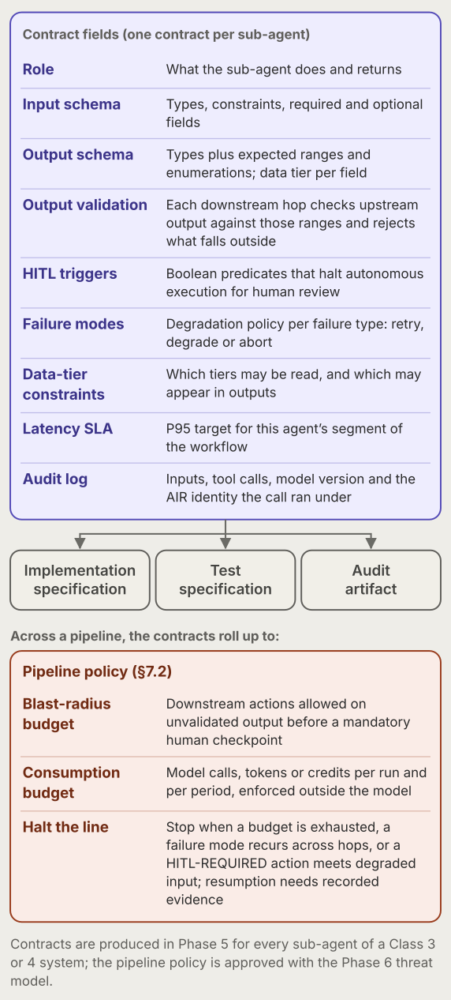

# CRISP-AG: An Artifact-Centered Framework for Enterprise Agentic AI Governance

An implementation framework of eight producible artifacts and a nine-phase lifecycle for governing enterprise agentic AI

<strong>Version 3.0</strong> · October 2026 · David Reed, PhD

<nav class="series-nav" aria-label="Series">
<strong>Agentic AI Governance in Practice</strong> — Part&nbsp;1&nbsp;of&nbsp;7
<ol><li>CRISP-AG</li><li><a href="/papers/agentic-prd-standard/">Agentic PRD Standard</a></li><li><a href="/papers/specification-driven-design/">Specification-Driven Design</a></li><li><a href="/papers/agentic-harness-specification/">Harness Specification</a></li><li><a href="/papers/agentic-security-specification/">Security Specification</a></li><li><a href="/papers/vendor-control-specification/">Vendor Control Specification</a></li><li><a href="/papers/agentic-delivery-workflow/">Agentic Delivery Workflow</a></li></ol></nav>

## Abstract

Enterprise adoption of agentic artificial intelligence systems — multi-step, tool-calling, and sometimes multi-agent architectures built on large language models — is outpacing the operational governance artifacts needed to deploy them safely. This paper proposes CRISP-AG, an artifact-centered implementation framework for governed agentic AI deployment. CRISP-AG extends the lifecycle logic of CRISP-DM by adding three agentic-specific phases: Operational Context Assembly, Trust/Governance/Risk Architecture, and Iterative Refinement and Scale. It formalizes eight implementation artifacts that are under-specified in common AI governance and MLOps practices: Delegation Authority Scoping, Contractor Access Governance, Orchestration Contracts, Capability Frontier Classification, the Agent Identity & Registry Record, an AI System Impact Assessment aligned to ISO/IEC 42005, the Workflow & Workforce Impact Record, and the Vendor Service Profile.

CRISP-AG is positioned as the implementation layer beneath management-system standards such as ISO/IEC 42001, impact-assessment guidance such as ISO/IEC 42005, and risk-management frameworks such as NIST AI RMF — not as a replacement for them. The standards establish what governance must achieve; CRISP-AG specifies what the producible artifacts look like.

The evidence base for this version is practitioner experience, structured framework comparison, and alignment with standards and security references, not a controlled empirical validation. Claims are therefore framed as design propositions and implementation guidance rather than proven causal effects. The paper concludes with a validation agenda for testing whether the proposed artifacts reduce deployment risk, improve auditability, and improve production readiness across domains.

**Keywords:** agentic AI; AI governance; LLM agents; multi-agent systems; agent identity; prompt injection; human-in-the-loop; impact assessment; change management; RAG evaluation; AI lifecycle; CRISP-DM; auditability

## Key contributions

- **Governance as producible artifacts.** Eight artifacts — the Delegation Authority Scope, Contractor Access Profile, Orchestration Contract, Capability Frontier Map, Agent Identity & Registry Record, AI System Impact Assessment, Workflow & Workforce Impact Record and Vendor Service Profile — each with a minimum schema, the phase that produces it, the gate that checks it and a standards mapping.
- **Autonomy assigned per action and earned on evidence.** Each action is assigned one of five DAS positions before architecture, promoted or demoted on a rolling evidence record, and capped structurally by reversibility, consequence and injection exposure.
- **A nine-phase lifecycle calibrated to agent class.** CRISP-DM is extended with operational-context, trust-and-governance and refinement phases, two gates, and compressed tracks for four agent classes.
- **A threat model organized by attack surface.** Nine surfaces from user input to human review, with output gating, session-context integrity and reviewer integrity treated as first-class defenses, and an item-by-item OWASP Agentic crosswalk.
- **The human side made measurable.** A reviewer-capacity model, human-side metrics, a disclosure rule for affected persons, and an ROI model that keeps capacity, quality, risk and workforce-transition cost apart.
- **An explicit claim boundary.** CRISP-AG is positioned as the implementation layer beneath ISO/IEC 42001, ISO/IEC 42005, NIST AI RMF and the EU AI Act, with an evidence-maturity table and a validation agenda in place of claims of proven effect.

> **What's new in v3.0 (since v2.4.1).**
>
> - **Three new artifacts.** The Agent Identity & Registry Record (§5.5), an AI System Impact Assessment aligned to ISO/IEC 42005 (§5.6) and the Workflow & Workforce Impact Record (§5.7) give identity, ethics and adoption the same artifact-level treatment as delegation, access, orchestration and capability.
> - **Vendor control.** An eighth artifact, the Vendor Service Profile (§5.9); a deployer track for vendor-supplied agents (§5.8); a Finance / Procurement approval level (§5.1.1); a consumption budget in the pipeline policy (§5.3); and cost metrics (§8). The failure pattern behind them is vendor-configured agents deployed without consumption controls, where nothing stops the credit meter.
> - **Agent class.** Class is set by behavior, not provenance; Class 4 turns on altering production state, not on any write; cross-organizational multi-agent systems carry two preconditions (§4).
> - **Earned autonomy, made explicit.** A crosswalk to the CSA Agentic Trust Framework (§5.1.4), defined demotion with full re-passage (§5.1.3), a default rule for injection exposure (§5.1), and seven default standing governance invariants that may invoke an agent's containment (§6.3).
> - **Consequential-decision flag.** Tasks that materially influence a decision about a person are capped at HITL-REQUIRED (§5.4.3); the flag is shown below a new vertical Capability Frontier spectrum (Figure 5).
> - **Security.** Canonical OWASP titles and the 2026 LLM numbering; a session-context surface; new mitigations for cascading failures and human-agent trust exploitation (§7.2); all ten OWASP Agentic items covered in §7, ASI04 by reference to the Agentic Security Specification.
> - **The human side.** A reviewer-capacity model that binds in both directions (§5.7), human-side metrics (§8.1), reviewer-integrity mitigations (§7.2.2) and a workforce-transition cost line in the ROI model (§9.4).
> - **Regulatory currency.** The EU AI Act timeline after the Digital Omnibus on AI, the Article 4 and Article 50 obligations now in force, Colorado SB 26-189, ISO/IEC 42005:2025 and a note on U.S. state law (Appendix B.9).
> - **Corrections.** Citations corrected after source verification, among them the procurement-efficiency source [12], and the v2.4.1 non-human-identity citation replaced by the Entro report [21] and the CSA–Strata survey [22]; §5.1.3 and §6.3 are presented as design proposals, with external convergence noted.

<!-- toc -->
## Contents

- [1. Introduction](#1-introduction)
- [2. Related work and positioning](#2-related-work-and-positioning)
- [3. Methodology and evidence status](#3-methodology-and-evidence-status)
- [4. Agent class taxonomy](#4-agent-class-taxonomy)
- [5. Eight core CRISP-AG artifacts](#5-eight-core-crisp-ag-artifacts)
- [6. The CRISP-AG nine-phase lifecycle](#6-the-crisp-ag-nine-phase-lifecycle)
- [7. Security architecture](#7-security-architecture)
- [8. Evaluation and metrics](#8-evaluation-and-metrics)
- [9. ROI and business case guidance](#9-roi-and-business-case-guidance)
- [10. Implementation roadmap](#10-implementation-roadmap)
- [11. Validation agenda](#11-validation-agenda)
- [12. Discussion and limitations](#12-discussion-and-limitations)
- [13. Conclusion](#13-conclusion)
- [Acknowledgements](#acknowledgements)
- [How to cite](#how-to-cite)
- [References](#references)
- [Appendix A — Minimal artifact checklist](#appendix-a--minimal-artifact-checklist)
- [Appendix B — Standards mapping matrix](#appendix-b--standards-mapping-matrix)
- [Appendix C — Glossary](#appendix-c--glossary)
<!-- /toc -->

## 1. Introduction

Agentic AI differs from conventional predictive or generative AI applications because it can select tools, call APIs, retrieve operational context, coordinate sub-agents, and execute multi-step workflows. In conventional predictive deployments, a model normally produces an output that a human interprets before acting. In agentic deployments, the system may produce an action sequence and execute it against enterprise systems. That inversion changes the governance problem.

The scale of the gap is now measurable in identity terms, a sharper framing for a security audience than general AI-project failure statistics. Research by Entro Security, as cited by the Cloud Security Alliance in 2026, finds that non-human identities outnumber human identities by roughly 45:1 on average, and by as much as 144:1 in cloud-native environments (up from 92:1 in the first half of 2024) [20][21]. A separate CSA survey of 285 security leaders, published with Strata Identity in February 2026 [22], finds that only about 28% of organizations can reliably trace agent actions to a human or system across all environments and that only 21% maintain a real-time registry of active agents. Strata's report page adds that 68% require human-in-the-loop oversight while lacking an architectural approach for delivering it.

Every artifact in this paper is, in one sense, an answer to those figures: the Delegation Authority Scope (DAS) ties an action to a named approver, the Orchestration Contract ties a sub-agent's behavior to a written specification, the Contractor Access Profile (CAP) ties an agent's effective access to an accountable authorization scope, and — new in this version — the Agent Identity & Registry Record ties a running agent instance to a named human sponsor and a revocable credential. The governance gap is not abstract; it is a traceability gap at enterprise scale, and it is widening faster than headcount-based governance models can track.

The central premise of CRISP-AG is that agentic governance fails when it remains at the level of principles. Statements such as "keep humans in the loop" or "apply least privilege" are directionally useful but insufficient unless translated into concrete artifacts that can be reviewed, approved, tested, audited, and revised. CRISP-AG therefore defines governance as a lifecycle of producible artifacts. Version 3.0 applies that test to the framework itself: three concerns that earlier versions addressed only as principles — identity, impact on affected people, and workforce adoption — are converted into artifacts with schemas, phases, gates, and standards mappings.

This white paper adopts a deliberate claim boundary. The framework is not yet validated as causing better outcomes. It is a structured proposal derived from practitioner deployment experience, standards comparison, and recurring governance gaps observed in enterprise agentic systems. The appropriate next step is empirical validation through multi-site case studies and controlled comparisons.

> **Implementation urgency.** RAND's 2024 study finds that more than 80% of AI projects fail — twice the rate of comparable IT projects — with leadership, problem framing and change management, rather than technology limitations, as the leading root causes. Organizational failure modes often dominate technical ones in AI initiatives [13].

### 1.1 Contributions

**Delegation Authority Scoping (DAS):** a formal classification of every action an agent may technically perform into one of five autonomy positions. It is structurally similar to a role-based access control table; the contribution is the *process* of producing it upstream of architecture with named cross-functional approval, and of re-evaluating it against live evidence.

**Contractor Access Governance (CAG):** an explicit Contractor Access Profile for enforcing data-access constraints in mixed workforces of FTEs, contractors and vendors.

**Orchestration Contract:** a formal specification artifact for each sub-agent in a multi-agent system, connecting implementation, testing, and auditability.

**Capability Frontier Taxonomy:** a task classification approach that links reliability, consequence, reversibility, and review protocol, with a consequential-decision flag that caps autonomy structurally.

**Agent Identity & Registry Record (AIR)** *(new in v3.0)*: a per-agent identity, sponsorship, credential-scope, and lifecycle record that answers which agent instance, holding which credential, under which human sponsor, is running right now.

**AI System Impact Assessment (AISIA)** *(new in v3.0)*: an ISO/IEC 42005-aligned assessment of who is affected by the agent, how, and what will be done about it — produced before architecture and refreshed on defined triggers, with a disclosure rule for affected persons.

**Workflow & Workforce Impact Record (WWIR)** *(new in v3.0)*: an as-is/to-be workflow with the agent's autonomy positions marked on each step, a role-impact table, a reviewer-capacity model, and an adoption scorecard, so that adoption is measured rather than assumed.

**Vendor Service Profile (VSP)** *(new in v3.0; defined in the Vendor Control Specification (VCS) [61], §4, VC-03)*: one record per vendor service a registered agent depends on, so that the deployer's consumption, lifecycle exposure and contractual terms receive the same artifact-level treatment as identity.

**CRISP-AG lifecycle:** a nine-phase implementation sequence that extends CRISP-DM [1] with agentic-specific operational, governance, and post-deployment monitoring phases, and with compressed tracks calibrated to agent class (see §6.2).

### 1.2 Claim boundary

| Claim type | What this paper claims | What this paper does not claim |
|---|---|---|
| Framework proposal | CRISP-AG defines a coherent artifact-centered lifecycle for agentic AI implementation. | That CRISP-AG has been statistically proven to outperform alternatives. |
| Practitioner evidence | The artifacts reflect recurring problems from enterprise deployment contexts. | That the observed problems have quantified population prevalence. |
| Standards alignment | CRISP-AG is the implementation layer beneath NIST AI RMF, NIST AI 600-1, ISO/IEC 42001, ISO/IEC 42005, EU AI Act obligations, and OWASP LLM and Agentic guidance — specifying the artifacts those frameworks require. | That CRISP-AG itself is a recognized standard or certification scheme, or that producing its artifacts constitutes legal compliance in any jurisdiction. |
| Thresholds | Suggested thresholds are practitioner-anchored starting targets calibrated against adjacent benchmarks. | That the thresholds are universally valid predictors of production success. |
| Scope | The framework addresses agentic AI implementation governance, including the deployer's obligations when the agent is vendor-supplied and the deployer's use of a selected vendor service. | That it allocates legal liability, prescribes vendor selection, or replaces formal application security review. |
| Identity chain | The AIR records which agent instance, holding which credential, under which sponsor, took which action, with the evidentiary strength of the identity provider and ledger it points to. | That the sponsor → agent → action chain is cryptographically proven end to end; no deployed protocol yet does that. |

**Where each artifact lives in a reference implementation (§10.1).** Section identifiers are those of the Agentic PRD Standard [57]; other implementations substitute their own.

| Artifact | Lives in |
|---|---|
| Delegation Authority Scope | Hub H8, with the six mandatory action-boundary rows of H9 at PROHIBITED; machine-readable in the Standard's specification M |
| Contractor Access Profile | S3.2 role-capability matrix |
| Agent Identity & Registry Record | S3.1 and the enterprise registry of record (for Microsoft-platform agents, the Agent 365 registration record) |
| AI System Impact Assessment | S4.4 |
| Workflow & Workforce Impact Record | Summary in hub H5; full record as S5.6 |
| System landscape map | S1.4 |
| Tool specification | S1.4 |
| Orchestration Contract | S1 (written in the specification form) |
| Pipeline policy | S5.2 |
| Capability Frontier Map | S2.10 (frontier and graduation evidence) |
| Vendor Service Profile | S1.9 (register, VSP and Vendor Change Register), S4.5 (data terms), S5.5 (spend governor); Harness §9; SDD Principle 11 and DP-04/DP-05 (binding, in-region substitute) |
| Security threat model | S3.4, with runtime controls in S3.7 and the Agentic Security Specification |
| Regression suite | S2.2 |

### 1.3 Summary for practitioners

CRISP-AG should be read as an implementation framework, not as a replacement for risk-management standards or legal compliance regimes. It sits beneath ISO/IEC 42001, ISO/IEC 42005, and NIST AI RMF, specifying the artifacts those frameworks require organizations to produce.

The core contribution is artifact design: each governance concern is converted into a document, schema, decision gate, or reviewable control. Version 3.0 extends that discipline to three concerns that earlier versions left at the level of principle — who the agent is (identity and registry), whom it affects (impact assessment), and who has to change how they work (workforce impact and adoption).

The most ambitious claims have been narrowed: CRISP-AG is proposed and structured, not yet empirically proven.

The framework is strongest for Class 2 and Class 3 enterprise agents: ReAct-style agents and orchestrated multi-agent systems with tool access. Class 4 code-executing agents require additional security engineering, sandboxing, and red-team validation beyond the base CRISP-AG lifecycle.

Two structural ceilings apply regardless of measured performance: irreversible high-consequence actions are held at HUMAN-ONLY (§5.1.2), and tasks that materially influence a consequential decision about a person — employment, housing, credit, insurance, education, health, legal status, essential services — cannot be promoted past HITL-REQUIRED (§5.4.3).

The framework also explicitly acknowledges its scope limits: it does not address liability allocation between vendors and deploying enterprises, vendor selection, red-team execution methodology, or single-number ROI quantification.

> **Context snapshot.** In Vanta's 2025 State of Trust survey, 48% of organizations reported having developed frameworks to limit or define agent autonomy, while 65% said their use of agentic AI is outpacing their understanding of it [14].

### 1.4 How to read this paper

Section 2 positions CRISP-AG against the standards and frameworks it sits beneath, and Section 3 states the methodology and the evidence status of each claim. Section 4 defines the four agent classes that calibrate everything after it. Section 5 specifies the eight artifacts, each with a minimum schema, the phase that produces it, the gate that checks it, and its standards mapping. Section 6 sets out the nine-phase lifecycle, its gates, the per-class compressed tracks and the standing governance invariants. Sections 7 to 9 cover security, evaluation and metrics, and the business case. Section 10 gives the implementation roadmap and the reference implementation; Section 11 is the validation agenda; Section 12 discusses limitations. Appendix A is a minimal artifact checklist, Appendix B the standards mapping matrix, and Appendix C a glossary.

The paper is written for practitioners developing governance guidance, operating protocols and implementation standards for enterprise agentic AI systems. Readers who know v2.4.1 can start with the summary of changes above the contents, then read §5.5 to §5.9 and §7.2.

## 2. Related work and positioning

CRISP-AG occupies the implementation layer between high-level AI governance frameworks and low-level agent implementation libraries. Governance frameworks such as NIST AI RMF [3], NIST AI 600-1 [4], ISO/IEC 42001 [5], ISO/IEC 42005 [23], and the EU AI Act [6] establish risk-management, management-system, impact-assessment, and compliance expectations. Agentic implementation frameworks such as ReAct [2], AutoGen [8], and LangGraph [9] establish implementation patterns for reasoning, tool use, and orchestration. CRISP-AG proposes implementation artifacts for the middle layer: what must be produced, approved, tested, and audited before an agentic system should operate in an enterprise environment.

**Positioning relative to ISO/IEC 42001.** ISO/IEC 42001 is an AI management-system standard. It specifies requirements and provides guidance for establishing, implementing, maintaining, and continually improving an AI management system, under which an organization must have controls for AI risk management, lifecycle integrity, and stakeholder accountability. In this paper's reading, it does not specify *what those controls should look like* for agentic systems in implementation terms. CRISP-AG specifies the artifacts that satisfy ISO/IEC 42001 obligations for agentic systems specifically: the DAS satisfies management-system clauses on accountability and risk treatment for delegated decisions; the CAP and the AIR satisfy data-classification, information-handling, and access-control clauses; the Orchestration Contract satisfies operational-control clauses for multi-agent systems; the Capability Frontier Map satisfies performance-evaluation and continual-improvement clauses; the WWIR satisfies competence, awareness, and resource clauses. The relationship is implementation-to-standard: an organization aligned with ISO/IEC 42001 uses CRISP-AG to produce the operational artifacts the standard requires it to maintain.

ISO/IEC 42001:2023 has been adopted in Europe as EN ISO/IEC 42001:2026 (18 March 2026) [47], but it is not cited in the Official Journal as a harmonized standard: alignment with, or certification against, 42001 does not create a presumption of conformity with the AI Act under Article 40. The harmonized quality-management standard in preparation for Article 17 is prEN 18286; the Article 17 row in Appendix B.4 will be re-mapped to that standard once it is published. This paper's position is alignment with 42001; certification is a separate decision for the governance body.

**Positioning relative to ISO/IEC 42005.** ISO/IEC 42005:2025 provides guidance for assessing the impacts of an AI system on individuals, groups, and society across the lifecycle, including how that assessment can be integrated into an organization's AI risk management and AI management system, such as one aligned with ISO/IEC 42001. Earlier versions of CRISP-AG did not cite it and, as a consequence, had no artifact in which fairness, bias, affected persons, or transparency to affected persons appeared. The AI System Impact Assessment in §5.6 adopts ISO/IEC 42005 as its anchor rather than inventing a bespoke ethics instrument.

**Positioning relative to NIST AI RMF.** NIST AI RMF organizes AI risk management into four functions: Govern, Map, Measure, and Manage. This paper maps CRISP-AG artifacts and phases to each. The DAS is primarily a Govern artifact (accountability, risk policy). The CAP, the AIR, and the impact assessment are primarily Map artifacts (operational context, third-party risk, affected parties). Orchestration Contracts are Measure artifacts (test specifications) that also serve Manage (audit and incident response). The Capability Frontier Map is a Measure artifact tied to Manage (verification protocol calibrated to risk). The WWIR is a Manage artifact (workforce and adoption treatment). Appendix B contains a more granular crosswalk.

**Positioning relative to OWASP.** The OWASP Top 10 for LLM Applications 2026 [7] (3 August 2026; it supersedes the 2025 edition and renumbers most entries) identifies attack surfaces, and CRISP-AG specifies governance artifacts that address them. Least-privilege scoping addresses LLM03 Excessive Agency, which rose from sixth place in the 2025 edition — the largest move in the list — so that OWASP's own data now places the risk the DAS bounds third. Output gating addresses LLM10 Improper Output Handling and LLM01 Prompt Injection; data-tier constraints address LLM02 Sensitive Information Disclosure; and provenance and re-testing of persistent memory address LLM08 Hidden Context Exposure, which is new in 2026 and names retrieved documents, agent memory, tool responses and application state.

The OWASP Top 10 for Agentic Applications 2026 [15] (published 9 December 2025) extends that list to agent-specific risks (ASI01–ASI10) and introduces the concept of *least agency* — grant an agent the minimum autonomy the task requires — which is what the DAS enforces at the action level. §7 carries an item-by-item crosswalk. This paper cites the 2026 LLM numbering throughout; where a mapping row changed number, the 2025 number is given in parentheses once.

**Positioning relative to the EU AI Act.** The EU AI Act establishes regulatory obligations for AI systems; CRISP-AG produces the documentation and evaluation evidence those obligations require but do not themselves specify in operational form. The timeline matters for how the artifacts are used. The Digital Omnibus on AI — Regulation (EU) 2026/1744 of 8 July 2026, published in the Official Journal on 24 July 2026, and in force from 27 July 2026 — deferred the stand-alone Annex III high-risk obligations to 2 December 2027, and the Annex I embedded-system obligations to 2 August 2028 [29]. The deferral is a fixed date, not conditional on harmonized standards. It kept the Article 4 AI-literacy duty (applicable since 2 February 2025) but reworded it: providers and deployers now "take measures to support the development of AI literacy of their staff," with a new duty on the Commission and Member States to support those efforts. CRISP-AG's capability-based literacy requirement (§5.7, §8.1) deliberately exceeds that floor.

The Article 50 transparency obligations applied as scheduled on 2 August 2026. The Commission's final Guidelines (20 July 2026) [54] read Article 50(1) to require an agent to disclose both its AI nature and the person or entity on whose behalf it acts, at the latest at first interaction, and to disclose itself to the persons instructing it at key steps and at each new interaction. The Article 50(2) machine-readable marking obligation for systems already on the market carries a grace period to 2 December 2026. The new Article 5 prohibitions on non-consensual intimate imagery and CSAM generation (Article 5(1)(ba) and (bb)) apply from the same date under Article 113 as amended; some commentators read them as applying from entry into force, but this paper uses 2 December 2026.

High-risk systems already on the market before the applicable date are caught only when substantially modified thereafter, and the providers and deployers of those intended for use by public authorities must in any case comply by 2 August 2030 (Article 111(2) as amended). For a deployer of vendor agents, a model or tool update inside a vendor product is the plausible "substantial modification", and §5.8 records where Legal assesses it.

The Commission's guidelines on high-risk classification under Article 6 are a draft (19 May 2026; consultation closed 23 July 2026; final due by 1 August 2027) [46]; §5.4.3 records what the draft says about human adoption of per-individual recommendations. For a deployer today, therefore, Article 4 and Article 50 are the obligations *in force*, and Articles 9–17 for Annex III systems (provider requirements; a deployer's own duties sit mainly in Article 26) are the obligations *to come*. Appendix B.5 records all of this. The AISIA in §5.6 is where Article 50 disclosure and Article 4 literacy planning are recorded; the DAS, Orchestration Contract, and Capability Frontier Map remain the evidence base for Articles 9–17 when those apply.

The NIST Generative AI Profile is particularly relevant because it provides a cross-sector companion to the AI RMF for identifying and managing risks specific to generative AI. ISO/IEC 42001 is relevant because it specifies requirements for establishing, implementing, maintaining, and improving an AI management system. OWASP's LLM and Agentic guidance is relevant because prompt injection, excessive agency, sensitive information disclosure, and related risks become more consequential when an LLM has tool access.

**Narrowed novelty claim.** CRISP-AG does not claim that no prior work discusses delegation, human oversight, access control, identity, impact assessment, evaluation, or auditability. The DAS, in particular, is structurally similar to a role-based access control table — a pattern with decades of IAM lineage — and the AIR is structurally similar to a service-account inventory. CRISP-AG's contribution is not the table formats. It is the discipline of producing the artifacts *before* architecture design begins, with named cross-functional approval, as a constraint on the architecture rather than a retrofit, and of re-evaluating them against live evidence afterward. This narrowed claim is more defensible and matches the framework's actual contribution.

### 2.1 Positioning matrix

| Dimension | High-level governance standards | Agent frameworks | CRISP-AG contribution |
|---|---|---|---|
| Delegation authority | Principles for human oversight and risk management; agency-law framing of information asymmetry, discretionary authority and loyalty (Kolt 2025 [39]) | Usually left to application design | Action-by-action autonomy classification artifact, produced upstream of architecture and re-evaluated on evidence |
| Mixed workforce access | General access-control and privacy expectations | Not usually modeled as a first-class agent concern | Contractor Access Profile and output constraints, produced before architecture |
| Multi-agent coordination | Rarely specifies sub-agent contracts | Provides orchestration mechanics | Orchestration Contract for implementation, testing, and audit |
| Capability frontier | Measurement and risk management guidance | Task benchmarks vary by implementation | Task classification linked to verification protocol, with a consequential-decision cap |
| Agent identity | Emerging: NIST NCCoE concept paper, IMDA v1.5, CSA ATF and AIGF call for verifiable agent identity | Service accounts or API keys, often shared | Agent Identity & Registry Record: one verifiable identity per agent, one named sponsor, scoped and expiring credentials |
| Impact on affected persons | ISO/IEC 42005 guidance; EU AI Act Art. 50; U.S. state ADMT laws | Not modeled | AI System Impact Assessment with a consequential-decision screen and a disclosure rule |
| Workforce and adoption | Competence and awareness clauses; Art. 4 literacy duty | Not modeled | Workflow & Workforce Impact Record with reviewer-capacity model and adoption scorecard, gated at Gate 2 |
| Lifecycle | Cross-cutting governance functions | Build-time implementation workflows | Nine-phase implementation lifecycle, with per-class compressed tracks |

### 2.2 Literature gaps to strengthen in future research and protocol guidance

- AI auditability, assurance cases, and evidence management for ML/LLM systems.
- Identity and access management models for agent-mediated workflows, including RBAC, ABAC, delegated authorization, workload identity (SPIFFE/SPIRE-style attestation), and policy enforcement points.
- Human oversight taxonomies, the practical limits of human-in-the-loop review, and the measurement of automation bias in operational settings — now receiving empirical attention (Yu et al. [35]; Turan [36]; Mitchell, Ghosh and Passi [37]; 2026).
- Agent evaluation benchmarks beyond RAG, including tool-use reliability, planning robustness, and multi-agent coordination failure modes.
- Security literature on indirect prompt injection, excessive agency, confused deputy problems, sandboxing for code-executing agents, and tool-poisoning and supply-chain attack surfaces specific to agentic systems.
- Organizational research on workflow redesign, role change, and skill degradation when agents absorb entry-level tasks.

## 3. Methodology and evidence status

This white paper uses a practitioner framework-development methodology. The process consisted of the following steps: (1) identifying recurring governance needs in enterprise agentic deployment contexts; (2) comparing those needs against existing lifecycle and governance frameworks; (3) converting high-level governance needs into producible artifacts; (4) organizing the artifacts into a lifecycle sequence; and (5) reviewing the resulting lifecycle against standards, security guidance, and practical deployability constraints. Version 3.0 added a sixth step: (6) verifying every emerging-framework citation and motivating statistic against its live source, and re-applying step (3) to the framework's own remaining principle-level statements.

Because this white paper does not present a controlled study, the methodology should be treated as design research and practitioner experience rather than empirical validation. The evidence is appropriate for proposing artifacts and explaining why they are needed. It is not sufficient to prove that the artifacts reduce incidents, accelerate deployment, or improve ROI.

### 3.1 Evidence maturity table

| Artifact / claim | Current evidence type | Maturity | Needed validation |
|---|---|---|---|
| Delegation Authority Scoping | Standards alignment + practitioner reasoning + independent convergence with 2026 government and research guidance (Berkeley CLTC [64], Five Eyes [40], IMDA [19]) on agency-scaled governance, reversibility-first approval and incremental autonomy | Moderate conceptual maturity; externally corroborated in shape | Case studies showing fewer unauthorized actions or clearer sign-off decisions |
| Earned autonomy (§5.1.3) and standing governance invariants (§6.3) | Design proposal + independent convergence with CSA ATF promotion/demotion gates | Conceptually corroborated, outcome-unvalidated | Field data on promotion/demotion decisions and invariant firings |
| Reviewer-integrity mitigations (§7.2.2) and human-side metrics (§8.1) | Design proposal; the threat is empirically documented — a seven-month study of 400 repeat reviewers of AI-agent code found population approval rates rising from 30.1% to 36.8% (a gap of about fifteen points from reviewers' first to tenth experience decile) and comment volume falling about a fifth while elapsed latency rose (Yu et al. 2026 [35]; §7.2.2) and oversight-capacity modeling (Turan 2026 [36]) | Threat documented; mitigation outcomes unvalidated | Within-gate A/B on interface rules and streak audits; automation-bias index as the outcome (§11) |
| Containment field (§5.5) and containment-triggering invariants (§6.3) | Convergence of NCSC [41], Five Eyes [40], IMDA [19] and CSA ATF [17] guidance that every agent needs an exercised, pre-designated stop; Anthropic [42] describes layered stop controls mapped out in advance | Externally anchored; field untested | Time-to-halt and resumption data from exercised containments |
| Contractor Access Governance | Structural risk analysis + practitioner observation | Promising but under-validated | Incident analysis and policy-enforcement tests in mixed workforces |
| Orchestration Contract | Software specification analogy + multi-agent deployment need | Strong artifact logic, weak outcome evidence | Ablation study comparing multi-agent systems with and without contracts |
| Capability Frontier Taxonomy | Benchmark-anchored thresholds + expert judgment | Useful but threshold-sensitive | Longitudinal studies across model updates and task domains |
| Agent Identity & Registry Record | Survey evidence of the gap [22][26] + convergence of NIST, IMDA and CSA guidance | Well-motivated, schema untested at scale | Measurement of sponsor traceability and credential hygiene before and after adoption |
| AI System Impact Assessment | Standards alignment (ISO/IEC 42005) + regulatory requirement analysis | Externally anchored, framework-specific fields untested | Comparison of assessment completeness and downstream design changes |
| Workflow & Workforce Impact Record | Industry survey evidence on adoption failure [13][27][28] + practitioner reasoning | Well-motivated, under-validated | Adoption and override-rate outcomes with vs. without a signed WWIR |
| Nine-phase lifecycle | Derived artifact dependency graph | Coherent framework proposal | Comparative deployment study against MLOps-only or ad hoc governance processes |
| ROI model | Consulting-style scenario modeling | Useful practitioner aid | Prospective measurement of cycle time, adoption, quality, and risk outcomes |

### 3.2 Threats to validity

**Selection bias:** the framework was derived from a limited set of enterprise contexts and may overfit procurement, learning, and operational workflow automation.

**Construct validity:** terms such as "capability frontier", "governance intensity", and "adoption" require stronger operational definitions before controlled study.

**External validity:** regulated healthcare, finance, legal, and public-sector deployments may require additional controls not captured here.

**Measurement validity:** proposed thresholds are starting points and should not be treated as universal production criteria.

**Evidence limitation:** without case data, the framework should not be treated as a validated empirical model. In particular, the earned-autonomy mechanism (§5.1.3), the standing governance invariants (§6.3) and the containment field (§5.5) are presented in this version as design proposals whose shape is corroborated by an independently developed external framework, not as reports of measured operating results.

## 4. Agent class taxonomy

Agentic systems should not receive a uniform governance treatment. A single-step tool-calling assistant and an autonomous code-executing agent create very different risks. CRISP-AG therefore uses a four-class taxonomy organized by governance consequence rather than implementation elegance. Figure 1 shows the decision tree; the table that follows defines each class.

*Figure 1 — Agent class taxonomy decision tree.*

| Class | Agent type | Definition | Primary governance risk | Minimum CRISP-AG intensity |
|---|---|---|---|---|
| 1 | Single-step tool-calling | The LLM may call one or more tools in a single invocation, but there is no autonomous loop and humans review outputs before action. | Output quality, hallucination, weak evidence citation. | Basic: DAS, output review, data handling, simple evaluation, impact screen. |
| 2 | ReAct-loop agent | The system performs iterative reasoning and tool use until a goal or step limit is reached. | Scope creep, loop divergence, unintended tool sequences. | Standard: DAS, AIR, CAP where relevant, step limits, HITL triggers, evaluation suite, impact assessment, WWIR. |
| 3 | Hierarchical multi-agent | An orchestrator delegates to specialized sub-agents across systems or tasks. | Emergent coordination failures, audit fragmentation, contract gaps, cascading failures. | Enhanced: Orchestration Contracts, per-agent identity and permissions, cross-agent audit trail, pipeline circuit breaker. |
| 4 | Autonomous code-executing | The agent generates or executes code, or can alter production state — a system of record, deployed configuration, or anything a human or downstream system acts on without further review. | Irreversible actions, privilege escalation, sandbox escape, data exfiltration. | Critical: all Class 3 controls plus sandboxing, red-team review, production-write restrictions. |

**Decision logic.** If the agent does not execute multiple autonomous reasoning/action steps, classify it as Class 1. If it can execute code or alter production state directly, classify it as Class 4. Writes confined to a sandbox or staging area under deny-by-default production-write restrictions and human promotion do not make an agent Class 4. Such an agent carries the Class 4 write controls (sandboxing, production-write restrictions, qualified red-team review of the write path) and continues to the next test; its AIR records "Class 4 write controls carried". If it coordinates two or more role-distinct agents, classify it as Class 3. Otherwise, an extended autonomous loop with tool calls is Class 2.

**Provenance does not change class.** An agent embedded in a vendor product — a work-order triage assistant in a facilities platform, an invoice-exception agent in an accounts-payable suite, a research assistant in a productivity suite — is classified by what it does, not by who built it. A vendor agent that loops over tools is a Class 2 agent; one that writes to a production system of record is a Class 4 agent. §5.8 specifies which artifacts the deployer still owns in that case. A vendor-configured agent — one the deployer configures inside a vendor product — is classified the same way; VCS §4 (VC-06) maps the product's admin plane to the runtime controls.

**Cross-organizational multi-agent systems.** Where a sub-agent or peer agent belongs to another legal entity — a counterparty's scheduling agent, a customer's procurement agent, a vendor's agent invoked over an agent-to-agent protocol — the system is Class 3 with two preconditions that an internal multi-agent system does not carry. First, cryptographic agent identity on both sides: the external agent presents a signed identity document (a signed A2A Agent Card under A2A v1.0 [45], or an equivalent the Orchestration Contract names), and the organization's agent presents its own; a peer identified only by an API key or a URL does not qualify. Second, a tamper-evident cross-agent audit trail that both parties can verify after the fact (the Agentic Security Specification's tamper-evidence control, SEC-04 [60], is the organization's side).

OWASP's governance maturity model [44] rates federated cross-organizational deployments "do-not-deploy" at Governance Levels 0–1, stating that federated trust requires minimum Level 3 — integrated and continuous oversight, with working kill switches — and rates Levels 2 and 3 "insufficient" and only Level 4 "minimum viable"; this paper adopts the Level 3 floor as the meaning of the two preconditions. Externally extended agents (an internal agent given external tools, or an external agent given internal tools) are high-exposure without supply-chain verification and agent-to-agent authentication, and the same preconditions apply in proportion.

## 5. Eight core CRISP-AG artifacts

Versions through 2.4.1 specified four artifacts. Version 3.0 adds three. The test for adding an artifact is the paper's own thesis: a governance concern that is stated as a principle but has no schema, no phase, no gate entry, and no standards mapping is a concern the framework does not actually govern. Identity, impact on affected persons, and workforce adoption failed that test. Each new artifact below receives the same treatment as the DAS: a minimum schema, the phase in which it is produced, the gate at which it is checked, and the standards it maps to. Version 3.0 also adds an eighth, the Vendor Service Profile, whose definition lives in the Vendor Control Specification; §5.9 records its place.

### 5.1 Delegation Authority Scoping

Delegation Authority Scoping converts autonomy into an approval artifact. Let *A* be the set of actions the agent can technically perform. The DAS is a function that maps each action in *A* to one of five classes: PROHIBITED, HUMAN-ONLY, HITL-REQUIRED, AGENT-DIRECTED, and FULLY-AUTONOMOUS. A valid DAS is complete, approved by accountable stakeholders at appropriate levels, and technically enforceable.

The DAS structure resembles a role-based access control table. This is intentional. The contribution is not the table format but the discipline of producing it as a governance artifact upstream of architecture: signed off cross-functionally before implementation and used as an architectural constraint rather than retrofitted to a built system. Figure 2 places the five positions on one spectrum, from full human control to full agent autonomy.

*Figure 2 — Delegation Authority Spectrum for action-level scoping of human control and agent autonomy.*

| DAS class | Meaning | Technical enforcement expectation | Example procurement action |
|---|---|---|---|
| **PROHIBITED** | Agent may not perform or assist execution. | Remove tool/API path or block at policy enforcement layer. | Waive compliance requirement. |
| **HUMAN-ONLY** | Agent may research or draft; human decides and executes. | No execution tool exposed to agent. | Contract negotiation strategy. |
| **HITL-REQUIRED** | Agent may prepare action; qualified human must approve before execution. | Approval workflow required before tool call. | Vendor approval. |
| **AGENT-DIRECTED** | Agent may execute within bounds; human reviews output or sample. | Telemetry, SLA review, rollback path. | Qualification recommendation. |
| **FULLY-AUTONOMOUS** | Agent may execute without per-instance review. | Telemetry and automated monitoring; only reversible low-consequence actions. | Document fetch or validation. |

**Per-action, not per-agent.** Published autonomy models — the CSA Agentic Trust Framework's four levels, the Five Eyes guidance [40] to "adopt agentic AI incrementally, beginning with low-risk tasks," OWASP's governance maturity levels, IMDA's risk tiers — assign autonomy to an agent or to a deployment. The DAS assigns it to an action. The two are reconciled through the Agent Identity & Registry Record (§5.5), an agent-level record that points at a DAS, which is an action-level record. An agent's "level", where one is needed for an external crosswalk, is the highest position any of its actions holds, and the agent's containment (§5.5) is set by that highest position; its class is set by its behavior (§4). This is why the same agent may hold FULLY-AUTONOMOUS for document fetch and HUMAN-ONLY for negotiation, and why a demotion (§5.1.3) can be surgical.

**Default rule for injection exposure.** Any action performed in a session that combines (a) access to non-public data, (b) exposure to content the organization does not control — documents, email, web pages, tool responses from outside the trust boundary — and (c) a channel that communicates outside the organization is classified at least HITL-REQUIRED, regardless of frontier position or evidence history. The rule does not apply where the architecture removes one of the three (for example, a read-only session with no external channel, or an external channel with no access to non-public data). The rule follows Meta's "Agents Rule of Two" as reported by OWASP (State of Agentic AI Security and Governance v2.01, June 2026 [44]), under which that configuration requires human-in-the-loop approval; the HITL-REQUIRED floor regardless of frontier position is this paper's choice. The configuration is the shape of every documented zero-click exfiltration chain, including EchoLeak (§7). The AIR's capability declaration records which of (a), (b) and (c) the agent holds; the prompt-fencing and isolation controls of the Agentic Security Specification (SEC-13, SEC-10) reduce (b) and (c) but do not remove them for the purpose of this rule.

#### 5.1.1 Required approval levels by autonomy class

A complete DAS specifies *which* Legal, Operations, Executive, and — new in this version — Responsible AI / Privacy approvers signed each action's classification, and at what review level. Generic "Legal approved" attestations are insufficient for audit and provide no escalation discipline. The Responsible AI / Privacy column exists because an ISO/IEC 42001-aligned enterprise already has that seat, and because the consequential-decision flag (§5.4.3) and the impact assessment (§5.6) need an approver who is accountable for them. The table below gives the recommended calibration. An implementation's delivery workflow must seat a Legal reviewer for the PROHIBITED and HUMAN-ONLY rows; where no Legal role exists in the workflow's RACI, the DAS is incomplete.

A sixth column, Finance / Procurement — or the Vendor Control Owner (VCS §6) where no Finance or Procurement function is seated in the workflow — exists because autonomy spends money. An AGENT-DIRECTED or FULLY-AUTONOMOUS position whose actions consume metered vendor capacity is a standing purchase order, and the person who approved the budget and the cap is as accountable for the classification as the person who approved the legal exposure.

| Autonomy class | Required Legal review level | Required Operations review level | Required Executive level | Required Responsible AI / Privacy review level |
|---|---|---|---|---|
| PROHIBITED with regulatory waiver, statutory non-compliance, or material legal exposure | General Counsel or designated equivalent | Operations VP with compliance ownership | Executive Sponsor at officer level | Responsible-AI lead confirms the prohibition rationale at initial classification. |
| HUMAN-ONLY with contract decisions, negotiation positioning, or executory commitments | Contracting counsel or commercial Legal | Operations leader for the affected workflow | Executive Sponsor | Privacy Officer where the research or draft touches personal data; otherwise not required. |
| HITL-REQUIRED in regulated workflows (financial services, healthcare, government contracting) or with the consequential flag set | Compliance officer with domain expertise | HITL operations leader with SLA accountability | Executive Sponsor | Responsible-AI lead or Privacy Officer at initial approval and on any consequence-class change; mandatory where the consequential flag (§5.4.3) is set. |
| AGENT-DIRECTED in documented regulated workflows | Compliance officer review | Operations leader for the workflow | Executive Sponsor | Privacy Officer at initial approval where personal data is processed; impact-assessment currency (§8.1) checked at each evidence review. |
| FULLY-AUTONOMOUS reversible operations | Compliance officer review at initial DAS approval; subsequent review only on consequence change | Operations leader review at initial approval | Executive Sponsor | Impact-assessment screen confirms no affected-person consequence; no further review unless the screen result changes. |

The Finance / Procurement (or Vendor Control Owner) review level is added to the matrix as a sixth column:

| Autonomy class | Required Finance / Procurement (or Vendor Control Owner) review level |
|---|---|
| PROHIBITED | Not required. |
| HUMAN-ONLY | Not required, unless the draft or research consumes a premium model tier (VCS §4, VC-02), in which case the tier decision is recorded. |
| HITL-REQUIRED | Vendor Control Owner confirms the VSP is current and the cap is configured at initial approval; Finance review where the monthly budget exceeds the threshold the AI Governance Board (AIGB) sets. |
| AGENT-DIRECTED | Finance / Procurement or Vendor Control Owner at initial approval and on any change to budget ceiling, model tier or vendor service; confirms an enforceable cap exists (HRN-12; VCS §4, VC-01). Without it the position cannot be held (§5.8). |
| FULLY-AUTONOMOUS | As for AGENT-DIRECTED, plus a review of the cost-per-unit-of-work metric (§8) against the budget at each evidence-review cadence. |

The DAS template therefore includes per-action columns for the action name; autonomy class; technical enforcement mechanism; Legal approver name and review level; Operations approver name and review level; Responsible AI / Privacy approver name and review level; Finance / Procurement (or Vendor Control Owner) approver name and review level, with the VSP identifier and the budget ceiling, where the action consumes metered vendor capacity; Executive Sponsor name; consequential flag (§5.4.3); approval date; rationale; evidence-review cadence; and the accountable reviewer for promotion/demotion decisions (§5.1.3). Without these columns, the DAS provides poor evidence in audit and creates ambiguity about who is accountable for which classification decisions.

#### 5.1.2 The governing rule on reversibility and consequence

Irreversible actions require at minimum HITL-REQUIRED. High-consequence irreversible actions require HUMAN-ONLY. Performance is not the deciding factor; reversibility and consequence are. An agent performing well on an irreversible high-consequence action does not justify AGENT-DIRECTED classification — what matters is what happens when the agent gets the action wrong.

#### 5.1.3 Earned, not just assigned

The DAS as specified above is a design-time artifact: autonomy positions are classified and approved before architecture begins, then enforced. That is necessary but not sufficient. A defensible DAS should also be *revisited against live evidence* on a defined cadence, rather than treated as permanent once signed.

The refinement is to track, for each action, a rolling evidence record — sample size, pass rate against defined success criteria, and incident history — and to gate promotion or demotion between autonomy positions on that record rather than on the original design-time judgment alone. A HITL-REQUIRED action with a long, clean evidence history is a candidate for promotion review toward AGENT-DIRECTED; an AGENT-DIRECTED action whose pass rate drops below its threshold should be *automatically* demoted pending review, not left at its original classification until someone notices a problem.

This design is not unique to CRISP-AG. The Cloud Security Alliance's Agentic Trust Framework [17], developed independently and published as a v0.9.1 public-review draft in April 2026, arrives at the same shape: four autonomy levels (Intern, Junior, Senior, Principal); promotion gated on demonstrated accuracy over an evaluation period, a security audit, positive impact, a clean incident history, and explicit stakeholder approval; and a rule that a critical incident triggers immediate demotion to the lowest level. That two independently derived models converge on "earned, not assigned, and automatically revoked" is not evidence that the mechanism improves outcomes — that remains on the validation agenda in §11 — but it is a reason to treat the mechanism as the default rather than an option. §5.1.4 records the crosswalk.

The ATF's demotion rules also treat a change in the underlying model or system, or a significant change in scope or purpose, as a review-based demotion trigger; treat a discovered security vulnerability as demotion pending remediation and three or more minor incidents in an evaluation period as a one-level demotion; and require full re-passage of every promotion gate after any demotion.

Its promotion gates carry illustrative numeric anchors: a minimum evaluation period of two weeks and availability above 99% to leave Intern; accuracy above 95% and availability above 99.5% to reach Senior; accuracy above 99% and availability above 99.9% to reach Principal, with zero critical incidents at every promotion gate and, for Principal, risk-committee approval and executive-sponsor sign-off. CRISP-AG adopts two of the ATF's demotion rules — the review-based trigger on a model, system, scope or purpose change, and full re-passage of every promotion gate after any demotion — and treats the anchors as what "a long, clean evidence history" means by default.

**Demotion** — the evidence- or incident-triggered lowering of a DAS position (or of the AIR's ATF level), automatic where the trigger is a pass-rate threshold or a critical incident and review-based where the trigger is a model, system, scope or purpose change — is this paper's term. The Agentic Security Specification specifies how the runtime enforces it, and the implementing Standard cites it.

Autonomy remains capped by consequence class — no amount of evidence moves an irreversible high-consequence action off HUMAN-ONLY, consistent with §5.1.2 — by the consequential-decision flag in §5.4.3 and by the injection-exposure default rule in §5.1. The ATF has no such ceiling, no per-action scoping and no "never" level (§5.1.4); those three properties are where CRISP-AG differs from it in kind, not in degree. The point is not that any specific tooling should be adopted; it is that DAS classifications age, and a framework that only specifies design-time assignment without a re-evaluation mechanism will drift out of sync with what the agent has actually demonstrated.

In practice, the DAS template carries two additional columns: evidence-review cadence (e.g., quarterly, or triggered by N executions) and the accountable reviewer for promotion/demotion decisions. Automatic demotion triggers should be technically enforced at the same policy-enforcement layer that enforces the classification itself, not left to a human noticing a dashboard. The promotion ledger (attempts, passes, and current position per action) is itself an audit artifact and should be retained under the same policy as the DAS. Two rules follow for the promotion ledger. First, a frontier re-evaluation trigger (§5.4) — a model update, including one inside a vendor product (§5.8); a material tool or corpus change; or an adverse incident — suspends the action's current position pending review rather than leaving it in place until the review completes. Second, a demoted action re-earns its position through the full evidence record from the lowest position, not a shortened one. Re-promotion is therefore never faster than promotion was.

#### 5.1.4 Crosswalk: DAS positions and CSA ATF levels

The ATF assigns a level to an *agent*; the DAS assigns a position to an *action*. An agent may therefore hold different DAS positions for different actions while carrying a single ATF level. The Agent Identity & Registry Record (§5.5) records the ATF level; the DAS records the per-action positions. The mapping below is a mapping of intent, not a claim that the boundaries are defined identically. There are two further differences of kind: the ATF has no PROHIBITED level (the table's last row) and no consequence ceiling — nothing in it prevents an agent with a long clean record from reaching Principal on an irreversible high-consequence action; §5.1.2 and §5.4.3 are where this paper differs. The ATF is cited at v0.9.1 (public-review draft, 3 April 2026). Its stewardship transferred to the CSAI Foundation, a CSA-launched nonprofit, on 29 April 2026, with its author continuing to lead development; its project site describes the current text as "ATF v1" while the repository carries no v1.0 tag. The level names and demotion rule are stable across those sources.

| ATF level | ATF meaning | Nearest DAS position | Note |
|---|---|---|---|
| **Intern** | Observe and report; continuous human oversight | HUMAN-ONLY | Default at creation in both models. An agent's first AIR entry carries ATF level Intern. |
| **Junior** | Recommend and approve; humans approve all actions | HITL-REQUIRED | Ceiling for consequential-decision tasks (§5.4.3). Irreversible high-consequence actions stay at HUMAN-ONLY (§5.1.2). |
| **Senior** | Act and notify; post-action notification | AGENT-DIRECTED | Requires telemetry, SLA review, and a rollback path. |
| **Principal** | Autonomous; strategic oversight only | FULLY-AUTONOMOUS | Under the DAS, only reversible low-consequence actions ever reach this position. |
| **—** | No ATF equivalent | PROHIBITED | The DAS removes the tool path entirely; the ATF has no "never" level. Here, as with per-action scoping and the consequence ceiling, the two models differ in kind. |

**Task-type descriptors (Feng, McDonald & Zhang [56]).** A third vocabulary describes the human–agent interaction mode per task type — operator, collaborator, consultant, approver, observer. It maps onto the table above as follows: *operator* and *collaborator* → HUMAN-ONLY (Intern); *consultant* → HITL-REQUIRED (Junior); *approver* → HITL-REQUIRED (Junior) for the consequential actions the user designates in advance; *observer* → FULLY-AUTONOMOUS (Principal); PROHIBITED has no equivalent. These descriptors remain useful in the WWIR's role-impact table (§5.7); they are not an approval or enforcement vocabulary and should not be used as one. In Feng et al.'s usage, *approver* denotes human sign-off on consequential actions *before* they run, with the user specifying in advance which actions require approval, as HITL-REQUIRED does.

### 5.2 Contractor Access Governance

Contractor Access Governance addresses a specific confused-deputy risk: an agent may possess access rights that exceed the rights of the contractor or vendor user invoking it. If the agent returns confidential outputs to a contractor because the agent can access the underlying system, the organization has created agent-mediated access escalation. Figure 3 shows the gap.

*Figure 3 — The contractor access gap: agent-mediated access can bypass individual authorization levels unless explicitly constrained.*

**Minimum Contractor Access Profile schema.** Every profile records these six fields, each with a default.

| Field | Required content | Default |
|---|---|---|
| **Contractor category** | Role, vendor, region, contract type, start/end dates. | No inherited access. |
| **Permitted systems** | Explicit list of systems/tools callable in contractor-invoked sessions. | None. |
| **Permitted data tiers** | Data tiers that may be read, reasoned over, and surfaced. | Tier 1 only. |
| **Output constraints** | Fields or categories forbidden in user-facing outputs. | Do not surface Tier 2/3 verbatim. |
| **Prompt visibility** | Whether contractor can inspect or export system prompt/policies. | Redacted. |
| **Offboarding** | Credential revocation and audit review process. | Immediate revocation at contract end. |

The architectural rule that closes the gap is that the agent's effective access for any session is the *intersection* of the agent's technical access and the invoking user's authorization scope, not the union. The Agent Identity & Registry Record (§5.5) records the agent side of that intersection; the CAP records the invoking-user side. Contractor Access Profiles are produced before architecture design begins because having contractors in scope changes which tools and data the agent can surface, and the architecture must be constrained by the CAP rather than retrofitted.

### 5.3 Orchestration Contract

The Orchestration Contract is the specification for a sub-agent. It is simultaneously an implementation artifact, a test artifact, and an audit artifact. It reduces ambiguity in Class 3 systems by specifying each sub-agent's role, input/output schemas, data-tier constraints, failure modes, HITL triggers, latency SLA, and logging obligations. Figure 4 summarizes its core fields.

*Figure 4 — The Orchestration Contract: a shared implementation, testing and audit artifact for multi-agent systems.*

**v3.0 extension for cascading failures (OWASP ASI08).** Two fields are strengthened. The *output schema* now carries expected ranges and enumerations — not just types — so that each downstream hop can validate upstream output against its expected distribution and reject out-of-range results rather than treat them as valid input. The *failure modes* field now specifies a degradation policy per failure type (retry, degrade or abort). The set of contracts in a pipeline rolls up to a pipeline-level policy with a blast-radius budget: the maximum number of downstream actions that may proceed on unvalidated upstream output before a mandatory human checkpoint. §7.2 specifies the halt-the-line rule that operates on these fields.

The pipeline policy also declares a consumption budget — model calls, tokens or vendor credits — per run and per period, expressed in the metering unit the VSP records (§5.9). Exhausting it is a halt-the-line condition under §7.2 with the same resumption evidence; the run's state is held, not discarded, so that a human can resume or abandon it with the cost visible. The budget is enforced outside the model by the spend governor (Harness Specification HRN-12 [59]; VCS §4, VC-01), not by an instruction to the agent. The sample contract's failure-modes row gains "Consumption budget exhausted: hold the run and escalate; do not retry."

**Sample Orchestration Contract excerpt.** The excerpt specifies a sanctions-screening sub-agent.

| Element | Example: Sanctions Screening Sub-Agent |
|---|---|
| **Role** | Check candidate vendors against approved sanctions-screening sources and return a structured risk status. |
| **Input schema** | `vendor_name`: string; `country`: ISO-3166 code; `tax_id`: optional string; `source_context_id`: string. |
| **Output schema** | `status`: enum {`clear`, `possible_match`, `confirmed_match`, `error`}; `confidence`: 0–1; `evidence_refs`: array; `data_tier`: Tier 1 or Tier 2. |
| **Output validation (new)** | `confidence` must lie in [0, 1]; `status` must be a member of the enumeration; `evidence_refs` must be non-empty whenever `status` ≠ `error`. A downstream hop that receives a violating output rejects it and counts one unit against the pipeline blast-radius budget. |
| **HITL triggers** | `status` in {`possible_match`, `confirmed_match`}; `confidence` < 0.85; source unavailable; conflicting records. |
| **Failure modes and degradation policy** | API timeout: retry twice, then escalate. Schema violation: abort this hop. Source unavailable: degrade to `possible_match` with human review. Pipeline-level: after three degraded hops in one run, halt the line (§7.2). Consumption budget exhausted: hold the run and escalate; do not retry. |
| **Data constraints** | May read approved sanctions databases; may not surface raw Tier 3 identifiers in contractor sessions. |
| **Latency SLA** | P95 ≤ 30 seconds for API response plus evidence normalization. |
| **Audit log** | Record input hash, source version, tool call IDs, response status, escalation result, model version, and the agent identity (AIR ID, §5.5) under which the call ran. |

### 5.4 Capability Frontier Taxonomy

The Capability Frontier Taxonomy classifies tasks by specifiability, observed performance, error consequence, and reversibility. It is not intended to make broad claims about model intelligence. It is an operational classification that determines the review protocol for a task in a specific deployment context. Figure 5 orders the four positions by suitability for delegation.

*Figure 5 — Capability Frontier spectrum: the four positions stacked from least suitable for delegation at the top to most suitable at the bottom, each with its default verification protocol, with the consequential-decision flag and the irreversibility rule (§5.1.2) drawn as separate boxes below them because both apply regardless of position.*

| Position | Criteria | Default verification protocol | Re-evaluation trigger |
|---|---|---|---|
| **Unsuitable** | Task requires empathy, live social judgment, physical presence, or non-delegable legal authority. | Never delegate. | Normally permanent unless legal or organizational policy changes. |
| **Outside Frontier** | Task cannot be sufficiently specified or performance is below acceptable threshold. | Human-authored final decision; agent may provide research only. | Explicit governance committee review. |
| **Frontier Edge** | Task requires judgment, performance is variable, or errors carry legal/financial consequence. | 50–100% expert review; HITL mandatory. | Every model update plus any adverse incident (suspends the current DAS position pending review, §5.1.3). |
| **Within Frontier** | Task is fully specifiable; performance is strong on domain-representative tests; errors are detectable and reversible. | 10–30% spot-check and automated monitoring. | Every model update or material corpus or tool change (suspends the current DAS position pending review, §5.1.3). |
| **Consequential flag (any position)** | Task materially influences a consequential decision about a person (§5.4.3). | Capped at HITL-REQUIRED; impact assessment mandatory; disclosure to affected persons; records retained. | Any frontier re-evaluation trigger, plus any change in the decision the task feeds. |

#### 5.4.1 Threshold framing

Suggested benchmark-related cutoffs (such as 85% performance for Within Frontier classification, 60% for the boundary between Frontier Edge and Outside Frontier, and 10–30% spot-check rates for Within Frontier tasks) are this paper's own choices, *anchored* to RAG benchmarks such as CRAG (Yang et al., 2024) [10] and FaithJudge (Tamber et al., 2025) [11]. They are not *derived* from those benchmarks in a rigorous statistical sense. On CRAG, state-of-the-art industry RAG solutions answer approximately 63% of questions without hallucination, so an 85% threshold represents performance meaningfully above the state of the art. That comparison is the basis for the threshold; it is not equivalent to a validated production-readiness criterion.

These thresholds are practitioner-anchored starting points. Each deployment must calibrate them against task consequence, the cost structure of false positives and false negatives, and review capacity — and §5.7 now specifies how review capacity is measured in both directions. An 85% threshold may be too low if false-positive cost is severe. It may be too high if the domain is harder than the benchmarks measure. The thresholds should be argued up or down from these starting points on the basis of local conditions, not defended as universal values.

#### 5.4.2 Visualization note

The four positions are points on a single suitability-for-delegation spectrum, with reliability and consequence as influencing factors, rather than coordinates on orthogonal specifiability and consequence axes; Figure 5 therefore stacks them from least suitable at the top to most suitable at the bottom, gives each its default verification protocol, and draws the consequential-decision flag and the irreversibility rule (§5.1.2) as separate boxes below them because both apply regardless of position.

#### 5.4.3 The consequential-decision flag

Some tasks are governed by what they feed rather than by how well the agent performs them. A task that *materially influences* a consequential decision about a person — a decision that affects access to or the terms of employment, housing, credit or lending, insurance, education, health care, legal status, or essential government services — carries a flag that is orthogonal to the four frontier positions. The domains listed are those named in Colorado SB 26-189 [24] and overlap substantially with EU AI Act Annex III [6]; deployers in other jurisdictions should extend the list to match local law.

The flag imposes four structural requirements. First, **an autonomy ceiling**: no action within a flagged task may be classified above HITL-REQUIRED, regardless of measured pass rate — the same ceiling logic §5.1.2 applies to irreversibility, applied here to consequence for the affected person. Second, **a mandatory impact assessment** (§5.6) with a fairness and bias testing plan proportional to the decision. Third, **a Responsible AI / Privacy approver** on the DAS (§5.1.1). Fourth, **disclosure and records**: affected persons receive notice under §5.6.2, and the decision record — inputs, agent output, human reviewer, outcome — is retained for at least the period local law requires (three years under Colorado SB 26-189).

"Materially influences" is read broadly on purpose. A recommendation, score, ranking, or shortlist that a human then adopts is within scope, because the failure mode the flag guards against is not the agent deciding but the human deferring — the automation-bias problem that §7.2 and §8.1 address. The flag is set during the impact-assessment screen in Phase 1, recorded on the DAS and the AIR, and re-evaluated on every frontier re-evaluation trigger and whenever the downstream decision changes.

The European Commission's draft guidelines on the classification of high-risk AI systems (19 May 2026; consultation closed 23 July 2026; final guidelines due by 1 August 2027) [46] take the same position. Human adoption of a per-individual recommendation "does not automatically remove high-risk classification"; systems producing per-individual outputs that contribute to substantive decisions remain high-risk even when humans make the final determination; and each Article 6(3) carve-out applies only where the system does not materially influence the outcome in a way that could adversely affect individuals. The draft also presumes a multi-purpose system to be high-risk unless its provider has taken clear and coherent steps across all its materials to exclude high-risk uses; merely asserting the exclusion in terms of service is insufficient.

Two consequences follow for this paper. First, a general-purpose assistant used by staff to inform a flagged decision is within the flag, not outside it; the §5.6.1 screen asks the question. Second, the flag's ceiling is HITL-REQUIRED rather than HUMAN-ONLY because the statutes themselves distinguish influencing a decision from merely organizing or presenting information for human review (Colorado SB 26-189 excludes the latter from its definition of automated decision-making technology), and HUMAN-ONLY is where CRISP-AG places pure research and drafting. Where a flagged action is also irreversible, §5.1.2 governs and the ceiling is HUMAN-ONLY: reversibility and consequence are distinct axes, and the tier of approval scales with both. Deployers should track the final guidelines; the Agentic PRD Standard's [57] standards-watch clause records the item.

### 5.5 Agent Identity & Registry Record

The Agent Identity & Registry Record (AIR) answers the question the other artifacts do not: *which agent instance, holding which credential, under which human sponsor, is running right now — and until when?* The DAS answers who approved an action class; the CAP answers what an invoking contractor may see; the Orchestration Contract answers what a sub-agent is specified to do. None of them identifies the running agent. That gap is why ASI03 (Identity & Privilege Abuse) was marked "partial" in the v2.4.1 crosswalk, and it is the gap the market has converged on. Only 21% of organizations maintain a real-time registry of active agents and 28% can reliably trace agent actions to a human or system across all environments [22]; CSA reports that 78% have no documented policy for creating or removing agent identities [26], [63].

NIST's NCCoE concept paper identifies OAuth 2.0, OpenID Connect, and SPIFFE/SPIRE-style workload identity as candidate standards for identifying agents as distinct non-human identities [25]; IMDA v1.5 requires verifiable agent identity and an audit trail of which agent acted under whose authorization [19]; the CSA Agentic Trust Framework's first question of any agent is "Who are you?" [17]. Its last is "What if you go rogue?" — the framework's incident-response element — and this version of CRISP-AG answers it with the containment field.

**Minimum Agent Identity & Registry Record schema.** Every AIR entry carries these fields; the third column gives the default, or the classes for which the field is required.

| Field | Required content | Default |
|---|---|---|
| **Agent ID** | Unique, cryptographically verifiable identity distinct from any human account and from any other agent — a workload identity per NIST NCCoE / SPIFFE-style attestation, or the platform's equivalent — one per agent *instance* (note 1). | Required for Class 2+; recommended for Class 1. |
| **Identity type** | One of: copilot; autonomous; orchestrator; ephemeral sub-agent; agent-as-a-service (vendor-operated; §5.8). The type determines the credential form, per the CSA Agent Identity Governance Framework (note 2). | Required for Class 2+. |
| **Delegation chain** | The sponsoring principal chain and, for on-behalf-of sessions, the parentage of the token. Rule: no agent may delegate more privilege than it holds; the §5.2 intersection rule is the special case where the delegating principal is the invoking user. | Required for Class 2+; every token carries its parentage record. |
| **Capability declaration** | The structured, machine-readable statement of what the agent may do (note 3). Runtime requests are checked against it; a request outside it is an escalation trigger (§6.3). | Required for Class 2+; standing privilege outside the declaration is a registry violation. |
| **Containment** | The tested mechanism that halts this agent immediately (note 4), who may invoke it (named roles, including out of hours), the target time-to-halt, the date it was last exercised, and the resumption evidence required. | Required for Class 2+; recommended for Class 1. Exercised at least at each Gate 2 re-validation for Class 4 and at least annually otherwise. A containment that has never been exercised is untested, and the field is incomplete. |
| **Human sponsor** | Named accountable individual — not a team mailbox or distribution list — who answers for the agent's actions. | Required, all classes. |
| **Class and DAS pointer** | Agent class (§4) and the DAS version the agent operates under, with its approval date; the consequential flag, if set. | Required. |
| **Credential scope** | Systems, tools, and data tiers the agent's credential can reach; the intersection rule with the invoking user (§5.2); checked at runtime against the capability declaration. | Least privilege; no shared or static credentials; secrets held in a managed vault, never in prompts or code. |
| **Provenance** | Built internally or vendor-supplied; vendor and product where applicable (§5.8); model provider and version; VSP identifiers (§5.9) of every vendor service the agent consumes — model provider, platform, connectors and tools. | Required. |
| **Cost and tier** | Cost center; monthly budget ceiling and the cap owner; where the cap is enforced (the HRN-12 governor, or the vendor admin plane named in the VSP) and whether it is a hard stop; default model tier per task class (note 5). | Required, all classes. The reduced Class 1 record carries the VSP identifiers and the budget ceiling. A tier above the smallest that passes the regression suite is a recorded exception. |
| **Lifecycle** | Provisioning approver and date; review cadence; retirement trigger; offboarding steps including credential revocation and log retention. | Auto-expire on sponsor change or departure, or after 90 days of inactivity; retirement is a logged decision (§6.3), never a silent deletion. |
| **ATF level (optional crosswalk)** | Intern / Junior / Senior / Principal per §5.1.4. | Intern at creation. |
| **Audit anchor** | Where the agent's action log lives, what it records (at minimum: AIR ID, invoking user, tool call IDs, DAS position invoked, HITL decision if any), and the retention period. | Per the Orchestration Contract's audit specification; retention at least the longest applicable regulatory period. |

1. **Agent ID.** Where the platform supports it, the identity is derived from a governed blueprint (for example, an Entra agent identity blueprint). Record the blueprint identifier, the agent identity identifier and, if one exists, the paired agent user account identifier: policies bound to one do not bind the other, and a DAS approved at blueprint level covers every derived instance.
2. **Identity type.** A copilot is session-bound, holding a token downscoped from the invoking user's authenticated identity and valid for the session; an orchestrator authenticates with mutual TLS or a SPIFFE SVID rather than an API token alone; an ephemeral sub-agent has a built-in time-to-live it cannot extend.
3. **Capability declaration.** The declaration lists the tools the agent may invoke, the resources and data tiers it may reach, whether it holds each of the three injection-exposure properties (§5.1 — non-public data, untrusted content, external channel), and the maximum access window.
4. **Containment mechanisms.** The candidate mechanisms are credential revocation at the identity provider, an egress or proxy cut, an inter-agent channel cut, orchestrator quarantine, or the platform's quarantine action.
5. **Cost and tier.** Each default model tier records its pinned model identifier and named successor (VCS §4, VC-02).

**Rules the record enforces.** Each agent has one identity, never shared with another agent or with a human. Each agent has one named sponsor; when the sponsor leaves or changes role, the credential expires until a new sponsor is recorded. Credentials are scoped and short-lived; a long-lived static API key in an agent's configuration is a registry violation, not a convenience. Inactivity triggers suspension, and reactivation requires the sponsor's approval. Retirement is a logged governance decision with the same evidentiary weight as provisioning.

Identity is issued and revoked in the enterprise identity provider and provisioned to the registry by SCIM (or the platform's equivalent), never minted inside the agent platform alone; an agent the identity provider cannot revoke has no valid containment. The AIR records the sponsor → agent → action chain; it does not cryptographically prove it. No deployed protocol yet does so: OAuth 2.0 handles one-hop delegation but not multi-hop chaining, and none can cryptographically prove which human principal authorized which agent to perform which action at the third or fourth hop of a delegation chain (Otsuka et al. 2026 [38]). The AIR's evidentiary strength is that of the identity provider and the ledger it points to, and the paper's claim boundary (§1.2) says so. An agent whose VSP is stale, or whose budget ceiling has no enforcing cap, is out of compliance with its own record in the same way as an agent whose sponsor has left.

**The registry is also an inventory.** The set of AIR entries is the organization's enumeration of every agent in or near production, and its completeness is itself a governance metric: an agent discovered running without an AIR entry is a finding in the same sense as an unregistered service account. For an organization early in its agentic adoption, producing the registry — every inventoried agent assigned a named sponsor — is the single fastest way to move past the 28% traceability benchmark, and it can be done before any other artifact is complete.

Allied cyber agencies now state the duty in the same terms: maintain a trusted registry of authorized agents and regularly reconcile it with active systems (Five Eyes joint guidance, 1 May 2026 [40]). Reconciliation is the operative word: the §8 registry-completeness metric compares the registry to what identity-provider and gateway logs show running. The registry of record is a SCIM-style directory with, at minimum, the sponsoring principal chain, provisioning date, access scope, capability declaration and containment status (CSA AIGF [26]).

Where the enterprise runs Microsoft Agent 365 (generally available 1 May 2026) [52], its registry is a candidate system of record for the AIR entries of Microsoft-platform agents. The agent-registration path is the Agent 365-powered Microsoft Graph API; retirement of the prior Entra registry API began on 15 June 2026 (MC1297981), so any agent registered only through the old API is a migration finding. The AIR remains the governance record and covers agents outside that registry — those run directly against a model API, on Databricks, or inside other vendor products.

**Phase and gate.** The AIR is created in Phase 2 (Operational Context Assembly) when the agent's scope is first defined, and activated — credential issued — at Gate 1. It is updated at every DAS re-evaluation, sponsor change, or credential-scope change, and closed at retirement. For Class 1 agents on the compressed track (§6.2), a reduced record (ID, sponsor, class, provenance, VSP identifiers, budget ceiling, retirement trigger) is produced in Phase 1.

**Standards mapping.** The AIR maps to these standards and frameworks.

| Standard / framework | Section | Mapping |
|---|---|---|
| NIST NCCoE concept paper [25] | Agent identity and authorization | Direct: the AIR is the record of the per-agent identity and delegated authorization the concept paper describes. |
| IMDA MGF for Agentic AI v1.5 [19] | Verifiable agent identity; audit trail of which agent acted under whose authorization | Direct. |
| CSA Agentic Trust Framework [17] | “Who are you?”; maturity level per agent | Direct: the ATF level field. |
| CSA Agent Identity Governance Framework [26] | Five identity types; delegation chain; JIT capability declaration; SCIM registry of record; unconditional escalation triggers | Direct: sponsor, lifecycle, and offboarding fields; plus the identity-type, delegation-chain and capability-declaration fields. |
| Five Eyes joint guidance [40] | Trusted registry reconciled against active systems; least privilege; cryptographically anchored identity | Direct: the inventory rule and the §8 metric. |
| NCSC [41] (unverified); IMDA v1.0 [19]; CSA ATF Incident Response element [17] | Halt autonomous activity immediately; take agents offline and limit their scope of impact | Direct: the containment field. |
| Microsoft Entra Agent ID / Agent 365 [52] | Blueprint-derived identities; sponsor recorded at creation; registry of record for Microsoft-platform agents | Direct where the platform is used. |
| OWASP Agentic Top 10 [15] | ASI03 Identity & Privilege Abuse | Direct: closes the v2.4.1 "partial". |
| ISO/IEC 42001 [5] | Annex A controls (access control, asset inventory, third-party) | Direct: the AIR is the asset inventory and access-control record for agents. |
| NIST AI RMF 1.0 [3] | Govern 1.1; Map 1.1 | Direct: accountable owner and system context per agent. |
| EU AI Act [6] | Article 12 (record-keeping), Article 26 (deployer obligations) | Approximate: the audit-anchor field supports these obligations when they apply. |

### 5.6 AI System Impact Assessment

The AI System Impact Assessment (AISIA) answers: *who is affected by this agent, how, and what will we do about it — before architecture?* Earlier versions of CRISP-AG treated ethics implicitly — the Unsuitable position, the reversibility rule, and the claim-boundary discipline are all ethical commitments in operational clothing — but the words *fairness*, *bias*, *discrimination*, *affected persons*, and *impact assessment* did not appear. A framework positioned as the implementation layer beneath ISO/IEC 42001 cannot leave out ISO/IEC 42005:2025 [23], which is precisely the standard that operationalizes impact assessment at the system level. The AISIA adopts it rather than inventing a bespoke ethics instrument, and adds the agent-specific fields the standard's general guidance does not name. It also adds a disclosure-sufficiency field, because provider transparency is declining as incidents rise: the 2025 Foundation Model Transparency Index average fell from 58 to 40 on a 100-point scale while documented AI incidents rose from 233 to 362 [50] (unverified). An assessment that assumes the disclosures will arrive will be incomplete.

#### 5.6.1 Minimum contents

| Element | Required content | Proportionality |
|---|---|---|
| **System description and intended use** | What the agent does, for whom, in which workflow; agent class; DAS pointer; AIR pointer. | All classes. |
| **Disclosure sufficiency** | Which provider disclosures the §5.8 table asks for were obtained, which were refused or unavailable, and how each gap was compensated (note 1). | Mandatory when flagged or when the agent is vendor-supplied; recommended otherwise. |
| **Affected parties** | Users; subjects of decisions or recommendations; workers whose roles change (cross-reference the WWIR, §5.7); third parties including contractors, vendors, and customers of customers. | All classes. |
| **Consequential-decision screen** | Does any task materially influence a decision in the domains listed in §5.4.3? If yes, the flag is set on the DAS and AIR, and the remaining elements are mandatory at full depth. The screen also covers general-purpose agents (note 2). | Screen for all classes; full depth when flagged. |
| **Foreseeable impacts** | Benefits and harms to each affected party, including erroneous output, unequal performance across groups, exclusion, loss of recourse, and over-reliance. ISO/IEC 42005 categories. | Depth scales with consequence. |
| **Fairness and bias testing plan** | Which outputs are tested, across which groups, with what metric and threshold, on what cadence; who reviews results. | Mandatory when flagged; recommended otherwise. |
| **Transparency and disclosure plan** | How affected persons learn an agent is involved (§5.6.2): EU AI Act Art. 50 disclosures; state-law pre-use notice; adverse-decision explanations. | Mandatory when flagged or when Art. 50 applies. |
| **AI-literacy plan** | What the people who operate, review, or are informed by the agent need to know (the reworded EU AI Act Art. 4 duty for EU staff, which CRISP-AG's capability requirement exceeds); cross-reference the WWIR training plan. | All classes. |
| **Worker-impact statement** | Roles created, changed, and removed; reviewer-monitoring disclosure (§8.1); skill-degradation risk where the agent absorbs entry-level tasks. | All classes; detail from the WWIR. |
| **Environmental note** | Material compute or energy consequences of the deployment, where relevant. | Where material. |
| **Mitigations and owners** | For each significant impact: the control, the CRISP-AG artifact that carries it, and a named owner. | All classes. |
| **Re-assessment triggers** | The frontier re-evaluation triggers (§5.4) plus any change in affected parties, decision domain, or jurisdiction. | All classes. |
| **Approvals** | Responsible AI / Privacy approver (§5.1.1); Legal where flagged; Executive Sponsor. | All classes. |

1. **Disclosure sufficiency.** The disclosures are model provenance and version, training-data categories, known risks and limitations, fairness testing, evaluation results, and exclusion of high-risk uses. A gap is compensated by independent evaluation on the deployer's own data and tasks, a narrower DAS, a lower frontier position, or a decision not to deploy on the flagged task. The Vendor Service Profile (§5.9) records the provider's disclosure posture once; this element records the consequence for this agent.
2. **General-purpose agents.** The screen asks a sub-question: is a general-purpose agent or assistant — a productivity-suite copilot, a chat assistant, a coding agent — being used by staff to inform a flagged decision? If yes, the task is treated as flagged unless the provider has clearly and coherently excluded that use across its materials (Commission draft Article 6 guidelines, 19 May 2026 [46]); a terms-of-service disclaimer is not sufficient, and the exclusion, if relied on, is recorded in the assessment.

#### 5.6.2 Disclosure rule for affected persons

CRISP-AG through v2.4.1 had a prompt-visibility rule for contractors (§5.2) but no disclosure rule for the people an agent's output affects. The rule: **a person who interacts with an agent, or about whom an agent produces an output that materially influences a decision, is told so, in plain language, before or at the point of interaction, and — for flagged decisions — is told after an adverse outcome what role the agent played and how to request human review.** The wording, timing, and channel are recorded in the AISIA.

This rule is drafted to satisfy two instruments. The first is EU AI Act Article 50 (in force since 2 August 2026) as read by the Commission's Guidelines of 20 July 2026 [54]: disclosure of the AI nature and of the person or entity on whose behalf the agent acts, at first contact and at each new interaction; the *disclosed principal* is defined in the implementing Standard (H8). The second is the pre-use notice, adverse-decision explanation, and human-review provisions of Colorado SB 26-189 [24] (effective 1 January 2027). Deployers in other jurisdictions should confirm local requirements. The AISIA records what the organization decided to disclose; whether that disclosure is legally sufficient is a determination for Legal and Privacy, not for the framework.

#### 5.6.3 Phase, gate, and refresh

The consequential-decision screen and the affected-parties list are produced in Phase 1 (Business and Stakeholder Understanding), because they change what the DAS may permit. The full assessment is completed in Phase 2 alongside the CAP and constraint log, checked at Gate 1, refreshed at Gate 2 with the frontier map and evaluation scorecard, and re-run on any re-assessment trigger. The impact-assessment currency metric in §8.1 tracks whether that refresh actually happens.

**Standards mapping.** The AISIA maps to these standards, laws and frameworks.

| Standard / framework | Section | Mapping |
|---|---|---|
| ISO/IEC 42005:2025 [23] | AI system impact assessment process and documentation | Direct: the AISIA is a 42005-conformant assessment with agent-specific fields added. |
| ISO/IEC 42001 [5] | Clause 6.1.4 (AI system impact assessment); Annex A | Direct: the AISIA is the artifact the management system requires. |
| NIST AI RMF 1.0 [3] | Map 1 (context), Map 5 (impacts to individuals, groups, society) | Direct. |
| EU AI Act [6][29] | Article 4 (AI literacy); Article 50 (transparency) — in force | Direct: the literacy and disclosure plans. |
| EU AI Act [6][29] | Articles 9, 10, 13, 14, 27 (Annex III systems, from 2 December 2027) | Approximate: the AISIA provides the impact and oversight documentation these will require. |
| Colorado SB 26-189 [24] | ADMT in consequential decisions: pre-use notice; adverse-decision explanation within 30 days; separate rights to correct data and to meaningful human review and reconsideration; three-year records; developer-to-deployer disclosures | Direct where the flag is set — for notice, explanation, human review, records and developer disclosures. SB 26-189 does not itself require an impact assessment (it repealed SB 24-205's requirement); the AISIA is a CRISP-AG requirement anchored to ISO/IEC 42005. |
| California CPPA ADMT regulations [53] | Significant decisions: pre-use notice; opt-out or an appeal conducted by a human reviewer with authority to overturn; risk assessments | Direct where the flag is set. The human of record for a flagged action must be able to interpret the output, consider it alongside other relevant information and change the outcome — the CPPA test, which the implementing Standard carries as *overturn authority* (H8). |
| OWASP LLM 2026 [7] | LLM07 Misinformation (2025: LLM09) | Approximate: over-reliance is an assessed impact. |

### 5.7 Workflow & Workforce Impact Record

The Workflow & Workforce Impact Record (WWIR) answers: *what work changes, for whom, and how will we know adoption is real?* Phase 8 (Workflow Integration and Change Management) has been part of the lifecycle since the first version, and the RAND finding that organizational causes dominate AI project failure [13] has motivated the paper since v2.3. But Phase 8 was the only phase with no producible artifact — a principle-level statement in a framework whose thesis is that principles fail.

Three facts make the omission costly. The DAS creates new human jobs (HITL reviewers, promotion/demotion decision-makers, standing-invariant responders) and removes others, and the paper never asked who those people are. Frontier Edge tasks require 50–100% expert review, which at enterprise scale is a headcount question the threshold guidance deferred to "review capacity" without saying how to measure it. And the §9 capacity-value formula depends on active users — an adoption variable that nothing in §8 measured. Externally, McKinsey's 2026 State of AI survey finds that high performers redesign workflows around AI rather than inserting AI into existing ones [27], and Vanta finds that 65% of organizations report their agentic use outpacing their understanding of it [14].

**Minimum Workflow & Workforce Impact Record contents.** The record has seven elements; the third column gives when each is produced.

| Element | Required content | Produced |
|---|---|---|
| **As-is / to-be workflow** | Step-level process maps with the agent's DAS position marked on each to-be step; hand-off points; what the human sees at each HITL gate. | Draft in Phase 1; final in Phase 8. |
| **Role-impact table** | For each affected role: tasks removed; tasks added (HITL review, promotion/demotion decisions, standing-invariant response, exception handling); capacity delta in hours per week; skill gap; whether the role is created, changed, or removed. | Phase 1 draft; signed by the affected function's leader and HR before Gate 2. |
| **Reviewer-capacity model** | See formula below; checked against actual staffed capacity, with the shortfall and its remedy stated. | Before Gate 2. |
| **Training and AI-literacy plan** | What each role must be able to *do* — for example, redesign a workflow step, recognize an out-of-scope agent action, or override with a recorded reason — measured by demonstrated capability, not module completion (note 1). | Phase 8. |
| **Adoption scorecard** | Active users vs. eligible users; override rate; workaround and shadow-tool signals; user satisfaction; baseline measured before rollout. | Baseline before Gate 2; ongoing in Phase 9. |
| **Communication plan and sponsor/champion map** | Who says what to whom, when; named champions in each affected team; the workforce-voice input gathered (frontline interviews or surveys) and what changed because of it. | Phase 8. |
| **Reviewer-monitoring disclosure** | What is measured about HITL reviewers (§8.1), why, who sees it, and the commitment that it is used for gate design rather than individual performance management unless HR has agreed otherwise (note 2). | Before Gate 2. |

1. **Training and AI-literacy plan.** The plan satisfies and exceeds the reworded EU AI Act Article 4 duty for EU staff. For reviewers on Frontier Edge gates it includes periodic unassisted performance of the reviewed task, so that the judgment the override assumes still exists (IMDA v1.5 skill-degradation guidance [19]; Mitchell, Ghosh and Passi 2026 [37]).
2. **Reviewer-monitoring disclosure.** Reviewers see their own approval-rate trajectory and active-review-time trend alongside downstream defect data, so that the measurement is a mirror before it is a control.

**Reviewer-capacity model.** The model converts task volume and the frontier review rate into the reviewer staffing a gate needs:

> **Required review FTE** = (Expected task volume per period × Review rate from §5.4) × Minutes per review ÷ Available reviewer minutes per FTE per period

The review rate is the one the verification protocol sets for the task's frontier position — 10–30% for Within Frontier, 50–100% for Frontier Edge — and the minutes per review should be measured in the pilot, not estimated. The result is compared with the reviewers actually staffed. If the gap is closed by lowering the review rate, that is a threshold decision that must be argued on §5.4.1 grounds and approved on the DAS, not absorbed silently. This comparison is also the point at which the argument for upstream workflow redesign becomes concrete: if the to-be workflow requires more review than the organization can staff, Phase 5 architecture should be constrained by the to-be workflow, not the reverse.

The converse also holds. A review rate that exceeds staffed capacity does not buy safety: modeled reviewer reliability declines once cumulative load passes capacity, and escalating everything lets more unsafe actions through than escalating selectively. An over-escalated queue is itself an attack surface: an adversary floods it with benign items so that the malicious one is waved through, and attack success climbs toward the rubber-stamp ceiling as the filler grows in simulation (Turan 2026 [36]). Capacity is therefore a constraint on the review rate in both directions. The HITL trigger design (§5.3) prioritizes by consequence and reversibility rather than escalating everything, and a queue whose volume exceeds the model's capacity is a gate finding, whether the remedy is more reviewers, fewer escalations, or a narrower DAS.

**Phase and gate.** The WWIR is drafted in Phase 1, when the business problem and baseline are stated, and completed in Phase 8. Gate 2 (§6.1) now requires three WWIR conditions: reviewer capacity confirmed, adoption baseline measured, and the role-impact table signed by the affected function's leader and HR. The scorecard feeds the §9 capacity value — no ROI figure should be presented until the adoption baseline exists — and the human-side metrics in §8.1.

**Shadow AI as a change-management signal.** The 2026 Verizon Data Breach Investigations Report [31] finds that regular employee use of AI tools (authorized or not) tripled in a year, from 15% to about 45% of employees; the report's nearest proxy for unsanctioned use is that 67% of those employees used AI through non-corporate accounts. The WWIR's shadow-tool signal is the sanctioned/unsanctioned split in the organization's own telemetry (Harness Specification HRN-07; VCS §4, VC-04 register). For a large enterprise this is a change-management problem before it is a security problem: people route around tools that do not fit their work. The WWIR treats shadow-tool signals as a leading indicator of an unmet need and, rather than an enforcement action, recommends an amnesty-style intake — "tell us what you are using; we will help you do it safely" — that feeds the registry (§5.5).

**Standards mapping.** The WWIR maps to these standards and frameworks.

| Standard / framework | Section | Mapping |
|---|---|---|
| ISO/IEC 42001 [5] | Clauses 7.2 (competence), 7.3 (awareness), 7.1 (resources) | Direct: training plan, literacy plan, reviewer-capacity model. |
| NIST AI RMF 1.0 [3] | Govern 2 (accountability structures, training); Manage 4 (post-deployment monitoring) | Direct. |
| EU AI Act [6] | Article 4 (AI literacy); Article 14 (human oversight, when applicable) | Direct: the literacy plan; the reviewer design supports Article 14 oversight measures. |
| IMDA MGF v1.5 [19] | Human accountability; automation-bias safeguards; skill-degradation and operational continuity | Direct: reviewer design and worker-impact statement. |
| ISO/IEC 42005 [23] | Impacts on workers as an affected group | Direct: the worker-impact statement is shared with the AISIA. |

### 5.8 Governing vendor-supplied agents

CRISP-AG is silent on vendor *selection* (§12) and remains so. But governing a vendor's agent is not the same thing as selecting a vendor, and most enterprises early in agentic adoption meet their first agents inside products they already license. IMDA v1.5 distinguishes platform-provider, system-provider, and deployer responsibilities explicitly [19]; the framework should say which artifacts the deployer still produces when the agent is someone else's. The rule: **the deployer owns every artifact that records its own authority, its own people, its own data, and its own affected persons, regardless of who built the agent.** The vendor owns the artifacts that specify the agent's internals, and the deployer's obligation is to obtain enough of them to complete its own.

IMDA's May 2026 Discussion Paper on the allocation of legal responsibility for AI agents [48] proposes allocating responsibility by each actor's "level of control, access to information and proximity to end users," and states that AI agents are not legal persons and cannot be agents in the legal sense. The artifact split below follows the same logic: the deployer records what it controls, knows and is proximate to, and so holds the records it will need under any such allocation.

IMDA's framework (v1.0, January 2026) also names the contractual minimum that a deployer should verify a third-party agent provider offers — per-agent identity tokens, scoped API keys, logging of tool calls and access history, and explicit distribution of obligations in the terms — and the Vendor Control Specification's clause checklist (VCS Appendix C) carries those items. This paper distinguishes a *vendor-supplied* agent (built by the vendor and consumed as a product) from a *vendor-configured* agent (configured by the deployer inside a vendor product such as Copilot Studio); the latter is governed by the configured-agent profile in VCS §4 (VC-06), and the rows below apply to both.

| Artifact | Owner when the agent is vendor-supplied | What the deployer needs from the vendor |
|---|---|---|
| **DAS (§5.1)** | Deployer, always. The vendor's configuration options are the action inventory. | The complete list of actions the agent can take against the deployer's systems, and the configuration mechanism that disables each — ideally in the form of an Agent Bill of Materials (note 1). |
| **CAP (§5.2)** | Deployer. | Confirmation that the agent enforces the invoking user's authorization scope (intersection, not union), and how. |
| **Orchestration Contract (§5.3)** | Vendor, for sub-agents inside the product; deployer, for any orchestration it builds around the product. | Input/output schemas, HITL triggers, failure modes, and audit-log contents for each exposed capability — or contractual equivalents. |
| **Capability Frontier Map (§5.4)** | Deployer, on the deployer's tasks and data. | Vendor evaluation results as an input, never as a substitute. |
| **AIR (§5.5)** | Deployer. | A distinct, revocable identity per deployed agent instance; no shared vendor credential across customers or across the deployer's own agents (note 2). |
| **AISIA (§5.6)** | Deployer. | Model provenance, training-data and limitation disclosures, and any fairness testing performed; for a general-purpose system, the vendor's documented exclusion of high-risk uses, if any (note 3). |
| **WWIR (§5.7)** | Deployer. | Nothing beyond product documentation; the workforce is the deployer's. |
| **Regression suite; model-update approval record** | Vendor runs; deployer approves. Model updates inside a vendor product are frontier re-evaluation triggers (§5.4). | Advance notice of model or tool changes; release notes sufficient to re-run the deployer's own evaluation. |
| **Threat model (§7)** | Shared. Vendor covers the product; deployer covers the integration and the data. | Security attestations; results of the vendor's adversarial testing at the §7.1 coverage level for the agent's class. |
| **Consumption and cost (VCS §4, VC-01, VC-02)** | Deployer, always. | The metering unit and per-action rates; the admin-plane cap and alert mechanism per agent, with its enforcement precision and latency; usage reporting at daily granularity; and whether a per-agent hard stop exists. Recorded in the VSP (§5.9). |
| **Commercial and data terms (§5.9; VCS §4, VC-03, VC-07, VC-09)** | Deployer records; vendor supplies. | Deprecation and notice policy, and whether it is contractual or published; data-use, retention and training terms, including retention that the vendor cannot waive; sub-processor list; regional footprint and residency controls; export mechanism. Recorded in the VSP. |

1. **Agent Bill of Materials.** The AgBOM (OWASP Agent Control Standard v0.1, September 2026 [51]; CycloneDX profile) lists tools, models, connectors and accessible data. It is also the change-notice unit for the regression-suite row. SEC-16 specifies the AgBOM the deployer produces for its own agents; the vendor's AgBOM is the input to it.
2. **Vendor agents on the deployer's tenant.** The identity is issued in the *deployer's* identity provider (not only the vendor's), with the deployer's sponsor recorded and the containment mechanism (§5.5) exercisable by the deployer.
3. **AISIA disclosures.** The limitation disclosures include the developer-to-deployer statement of intended uses, known risks and limitations, and categories of training data that Colorado SB 26-189 requires. For a general-purpose system, a terms-of-service disclaimer is not a sufficient exclusion of high-risk uses (Commission draft Article 6 guidelines, 19 May 2026 [46]). The AISIA's disclosure-sufficiency element (§5.6.1) records what was obtained, what was refused, and how the gap was compensated.

A vendor agent for which the deployer cannot obtain any one of the action inventory, a distinct identity in the deployer's own identity provider, or update notice cannot be classified above HITL-REQUIRED under this framework, because the deployer cannot produce a complete DAS or a valid AIR for it. A vendor agent for which the deployer cannot configure an *enforceable* spend cap — one that stops consumption rather than reports it — cannot hold an AGENT-DIRECTED or FULLY-AUTONOMOUS position for any action that consumes metered vendor capacity; alert-only budgets do not qualify (VCS §4, VC-01, and Appendix B record which platforms offer a hard stop).

A vendor agent for which the deployer cannot obtain the model-provenance and limitation disclosures the AISIA needs for a flagged task cannot be deployed on that task until the AISIA records the gap and the compensating controls (independent evaluation on the deployer's data; a narrower DAS). These are governance consequences, not procurement recommendations.

Two further rules follow from the regulatory frame. First, a deployer that repurposes a vendor's general-purpose agent for an Annex III use, or substantially modifies it, may become a provider under EU AI Act Article 25(1). That repurposing is an AISIA re-assessment trigger (§5.6.1) and a question for Legal, and the Article 25(4) written-agreement contents are the floor of information the deployer requests from every registered vendor, whether or not Article 25(4) binds it. Second, a model or tool update inside a vendor product, already a frontier re-evaluation trigger (§5.4), is also the point at which Legal assesses whether a legacy high-risk system has been "substantially modified" for the purposes of Article 111(2) as amended (Appendix B.5).

### 5.9 Vendor Service Profile (defined in the Vendor Control Specification §4, VC-03)

The eighth artifact is defined outside this paper. The *Vendor Service Profile* (VSP) is one controlled record per vendor service the deployer depends on for any registered agent; its schema, its blocks, and the rules that govern it are specified in the Vendor Control Specification §4 (VC-03) and its Appendix A. This section records only what CRISP-AG needs in order to place the artifact in the lifecycle.

**Place among the artifacts.** The VSP is the eighth core artifact. It stands to the vendor service as the Agent Identity & Registry Record (§5.5) stands to the agent: the AIR says which agent is running under whose sponsor; the VSP says which vendor service that agent consumes, on what commercial, lifecycle and data terms, and under which controls. The AIR carries the VSP identifiers of every service the agent consumes (§5.5, Provenance row).

**Phase and gate.** The VSP is produced in Phase 2 (Operational Context Assembly) alongside the AIR, when the agent's dependencies are first known, and refreshed at contract renewal, on any Vendor Change Register entry (VCS §4, VC-05), and at least annually. Gate 1 requires a current VSP for every dependency; a stale VSP fails the gate. For Class 1 agents on the compressed track (§6.2), the reduced record defined in VCS Appendix A is produced in Phase 1 with the reduced AIR.

**The register is also an inventory.** The set of VSPs, together with the approval status of each service, is the Approved AI Service Register (VCS §4, VC-04, and §5). A dependency without a VSP is a finding in the same sense as an agent without an AIR entry (§5.5): it is the vendor-side traceability gap. NIST AI RMF Map 4.1 describes the underlying obligation as inventorying third-party materials — hardware, software, data, models — and the VSP is the organization's instance of that inventory; no standard names a "Vendor Service Profile" as such.

**Standards mapping.** The VSP's standards mapping is maintained in VCS §10. In summary, it maps to ISO/IEC 42001 Annex A.10 (supplier relationships; A.10.4 where an agent serves the organization's customers), NIST AI RMF Govern 6.1 and 6.2 and Map 4.1, and NIST AI 600-1 §2.12 (Value Chain and Component Integration). It also maps to EU AI Act Article 25(4), as the minimum information set requested of every registered vendor; OWASP LLM 2026 LLM04 Supply Chain and LLM06 Unbounded Consumption; OWASP Agentic ASI04; and EU Data Act Chapter VI, for services contracted by the organization's EU-established entities. This paper uses DORA Article 28 and the UK Critical Third Parties regime as analogues for customer due-diligence alignment where they do not bind the organization directly. Appendix B.10 points to that mapping.

**Owner.** The Vendor Control Owner (VCS §6; Agentic Delivery Workflow [62] §4, eleventh role) owns the register, the VSPs and the Vendor Change Register. Where no Procurement or third-party-risk function exists, the Harness Engineer may hold the role.

## 6. The CRISP-AG nine-phase lifecycle

CRISP-AG extends CRISP-DM by adding phases that address operational context, governance architecture, and post-deployment capability drift. The lifecycle is iterative. Phase boundaries are not intended as bureaucracy; they are intended to prevent architecture and deployment decisions from being made before authorization, data, workforce, security, and evaluation constraints are known. Version 3.0 moves workforce and affected-person constraints upstream: the impact screen and the WWIR draft are Phase 1 outputs, so that Phase 5 architecture is constrained by the to-be workflow and the consequential-decision flag rather than the reverse.

| Phase | Name | Key output | Why it matters for agentic AI |
|---|---|---|---|
| 1 | Business and Stakeholder Understanding | Problem statement, quantified baseline, DAS draft, RACI, consequential-decision screen and affected-parties list (§5.6), WWIR draft with role-impact table (§5.7). | Defines what the agent is for, who authorizes action, whom it affects, and whose work changes. |
| 2\* | Operational Context Assembly | Context specification, CAP, constraint log, system inventory, AIR created (§5.5), VSP for every dependency (§5.9), full impact assessment (§5.6). | Captures workforce, policy, identity, and operational constraints before architecture. |
| 3 | Data and System Landscape Discovery | API catalog, permission matrix, latency/dependency map, identity model for agents (service principals, secrets management). | Agents interact with live systems; system reliability becomes model reliability. |
| 4 | Data and Context Preparation | RAG corpus, tool specs, system prompt, data classifications. | Prepares runtime context and enforces data boundaries. |
| 5 | Agent Architecture Design | Architecture decision record, orchestration design, contracts, HITL spec — constrained by the to-be workflow and the consequential flag. | Replaces model selection with workflow, tool, memory, and agent topology design. |
| 6\* | Trust, Governance, and Risk Framework | Threat model, audit spec, compliance mapping, tier policy, pipeline circuit breaker, halt-the-line rule and consumption budget (§7.2). | Creates reviewable controls for trust, security, and accountability. |
| 7 | Capability Frontier Evaluation | Frontier map, evaluation scorecard, regression suite, reviewer-capacity check. | Determines what the agent may do autonomously and what requires review — and whether the review can be staffed. |
| 8 | Workflow Integration and Change Management | As-is/to-be process, enablement plan, HITL operations, completed WWIR with adoption baseline and signed role-impact table. | Addresses adoption and human workflow redesign with a producible artifact. |
| 9\* | Iterative Refinement and Scale | Observability, model-update approval, prompt versioning, scaling gates, standing governance invariants including the seven defaults (§6.3), human-side metrics (§8.1), AIR and AISIA refresh. | Agentic systems evolve after deployment; governance must remain active. |

*\* New phase with no direct CRISP-DM equivalent.*

### 6.1 Phase gates

**Gate 1: Architecture Design Entry.** Required before Phase 5 begins. Minimum evidence: data tiers assigned; tool specifications complete; system prompt reviewed; DAS approved at the levels required in §5.1.1, including the Responsible AI / Privacy level where required; CAP reviewed where contractors are in scope; AIR activated with a named sponsor, a scoped credential, a capability declaration and, for Class 2+, a tested containment; current VSP for every dependency; impact assessment complete and consequential flag recorded; adversarial prompt tests completed (see §7.1 for coverage requirements); latency feasibility checked.

**Gate 2: Production Deployment Entry.** Required before Phase 8 workforce rollout. Minimum evidence: frontier map approved; evaluation scorecard meets deployment-specific targets; HITL triggers tested; zero unresolved Tier 2/3 data incidents; threat model and security testing complete; observability ready; reviewer capacity confirmed against the §5.7 model; adoption baseline measured; role-impact table signed by the affected function's leader and HR; impact assessment refreshed; disclosure to affected persons in place where required.

### 6.2 Per-class compressed tracks

Not all agent classes require all nine phases. The lifecycle compresses according to the agent class established in §4. The compression is not a relaxation of governance; it is a calibration of phase work to the actual stakes. The three new artifacts compress with the track: a Class 1 agent needs an impact *screen* and a reduced registry entry, not a full assessment and a full WWIR.

| Class | Required phases | Phase gates required | Notable additional requirements | Typical time-to-production |
|---|---|---|---|---|
| **Class 1 — Single-Step Tool-Calling** | 1, 4, 5, 8 (skip 2, 3, 6, 7, 9) | None | Output review by humans replaces formal frontier evaluation. Model updates handled via standard application versioning. Impact screen and reduced AIR (ID, sponsor, class, provenance, VSP identifiers, budget ceiling, retirement trigger) in Phase 1; WWIR reduced to the role-impact table. | 2–4 weeks for a small team |
| **Class 2 — ReAct-Loop** | 1, 2, 3, 4, 5, 7, 8 (skip 6, optionally skip 9 if not at scale) | Gate 1 required | CAP required if any non-FTE category invokes the agent. Step limits and HITL triggers required. Full AIR; full impact assessment when flagged, otherwise screen plus affected-parties list; WWIR with reviewer-capacity model. | 6–10 weeks |
| **Class 3 — Hierarchical Multi-Agent** | All 9 phases | Gate 1 and Gate 2 required | Orchestration Contracts mandatory for every sub-agent, with output validation and degradation policy. Cross-agent audit trail mandatory. Phase 6 threat model must address inter-agent attack surfaces and specify the pipeline circuit breaker. One AIR per sub-agent. Cross-organizational systems: signed peer identity and a verifiable cross-agent trail before Gate 1 (§4). | 3–6 months |
| **Class 4 — Autonomous Code-Executing** | All 9 phases plus quarterly re-testing | Gate 1, Gate 2, plus quarterly Gate 2 re-validation | Sandboxing and qualified red-team review required at Phase 6. Regression suite reruns at Phase 7 after any model, tool, or RAG corpus change. Quarterly penetration testing at Phase 9. AIR credential scope reviewed and containment exercised at each re-validation. | 4–8 months. Maintenance is 20–30% of build effort, ongoing. |

The principle is that phase work scales with what is at stake. A Class 1 FAQ assistant does not need a threat model that addresses sandbox escape. A Class 4 operations agent does. Compressed tracks make the framework usable for low-stakes deployments without compromising the rigor needed for high-stakes ones.

### 6.3 Standing governance invariants

Phase 9's monitoring outputs in §6 — observability, model-update approval, prompt versioning, and scaling gates — form a monitoring and re-approval cadence. What they do not by themselves specify is what happens to governance work *after* it is approved and closed: a signed-off DAS entry, a closed threat-model gap, a passed regression suite, an activated AIR credential. The implicit assumption is that once approved, an artifact stays valid until the next scheduled review.

That assumption should be made explicit and stronger. The proposal is that completed governance work should convert into a standing governance invariant — a continuously and automatically checked condition, not a one-time sign-off that is trusted until the next audit. A closed threat-model gap becomes a monitored condition that pages a human the moment its underlying assumption stops holding (e.g., a mitigation control is disabled, a scope boundary is widened, a dependency the mitigation relied on changes). An approved DAS entry becomes a monitored condition tied to the evidence-based re-evaluation mechanism in §5.1.3, including its model-change and scope-change triggers. An AIR entry becomes a monitored condition on its sponsor, credential scope, and activity (§5.5).

Two properties distinguish a standing governance invariant from a conventional monitoring alert. First, it never silently self-repairs — automated remediation that fixes and forgets a governance violation produces exactly the audit gap that the DAS and CAP were designed to close. A standing governance invariant that fires routes to a human; it does not close itself. Second, retirement of a standing governance invariant is itself a logged, approved governance decision — indistinguishable in evidentiary weight from the original approval that created it — never a silent deletion when it becomes inconvenient or noisy.

**Default invariants.** Four conditions are standing governance invariants for every Class 2+ agent, before any deployment-specific invariant is written. They are the CSA Agent Identity Governance Framework's unconditional escalation triggers, restated in this paper's terms: (1) the agent attempts a capability beyond its recorded capability declaration (§5.5); (2) the agent creates or modifies another agent's identity or credentials; (3) the agent accesses a resource above its authorized data tier; (4) the agent gains the ability to persist data outside its designated scope. To these the paper adds three of its own: (5) an agent is observed running with no current AIR entry (§8 registry completeness); (6) a credential is used after its sponsor has left or changed role (§5.5 lifecycle rule); (7) an agent's pass rate falls below its DAS threshold (§5.1.3 automatic demotion). Each fires to a human; none closes itself.

**Containment by invariant.** A standing governance invariant that fires on a rogue-agent signal — (1), (2), (5) or (6) above, or a critical incident under §5.1.3 — may invoke the agent's containment (§5.5) automatically, at the policy-enforcement layer, without waiting for the human it pages. That is the one automated action an invariant may take, because halting is reversible and continuing is not. Resumption is a logged human decision by a role the containment field names, with the resumption evidence the field requires. The containment event, the halt time achieved against the target, and the resumption decision are retained under the same policy as the DAS. An invariant that has invoked containment has not "self-repaired"; it has stopped the agent and handed the decision to a person, which is the property the paragraph above protects. The Agentic Security Specification specifies the enforcing mechanics (SEC-12).

> **Terminology.** A *standing governance invariant* is distinct from a system's *governing invariant* or *protocol invariant* — a property of the system's own behavior that its design holds and enforces (the implementing specification form defines that term). The former watches governance work after approval; the latter is what the system is built never to violate.

Standing governance invariants are presented as a design proposal. Their shape is consistent with the "continuous verification" posture of the CSA Agentic Trust Framework [17], with the CSA Agent Identity Governance Framework's escalation triggers [26] and the Berkeley CLTC recommendation [64] of automated shutdowns on crossed thresholds, and with the standing-control expectations of ISO/IEC 42001 Clause 9. The proposal is on the validation agenda in §11. Phase 9's monitoring outputs (regression suites, model-update approval, frontier drift) cover the *model and task* side of post-deployment drift well. On their own they do not cover the *governance-artifact* side — the risk that an approved control quietly stops being true. Standing invariants, which §6 lists among the Phase 9 outputs, close that gap.

## 7. Security architecture

Agentic AI security requires treating the model's context and tool-use path as part of the attack surface. Prompt injection becomes more consequential when a model can call tools or influence downstream systems. Indirect prompt injection is especially relevant to RAG and document-processing workflows because malicious instructions can enter the context through content that appears to be ordinary business material.

The risks are no longer hypothetical. The OWASP Top 10 for Agentic Applications 2026 [15] anchors its entries to documented incidents: a zero-click prompt-injection exfiltration path in a widely deployed enterprise assistant (CVE-2025-32711, "EchoLeak") for ASI01 goal hijack; a tool-connection exploit against a source-control MCP integration for ASI04 supply-chain compromise; and an agent that deleted a production database during a code freeze for ASI10 rogue agents.

MITRE ATLAS [55] now records agentic case studies for the same class of incident — data exfiltration via agent tools in Copilot Studio (AML.CS0037), data destruction via indirect prompt injection targeting Claude (AML.CS0046), and EchoLeak (AML.CS0059) — and two mitigations, Segmentation of AI Agent Components (AML.M0032) and Input and Output Validation for AI Agent Components (AML.M0033). The Agentic Security Specification carries the ATLAS column (data edition v2026.06), and this paper cites it. OWASP introduces the concept of *least agency* — grant an agent the minimum autonomy the task requires — which is the DAS stated as a security principle. The complementary framing from the CSA and RSAC 2026 discussions of the Agentic Trust Framework — move from *access* control to *action* control — is a one-line summary of what output gating does.

Microsoft's red-team taxonomy of agentic failure modes (v2.0, June 2026) [43], drawn from a year of testing against systems of the kind this paper governs, reports human-in-the-loop bypass as the most consistently exploited failure mode, with zero-click end-to-end chains achieving exfiltration; cross-domain prompt injection and memory poisoning remained the most reliable initial-access vectors. These correspond to the human-review and persistent-memory surfaces in the table below.

Figures 6a and 6b map the nine attack surfaces in the table below onto an agent's path from input to action: Figure 6a shows the surfaces through which adversarial content enters the context, and Figure 6b those at which a contaminated plan takes effect. Each surface carries its OWASP identifiers in the 2026 numbering and its CRISP-AG mitigation.

*Figure 6a — Context surfaces: user input, retrieved content, persistent memory and the session context, all of which feed the model's reasoning. The session-context surface follows Microsoft's failure-mode taxonomy v2.0 [43]: adversarial data introduced early in a session biases every later step.*

*Figure 6b — Action surfaces: orchestration, tool execution, code execution, output and human review, which stand between the planned action and downstream systems. Output gating operates here, on the planned action, so it holds even where input sanitization fails.*

| Attack surface | Risk | CRISP-AG mitigation | Residual risk |
|---|---|---|---|
| **User input surface** | Direct prompt injection. | Adversarial testing, structured refusal rules, DAS-enforced action boundaries. | Cannot fully separate instructions from data in all cases. |
| **Retrieved content surface** | Indirect injection through documents, emails, web pages, or database text. | Document provenance, content scanning, context sanitization, tool permission limits, output gating (see below). | Malicious content may still influence reasoning; blast radius must be limited. |
| **Tool-call surface** | Excessive agency: too much functionality, permission, or autonomy. | Least-privilege tools, scoped per-agent credentials (AIR), HITL gates, audit logging. | Mis-scoped tools can still create unauthorized side effects. |
| **Output / action surface** | Agent action plan diverges from user request scope. | Output gating: action plans for HITL-REQUIRED+ actions verified against an independently derived expectation of the original user request scope; divergent plans flagged regardless of input cleanliness. | Output gating depends on accurate request-scope inference. |
| **Inter-agent surface** | Cross-agent instruction propagation, delegated scope leakage, cascading failures. | Orchestration Contracts with output validation, per-agent identity and permission boundaries, inter-agent message validation, pipeline circuit breaker (§7.2); signed peer identity for external agents (§4). | Emergent behavior may not be fully captured by unit tests. |
| **Code-execution surface** | Sandbox escape, privilege escalation, file/database modification. | Sandboxing, deny-by-default production writes, red-team review, separate secrets boundary. | Class 4 systems remain high-risk and require separate security acceptance. |
| **Persistent memory surface (OWASP ASI06)** | Standing-policy poisoning: an entry written once into retrieved memory, a lessons store, or a precedent collection reloads on every subsequent invocation, carrying the authority the system grants its own knowledge base. Unlike a one-shot injection, the effect survives the context window. | Provenance on every write (originating run, evidence, approving identity); writes gated on an independent verifier rather than the producing agent; mechanical scan before load; periodic re-testing of sampled entries against ground truth; retirement by logged decision, never silent deletion. | An entry authored by a legitimately authorized human remains indistinguishable from a correct one at write time. Detection depends on the re-testing cadence, not on the write path. |
| **Session-context surface (Microsoft failure-mode taxonomy v2.0)** | Session context contamination: adversarial data introduced early in a session — a poisoned first document, a planted tool response — biases every later step of the same session without any single later input being malicious (note 1). | Provenance tags on every context region (prompt fence, SEC-13); a context-minimization pattern in the Orchestration Contract; per-stage context reset at HITL gates; output gating on the planned action (note 2). | Contamination that survives minimization and reset is indistinguishable from legitimate context drift at the point of action; detection depends on the adaptive injection evaluation (SEC-14), not on the session. |
| **Human-review surface (OWASP ASI09)** | Reviewer rubber-stamps agent output; the HITL gate stops holding. | Reviewer-behavior metrics, known-bad injections, latency floors, reviewer rotation, evidence-first UI (§7.2); reviewer capacity staffed (§5.7). | Measurement itself can change behavior; requires disclosure and ground-truth sampling. |

1. **Session context contamination.** This threat is distinct from a one-shot injection (which acts on the step that receives it) and from memory poisoning (which survives the session).
2. **Session-context mitigations.** The Agentic Security Specification's prompt fence (SEC-13) applies per-run nonce fencing and datamarking to untrusted regions. Under context minimization, each hop receives what it needs, not the whole session. The per-stage reset at HITL gates keeps the contaminated context out of the reviewer's evidence.

Output gating deserves particular emphasis as a defense category. For HITL-REQUIRED and higher actions, the agent's planned action is verified against an independently derived expectation of what the original user request entailed. Action plans that diverge from the expected scope are flagged regardless of input cleanliness. Output gating is the most effective single defense against indirect prompt injection because it does not depend on perfect input sanitization: it operates on the planned action, where the consequence of a successful injection would manifest.

**Related frameworks.** This threat model was developed independently and is organized by attack surface rather than by a published agentic-specific taxonomy. Three frameworks cover closely related ground, and they are named explicitly here so that the overlap is acknowledged.

The Cloud Security Alliance's MAESTRO framework (Multi-Agent Environment, Security, Threat, Risk, and Outcome; introduced February 2025) [16] is a threat-modeling methodology purpose-built for autonomous multi-agent systems. It extends STRIDE-style analysis across seven architectural layers: Foundation Models; Data Operations; Agent Frameworks; Deployment and Infrastructure; Evaluation and Observability; Security and Compliance, a vertical layer spanning the other six; and Agent Ecosystem. This layering is a different decomposition from the attack-surface organization used here. Its Agent Frameworks and Evaluation and Observability layers are where the runtime controls of the Harness Specification and the Agentic Security Specification sit; its Agent Ecosystem layer overlaps most with this section's inter-agent surface; its Security and Compliance layer has no direct counterpart in this table and is handled in §6 and §8 instead.

The OWASP Agent Control Standard (v0.1 public preview, 1 September 2026; originated at Zenity) [51] (unverified) names three trustworthiness properties: an agent must be *inspectable, traceable and instrumentable*, so that an operator can determine after the fact what it did and why, and can constrain what it is allowed to do. It also describes an architecture in which observed agents interact with "guardian agent" enforcement points, with telemetry over OpenTelemetry and OCSF and an Agent Bill of Materials over CycloneDX, SWID and SPDX. The guardian enforcement point is the runtime counterpart of this section's output gating, and the AgBOM is the form §5.8 asks vendors to supply. The ACS is a vocabulary, not an enforcement mechanism — deny and modify operations are on its v3 roadmap — and this paper cites it as such.

The OWASP Top 10 for Agentic Applications 2026 (published 9 December 2025; ASI-prefixed, distinct from and additive to the OWASP LLM Top 10 already cited in §2) is a flat ten-item risk list, not a thematic taxonomy. The table below gives the crosswalk against this section's surfaces, updated for v3.0.

| OWASP ASI item | Covered by this framework? |
|---|---|
| ASI01 Agent Goal Hijack | Yes — user-input and output/action surfaces. |
| ASI02 Tool Misuse | Yes — tool-call surface. |
| ASI03 Identity & Privilege Abuse | Yes (v3.0) — Agent Identity & Registry Record (§5.5) plus CAP (§5.2), including the identity-type, delegation-chain and capability-declaration fields. Was "partial" in v2.4.1. |
| ASI04 Agentic Supply Chain Vulnerabilities | Covered by the Agentic Security Specification — SEC-16 (Agent Bill of Materials), SEC-19 (tool-description integrity), SEC-22 (model provenance) and SEC-23 (MCP server allowlist); this paper's part is the VSP's notice and lifecycle blocks (§5.9) and the §7.3 residual. Was "No" in v2.4.1. |
| ASI05 Unexpected Code Execution | Yes — code-execution surface. |
| ASI06 Memory & Context Poisoning | Yes — persistent memory surface. |
| ASI07 Insecure Inter-Agent Communication | Yes — inter-agent surface. |
| ASI08 Cascading Failures | Yes (v3.0) — mitigations drafted in §7.2; contract fields and consumption budget in §5.3. |
| ASI09 Human-Agent Trust Exploitation | Yes (v3.0) — mitigations drafted in §7.2; metrics in §8.1; capacity in §5.7. |
| ASI10 Rogue Agents | Yes (v3.0) — bounded by the DAS (§5.1) and the capability declaration, detected by the default standing governance invariants (§6.3) and AIR rules (§5.5), and contained by the AIR containment field, which an invariant may invoke. Was "partial" in v2.4.1, because the framework had no individually scoped stop. |

All ten are covered in v3.0, one of them (ASI04) by reference to the Agentic Security Specification rather than by this paper's own artifacts. Adopters using both frameworks should still not assume that satisfying this threat model implies satisfying the OWASP list; item titles here are the canonical titles of the 9 December 2025 publication. Conversely, the surface model treats output gating, session-context integrity and human-review integrity as first-class defense categories, which the ASI list does not call out separately.

### 7.1 Security requirements by class

Adversarial test count is not a meaningful security metric. *Coverage* is. Test coverage must include direct injection variants (instruction override, context confusion, role manipulation), indirect injection vectors (RAG corpus poisoning, tool response poisoning, multi-document instruction smuggling), and excessive-agency tests (out-of-scope tool calls, permission escalation attempts). The minimum is three tests per documented vector.

| Class | Minimum security expectations |
|---|---|
| **Class 1** | Direct injection coverage (instruction override, context confusion, role manipulation); schema validation; access-controlled prompt storage; basic logging. |
| **Class 2** | Class 1 coverage plus indirect injection coverage (RAG corpus poisoning, tool response poisoning, multi-document smuggling); step limits; scoped tools under a per-agent identity; HITL triggers; output gating for HITL-REQUIRED+ actions; model/corpus version logging; the injection-exposure default rule (§5.1) applied to every action inventory; and a session-context contamination scenario. |
| **Class 3** | Class 2 coverage plus cross-agent injection tests, per-sub-agent identity and permissions, Orchestration Contracts with output validation, cross-agent audit trail, pipeline circuit-breaker test, excessive-agency coverage on the orchestrator, and session-context contamination tests across hops. |
| **Class 4** | Class 3 coverage plus sandbox isolation, production-write restrictions, qualified red-team review, code-execution-specific scenarios, and re-testing after every material model/tool update. |

### 7.2 Threats addressed in this revision: cascading failures and trust exploitation

CRISP-AG v2.4.1 named OWASP ASI08 and ASI09 as uncovered and promised mitigations for v3. Both are drafted here. They are design proposals, calibrated against OWASP's guidance and IMDA v1.5's automation-bias safeguards [19], and are on the validation agenda in §11.

#### 7.2.1 Cascading agent failures (ASI08)

A fault, bad output, or degraded dependency in one agent propagates through an orchestrated pipeline, with each downstream agent treating the corrupted upstream result as valid input. The Orchestration Contract's failure-modes field bounds a single sub-agent's behavior; the pipeline needs its own controls.

- **Per-hop output validation.** Every downstream hop validates upstream output against the expected ranges and enumerations in the upstream contract's output schema (§5.3), not merely its types. Out-of-range output is rejected at the hop, not passed on.
- **Blast-radius budget.** Each pipeline declares the maximum number of downstream actions that may proceed on degraded or unvalidated upstream output before a mandatory human checkpoint. The budget is a Phase 6 artifact, approved with the threat model, and enforced at the orchestrator.
- **Halt-the-line rule.** Any sub-agent, the orchestrator, or a monitoring invariant may halt the pipeline when the blast-radius budget is exhausted, when the same failure mode recurs across hops, or when a HITL-REQUIRED action is reached with degraded inputs. Who may halt, who may resume, and what evidence resumption requires are recorded in the pipeline policy. Halting is never penalized in the metrics that govern the pipeline.
- **Degradation policy at pipeline level.** Each contract's retry / degrade / abort policy rolls up into a pipeline-level policy that states what the pipeline delivers when a segment is aborted — a partial result with an explicit degraded-status flag, or nothing — so that a downstream consumer never receives a silently degraded output as if it were complete.
- **Regression coverage.** The Class 3 regression suite includes at least one injected upstream failure per contract to confirm that validation, budget, and halt behave as specified.

#### 7.2.2 Human-agent trust exploitation (ASI09)

An agent's fluency, confidence, or accumulated reliability induces a human reviewer to approve what they have not actually verified — the failure mode that turns a HITL gate into a rubber stamp. This failure mode is a direct threat to CRISP-AG's own control model, because the DAS and the Capability Frontier both discharge risk into human review and assume that review is real. IMDA v1.5 addresses the same risk as automation bias and recommends monitoring override rates and response times [19]. The mitigations treat the reviewer as a designed role rather than an assumed one:

- **Reviewer-behavior metrics.** Active review time (from evidence displayed to decision), override rate, spot-check accuracy and approval-streak length per HITL gate (§8.1), reported at gate level. Active review time collapsing toward the interface floor, an override rate near zero on a Frontier Edge task, or a long unbroken approval run by one reviewer is a signal that the gate has stopped holding. *Elapsed* latency is not the signal. In the only sizable field study to date, approval rates of AI-agent output rose from 30.1% to 36.8% (a gap of about 15 percentage points from reviewers' first to tenth experience decile) and inline comments fell about a fifth over seven months, while elapsed review latency more than tripled (longer queue time, shorter inspection); the authors read the pattern as reflexive habituation under growing workload rather than calibrated trust (Yu et al. 2026 [35]).
- **Known-bad injections.** Randomized, labeled-after-the-fact insertion of outputs known to be wrong into the review queue, at a rate the WWIR states, to measure spot-check accuracy directly rather than infer it.
- **Streak audits.** When one reviewer's consecutive approval run exceeds a length the WWIR states, a sample is routed to secondary inspection. Streak length is observable before any ground truth is known and is therefore the earliest signal available.
- **Active-review floors.** For high-consequence and consequential-flagged actions, the interface does not accept an approval before a minimum active review time has elapsed with the evidence on screen.
- **Reviewer rotation and capacity.** Rotation across reviewers on high-volume gates; reviewer load kept within the §5.7 capacity model, because an overloaded reviewer is a rubber stamp by necessity. Rotation also prevents any single reviewer from accumulating an excessive share of a gate's approvals, which is where habituation was measured. Capacity binds in both directions (§5.7): over-escalation degrades review and opens the queue to flooding.
- **Evidence-first interface rules.** The review surface shows the agent's evidence and confidence before its recommendation; there is never a one-click approval for HITL-REQUIRED actions; an override requires a recorded reason, and the reasons are reviewed as a corpus.
- **Inter-rater baseline and skill retention.** Before the automation-bias index (§8.1) is interpreted, the ground-truth sample is rated by more than one reviewer and the agreement (κ) is recorded; rater agreement on what is unsafe can be only moderate (three LLM reviewer personas, a proxy for human annotators, reached Fleiss' κ ≈ 0.52 on 125 actions in Turan 2026 [36]), and an index read against a single rater's judgment measures that rater. Reviewers on Frontier Edge gates periodically perform the reviewed task unassisted (§5.7) so that the judgment the override assumes still exists.
- **Disclosure and use limits.** Reviewers are told what is measured and why (§5.7). The metrics are used for gate design and staffing, not for individual performance management, unless HR has agreed to that use and the reviewers have been informed. Measurement of reviewers that is undisclosed or used punitively converts a security control into a workforce harm, and the impact assessment (§5.6) records the decision.

### 7.3 Threats still not covered in this framework

CRISP-AG's threat model is OWASP-aligned, which means it is conservative. The following threat categories are emerging in 2025–2026; this version marks which are now covered by reference to the Vendor Control and Agentic Security Specifications, and which remain uncovered (side-channel inference; model-extraction attacks; compromise of a model provider itself). Until those are covered, defense against them is a deployer responsibility outside CRISP-AG.

**Tool poisoning and agentic supply chain (ASI04) — covered by reference.** A tool's output schema or behavior is silently changed — through a compromised dependency, an upstream service, or a manipulated tool description in a connector — and the agent receives plausible-looking but adversarial responses. Mitigation requires response-schema validation, tool-integrity verification and connector allow-listing. The output-validation field of the Orchestration Contract (§5.3) covers the first.

The Agentic Security Specification covers the second and third: a per-run Agent Bill of Materials that pins model identifiers, runtime version, settings and hook hashes, dependencies, connector servers and tool-description hashes (SEC-16); a preflight that fails when a pinned tool description changes (SEC-19); and the rule that a connector server not on the Approved AI Service Register (VCS §4, VC-04) is not reachable. OWASP's Agent Control Standard names the same two pieces — an AgBOM for integrity verification and allow-listing, and guardian enforcement points that mediate tool calls (§7).

OWASP also maintains a separate MCP Top 10 for the tool-connection layer [30]; it is an OWASP Foundation project in beta, distinct from the GenAI Security Project's ASI list, and its items map onto this paper as follows:

- MCP01 Token Mismanagement & Secret Exposure and MCP07 Insufficient Authentication & Authorization → AIR credential rules (§5.5).
- MCP02 Privilege Escalation via Scope Creep → DAS and the intersection rule (§5.1, §5.2) and the capability declaration.
- MCP03 Tool Poisoning and MCP04 Software Supply Chain Attacks & Dependency Tampering → the paragraph above, SEC-16 and SEC-19.
- MCP05 Command Injection & Execution → code-execution surface.
- MCP06 Prompt Injection via Contextual Payloads and MCP10 Context Injection & Over-Sharing → retrieved-content and session-context surfaces and output gating.
- MCP08 Lack of Audit and Telemetry → the AIR audit anchor.
- MCP09 Shadow MCP Servers → registry completeness (§8) and the shadow-tool signal (§8.1), because an unregistered connector is the connector analogue of an unregistered agent.

The residual is a compromise the AgBOM cannot see: a tool whose description is unchanged but whose behavior has changed server-side. Detection depends on response-schema validation and the adaptive injection evaluation (SEC-14).

**Supply-chain change and compromise at model providers and inference layers — partially covered.** Two threats sit here, and the framework now separates them. The first is *unannounced or under-noticed change*: a model retired, a successor substituted, a meter or price changed, terms altered on short notice. That threat is covered by the Vendor Service Profile's notice and lifecycle blocks, the Vendor Change Register and the substitution suite (§5.9; VCS §4, VC-03 and VC-05), with model identifiers pinned per run and the successor named before the notice window closes.

The second is *compromise*: a poisoned checkpoint, an injection in the inference layer's prompt prepending, an adversarial fine-tune. That threat is covered in part by the Agentic Security Specification's model-provenance and supply-chain controls (SEC-16 AgBOM, SEC-19 tool-description integrity, SEC-22 model provenance, SEC-23 MCP server allowlist), which pin what the deployer can pin and record what it cannot. The residual — compromise of the provider itself, undetectable from the deployer's side — remains uncovered; model-provenance attestations from providers are still nascent. Unbounded consumption (OWASP LLM 2026 LLM06) is covered by the consumption budget (§5.3) and the spend governor (HRN-12; VCS §4, VC-01).

**Side-channel inference.** Adversaries infer information about the agent's state, its system prompt, retrieved content, or other agents' actions through timing variations, partial response patterns, or error-message content. Mitigation requires output normalization and timing controls, which are not currently specified.

**Model-extraction attacks against deployed agents.** Adversaries reconstruct the system prompt, tool definitions, or proprietary data through repeated probing of a deployed agent. Mitigation requires query rate limiting and probe-pattern detection, which are not currently specified.

These categories are not exhaustive. Deployers should consult contemporary AI red-teaming literature for emerging threats; the field is moving faster than this document is revised.

## 8. Evaluation and metrics

The evaluation strategy should be deployment-specific. CRISP-AG proposes a minimum set of metric categories rather than a universal scorecard. Each target should be justified against the task class, data tier, consequence level, and review capacity. Version 3.0 adds a second table: every metric in the first is a *system* metric, and none of them measures whether the humans around the agent use it, trust it, override it, or route around it. It also adds a third group, cost metrics, because a framework that governs autonomy must see what autonomy spends. Their definitions are given in the Vendor Control Specification §9; the table below records their governance use.

| Metric | Definition | Use | Caution |
|---|---|---|---|
| **Task completion rate** | Percent of initiated tasks completed without abort or inappropriate escalation. | Operational readiness. | High completion can be bad if HITL gates are bypassed. |
| **RAG faithfulness** | Percent of grounded outputs without unsupported factual claims. | Retrieval and output reliability. | LLM-as-judge results require human spot-checking. |
| **HITL trigger accuracy** | Correct routing to human review versus autonomous completion. | Governance alignment. | False negatives matter more for high-consequence tasks. |
| **Tool success rate** | Percent of tool calls completing within SLA and without error. | Runtime reliability. | System SLAs compound across multi-step workflows. |
| **Data-tier incident rate** | Number of Tier 2/3 boundary violations. | Security and privacy control effectiveness. | Any severe incident should trigger scope review. |
| **Output-gating divergence rate** | Frequency of action plans flagged as outside the expected request scope. | Monitoring for indirect injection and excessive agency. | Persistent divergence indicates either an injection-active environment or miscalibrated scope inference. |
| **Frontier drift** | Change in task classification or metric performance after a model, tool or corpus update. | Phase 9 monitoring. | Requires version-locked regression suites. |
| **Registry completeness** | Share of all agents observed running (in identity-provider, gateway and platform-registry logs) that have a current AIR entry in the registry of record: a SCIM-style directory (CSA AIGF [26]), or Agent 365 for Microsoft-platform agents. The share is reconciled on a stated cadence (Five Eyes guidance [40]). | Traceability; ASI03 and ASI10 monitoring. | Depends on the observability of the identity layer; an unobservable agent is the finding. Reconciliation is the metric; a registry that is complete against itself proves nothing. |
| **Cost per unit of work** | Per agent, per model tier and per vendor, as defined in VCS §9. | Whether autonomy is paying for itself; the §9 capacity-value denominator. | A falling unit cost from a tier downgrade must be checked against the regression suite before it is celebrated. |
| **Premium-tier share** | Share of calls or spend on the highest model tier, per agent (VCS §9). | Detects tier drift and prompts that route to premium by default. | Some tasks require the premium tier; the tier decision is recorded on the AIR, not inferred from the share. |
| **Cap events** | Per agent per month: alerts fired, hard stops reached, held runs (VCS §9). | Whether budgets are calibrated; whether the governor is real. | Zero cap events with a cap set well above usage proves nothing. |
| **Vendor changes absorbed** | Vendor Change Register entries closed without incident, against entries opened (VCS §9). | Lifecycle exposure; substitution readiness. | A change absorbed by silently accepting the vendor's successor model is not "absorbed"; the substitution suite must have run. |
| **VSP currency** | Share of dependencies with a current VSP (VCS §9). | Vendor-side registry completeness; Gate 1 evidence. | A stale VSP is a gate finding, not a housekeeping item. |
| **Vendor concentration** | Share of production agents and of spend per model vendor and per underlying cloud provider, annually (VCS §9, VC-08 concentration report). | Exit-path priority; customer due-diligence answers. | Counting the model vendor alone hides the cloud on which every vendor runs. |
| **Containment currency** | Share of Class 2+ AIR entries whose containment (§5.5) was exercised within its stated cadence, and the achieved time-to-halt against the target. | ASI10 readiness; Gate 2 re-validation evidence for Class 4. | An exercise that revokes a credential the agent was not using proves little; exercise against the live path. |

### 8.1 Human-side metrics

These metrics measure the people around the agent: whether they use it, trust it, override it or route around it.

| Metric | Definition | Use | Caution |
|---|---|---|---|
| **Active-user ratio** | Eligible users who used the agent in the period, as a share of all eligible users; baseline measured before rollout (§5.7). | Adoption; the §9 capacity-value input. | A high ratio with a high override rate is tolerance, not trust. |
| **Reviewer behavior (ASI09)** | Active review time (from evidence display to decision), override rate, spot-check accuracy and approval-streak length for each HITL gate, and the distribution shape of active review time. Elapsed queue latency is reported separately as a capacity signal, not an integrity signal (Yu et al. 2026 [35]). | Detects rubber-stamping; informs gate design and staffing. | Disclose to reviewers; use for gate design, not individual performance management, unless HR agrees and reviewers are informed. |
| **Automation-bias index** | Rate at which reviewers accept agent output later found wrong, compared with the rate at which they accept output later found right. | Direct measure of ASI09 exposure; IMDA v1.5 anchor. | Requires ground-truth sampling or known-bad injections (§7.2.2); small samples are noisy; establish an inter-rater agreement baseline (κ) on the ground-truth sample before interpreting the index — rater agreement on what is unsafe can be only moderate (Turan 2026 [36]). |
| **Shadow-tool signal** | Unapproved AI tool usage in the workflow's population, from surveys and data-loss-prevention telemetry. | Change-management leading indicator; registry intake. | Handle as an enablement and well-being signal, not an enforcement trigger; the intake is an amnesty. |
| **Capability-based literacy** | Share of affected staff who can demonstrate the WWIR training outcomes (e.g., redesign a step, recognize an out-of-scope action), assessed rather than self-reported. | Art. 4 evidence; adoption readiness. | Module completion is not this metric. |
| **Impact-assessment currency** | Days since the last AISIA refresh, against the re-assessment triggers that have occurred. | Ethics governance; review input for the Responsible AI approver. | A triggered-but-unrefreshed assessment is a gate finding. |
| **Escalation load** | HITL escalations per reviewer per period against the §5.7 capacity model, and the share of escalations resolved above the WWIR's stated active-review floor. | Detects over-escalation and queue flooding (§5.7); informs HITL trigger design. | Reducing escalations by widening the DAS is a threshold decision, not a metric improvement. |

## 9. ROI and business case guidance

An ROI model for agentic AI is a decision-support tool, not proof of framework effectiveness. The most defensible model separates capacity value, quality value, and risk-reduction value, and uses different evidence standards for each. Critically, CRISP-AG does not recommend summing across the three buckets — doing so forces speculation into the risk bucket and contaminates the credibility of the legitimately quantified buckets. Version 3.0 adds a fourth line, workforce-transition cost, which is likewise not summed into the value buckets. It is presented alongside them so that the change-management work §5.7 requires is financially visible rather than hidden inside a loaded hourly rate. Figure 7 shows the three buckets and the separate cost line.

*Figure 7 — Three-bucket ROI framework separating capacity, quality and risk-reduction value, with the workforce-transition cost line (§9.4) shown alongside rather than summed.*

### 9.1 Capacity value (the formula)

Capacity value uses an explicit formula rather than illustrative dollar amounts:

> **Capacity Value** = Active users × Hours saved per week × Working weeks per year × Loaded hourly rate

The "hours saved per week" parameter should be calibrated to a documented industry range. For agentic deployments in procurement, McKinsey's October 2025 analysis projects that a shift to a hybrid workforce, in which procurement professionals work with digital coworkers, could make the procurement function 25–40% more efficient [12]. Its February 2026 follow-up reports case results of 20–30% staff-efficiency gains from autonomous sourcing and up to 90% reductions in negotiation-analysis time [34]. The range, not the most favorable case, is the calibration. For non-procurement domains, comparable industry productivity studies should be used; if no domain-specific study exists, the calibration should be made explicit and bounded conservatively. The "active users" parameter is the adoption scorecard's active-user ratio (§8.1) applied to the eligible population, and no capacity figure should be presented until the WWIR adoption baseline exists.

| Scenario | Hours saved per week parameter | Active user count |
|---|---|---|
| **Conservative** | Lower bound (e.g., 25% of current cycle time for procurement) | Conservative active-user count (only currently engaged users, from the adoption baseline) |
| **Base case** | Midpoint (e.g., 32–33%) | Realistic active-user count (existing users plus likely adopters in year one) |
| **Optimistic** | Upper bound (e.g., 40%) | Stretch active-user count (full target population) |

The output is deliberately three dollar ranges, not a single number: a single number obscures the modeling uncertainty and invites scrutiny of inputs that cannot be defended at single-point precision.

### 9.2 Quality value

Quality value is calibrated from organizational history, not projected from speculation. The categories include:

- Reduction in compliance incidents (baseline from historical incident rates)
- Reduction in vendor data-quality issues (baseline from data-quality audits)
- Reduction in external consultant spend (baseline from spend records)
- Reduction in rework cycles (baseline from process metrics)
- Reduction in duplicate records (baseline from master-data audits)

Each category should be presented with the historical baseline, the projected post-deployment value, and the source of the projection (analogous deployment history, vendor benchmarks, or pilot data). Categories without historical baselines should be presented qualitatively rather than projected speculatively.

### 9.3 Risk reduction (qualitative)

Risk reduction is named and framed, not assigned a speculative dollar amount. The categories include:

- Regulatory data violation exposure
- Contractor access incident exposure
- Model update disruption exposure
- Excessive agency / unauthorized action exposure
- Prompt injection / indirect injection exposure
- Untraceable-agent exposure (an agent acting without a registered sponsor)
- Consequential-decision exposure (notice, human-review, or record-keeping failure)

For each category, the business case should reference the specific risk-register entry, the qualitative likelihood and severity assessment, and the CRISP-AG artifact that addresses it. Risk reduction *should not* be summed with capacity or quality value to produce a unified ROI figure. The CFO performs that integration, applying their own risk weighting.

### 9.4 Workforce-transition cost

The change-management work that §5.7 requires has a cost, and in earlier versions it was invisible — absorbed into the loaded hourly rate or omitted. It is presented here as an explicit line with three components, drawn directly from the WWIR:

- **Training and literacy.** Hours per affected role × roles × loaded rate, plus content development.
- **Reviewer capacity.** The FTE result of the §5.7 model, whether newly hired, reassigned, or contracted — and, if reassigned, the work no longer done.
- **Role redesign.** The one-time cost of the to-be workflow: process documentation, tooling changes, and any severance or redeployment.

The line is not netted against capacity value in the framework's presentation, for the same reason the three buckets are not summed. It has a different evidence standard (it is an estimate of committed spend, not a projection of benefit), and netting it invites the reader to treat the capacity range as a certainty. Presenting it separately also makes the change-management artifact financially visible to the executive who funds it.

### 9.5 Why different evidence standards

The buckets use different evidence standards because they are different kinds of claims. Capacity is a forward projection grounded in a formula calibrated to industry data. Quality is a measured improvement grounded in organizational baselines. Risk is a probability-weighted exposure that cannot be rigorously quantified for low-frequency, high-severity events without inviting unsupportable precision. Workforce-transition cost is a committed-spend estimate.

Mixing these standards into a single number is the most common mistake in AI investment cases. The result is a number that the CFO can attack at its weakest input (typically the speculative risk-reduction figure), and that attack then contaminates the credibility of the capacity and quality figures that were defensible. Keeping the buckets separate, with their respective evidence standards intact, is what consistently succeeds in real CFO conversations.

## 10. Implementation roadmap

| Stage | Timeframe | Focus | Exit evidence |
|---|---|---|---|
| **Foundation and pilot** | Months 1–6 | Inventory every agent in or near production and register it (AIR); produce the DAS and CAP; screen for impact; discover systems; prepare context; pass Gate 1; pilot a limited workflow. | Registry with a named sponsor for every agent; pilot artifact package; initial evaluation results; adoption baseline; zero unresolved severe incidents. |
| **Governance and scale** | Months 7–12 | Complete the trust and governance architecture; pass Gate 2; design and staff the reviewer role; run role enablement; roll out to departments. | Security acceptance; HITL and reviewer-behavior metrics; adoption data; signed role-impact table; updated CAP, AISIA, and frontier map. |
| **Institutionalize and evolve** | Months 13–18 | Operational monitoring; regression suite; model-update approval; standing governance invariants; enterprise governance cadence; vendor-agent track applied to the most consequential licensed tools. | Phase 9 dashboard including human-side metrics; version-control process; scaling gate results; measured ROI report in three buckets plus workforce-transition cost. |

The roadmap above describes the typical Class 3 case. Class 1 deployments compress to a timeline of 2–4 weeks using only Phases 1, 4, 5, and 8 (see §6.2). Class 4 deployments extend to 4–8 months and add quarterly Gate 2 re-validation that continues indefinitely. Regardless of class, the registry can be produced first: it depends on nothing else in the lifecycle, and for an organization early in agentic adoption it is the fastest reportable governance result.

### 10.1 Reference implementation

An enterprise implementation of CRISP-AG consists of six instruments:

- a *document standard* that defines the content of the artifacts in §5 and Appendix A;
- a *specification form* in which contracts, invariants, and governance clauses are written;
- a *runtime control specification* that defines the mechanisms enforcing DAS positions and the standing governance invariants of §6.3;
- a *vendor control specification* that defines the Vendor Service Profile, the Approved AI Service Register, the spend governor and the vendor lifecycle controls this paper cites in §5.8, §5.9 and §8;
- an *agentic security specification* that defines the runtime and record security controls this paper cites in §5.5, §6.3 and §7; and
- a *delivery workflow* that sequences the phases of §6 as gated stages with named approvers.

The companion papers in this series are one such implementation: the *Agentic PRD Standard* (v3.10.2) [57], *Specification-Driven Design for Agentic Systems* (v1.0.3) [58], the *Enterprise Agentic AI Harness Specification* (v1.3) [59], the *Vendor Control Specification* (v1.0) [61], the *Agentic Security Specification* (v1.0) [60], and the *Agentic Delivery Workflow* (v1.10) [62]. Where an implementation and this framework differ, the implementation's own precedence rule records the resolution. This framework governs the definition of the governance artifacts and of the terms it owns, among them the DAS positions, agent classes, containment and demotion. Implementations govern content, form, controls, and sequence; the vendor and security specifications own their own terms, which this paper cites and never restates.

## 11. Validation agenda

The most important next step is not to add more framework detail but to validate whether the framework changes outcomes. The following studies would strengthen future protocol guidance and support more rigorous research validation.

| Study | Research question | Design sketch |
|---|---|---|
| **Multi-site case study** | Do organizations produce more complete governance evidence when using CRISP-AG? | Apply an artifact-completeness rubric across deployments and compare the results with baseline governance practices. |
| **Controlled deployment comparison** | Does CRISP-AG reduce production incidents or rework compared with MLOps-only governance? | Matched teams or workflows using CRISP-AG versus the existing process, with pre-registered metrics. |
| **CAP incident study** | How often does agent-mediated access exceed contractor or user authorization? | Audit simulated and real contractor-invoked workflows across access levels. |
| **Frontier drift study** | How often do task classifications change after model or tool updates? | Run fixed regression suites across model versions and measure classification movement. |
| **Orchestration Contract ablation** | Do formal sub-agent contracts reduce coordination failures? | Compare multi-agent systems with and without contracts on controlled task suites. |
| **Earned-autonomy study** | Do evidence-gated promotion and automatic demotion change incident rates relative to fixed design-time assignment? | Compare action-level incident rates before and after the §5.1.3 mechanism, or across matched deployments. |
| **Registry traceability study** | Does the AIR improve sponsor traceability and credential hygiene, and by how much? | Measure the share of observed agents with a current sponsor and a scoped credential, and the containment time-to-halt, before and after registry adoption; compare with the 28% and 21% benchmarks [22]. |
| **Impact-assessment study** | Does the AISIA change designs? | Count and characterize architecture or DAS changes attributable to the assessment across deployments; compare completeness with generic ISO/IEC 42005 assessments. |
| **Adoption study** | Do a signed WWIR and a staffed reviewer-capacity model change the active-user ratio and the override rate? | Compare adoption scorecards for deployments with and without a completed WWIR at Gate 2. |
| **Reviewer-integrity study** | Do known-bad injections, latency floors, and evidence-first interfaces improve spot-check accuracy? | Within-gate A/B tests of interface rules and streak audits, with the automation-bias index as the outcome. |
| **Containment study** | Does an exercised, pre-designated containment change time-to-halt and incident blast radius? | Compare containment events across agents with and without a current exercised containment field. |

## 12. Discussion and limitations

The framework is empirically under-validated and should not yet be described as a proven standard or best practice. The practitioner contexts that motivated it may not generalize to all regulated domains. Thresholds require local calibration and should not be treated as universal acceptance criteria. Industry reports are useful for motivating urgency but should not be used as the primary evidence for scholarly claims.

Security recommendations are a baseline for governance design, not a substitute for formal application security review, red teaming, or compliance assessment. The framework currently emphasizes text-centric LLM agents and may need extension for multimodal agents, robotics, and real-time autonomous control systems.

**Source verification.** Emerging-framework versions, dates and motivating statistics were checked against live sources in September 2026. Where a citation rests on a secondary source rather than the full primary text, the citation in the text carries "(unverified)" or the reference entry is marked as a secondary source, and the claim is limited accordingly. The table below lists the affected references, the basis on which each is cited, and the sources relied on.

| Reference | Basis of citation | Sources |
|---|---|---|
| [19] IMDA MGF v1.5 | Legal commentary on v1.5; primary text of v1.0 | Covington (18 June 2026) and Baker McKenzie (June 2026) summaries |
| [21] Entro NHI report | Secondary reports of the findings | The CSA white paper [20] and SC Media (23 July 2025); the CSA's 45:1 average, attributed to Entro, could not be traced to Entro's published findings and is not used |
| [24] Colorado SB 26-189 | Legal commentary on the enrolled text | Seyfarth Shaw, Finnegan and Crowell & Moring summaries |
| [40] Five Eyes guidance | Secondary reports of the CISA publication | [Crowell & Moring](https://www.crowell.com/en/insights/client-alerts/american-and-allied-cyber-agencies-issue-first-joint-guidance-on-securing-agentic-ai) and [CSA Labs](https://labs.cloudsecurityalliance.org/research/csa-research-note-cisa-agentic-ai-adoption-guide-20260517-cs/) |
| [41] NCSC guidance | Press report of the NCSC publication | The Computer Weekly report cited |
| [44] OWASP State of Agentic AI | Secondary research note on the report | [CSA Labs research note](https://labs.cloudsecurityalliance.org/research/csa-research-note-owasp-agentic-ai-governance-maturity-v2-20/) |
| [45] A2A v1.0.0 | Publisher's press release for the exact March 2026 release day | Linux Foundation press release |
| [46] Commission draft Article 6 guidelines | Legal commentary on the draft text | [DLA Piper, June 2026](https://www.dlapiper.com/en/insights/publications/2026/06/eu-commission-draft-guidelines-on-classification-of-high-risk-ai-systems-key-points) |
| [47] EN ISO/IEC 42001:2026 | Published commentary rather than the CEN/CENELEC record | The 4 July 2026 commentary cited |
| [48] IMDA legal-responsibility paper | Legal commentary on the paper | [Rajah & Tann](https://www.rajahtannasia.com/viewpoints/imda-issues-discussion-paper-on-allocation-of-legal-responsibility-for-ai-agents/) |
| [50] Stanford AI Index 2026 | Secondary report of the Index | The ComplexDiscovery report cited |
| [51] OWASP ACS | Publisher's resource page and secondary commentary; specification body in excerpt only | OWASP resource page; Zenity Labs (10 September 2026) on its origin |
| [53] CPPA ADMT regulations | Agency announcement; audit-submission phasing not confirmed against the regulation text | CPPA announcement and regulations page |

**The impact assessment is guidance-anchored, not a legal determination.** ISO/IEC 42005 is guidance, not a certifiable standard, and the AISIA records what an organization assessed and decided. Whether a given disclosure, fairness test, or record-retention practice satisfies a particular law is a determination for Legal and Privacy in the relevant jurisdiction. The consequential-decision domains in §5.4.3 are drawn from specific statutes and will need extension as other jurisdictions legislate.

**The workforce artifact measures adoption; it does not guarantee it.** The WWIR makes adoption visible and gates deployment on capacity and sign-off. It does not resolve disagreements about role change, and it should not be read as a substitute for the organization's own employment, consultation, and labor-relations obligations, which vary by jurisdiction.

**Liability allocation is outside scope.** When an agent classified as AGENT-DIRECTED takes an action that causes harm, who bears legal liability — the model vendor, the deploying enterprise, individual approvers or the executive sponsor — is a legal and contractual question. The answer varies by jurisdiction and depends on the contract terms between enterprise and vendor. CRISP-AG produces the *evidence trail* that enables liability allocation after an incident; it allocates no legal liability itself, whether among the organization, its vendors or the humans of record.

The *disclosed principal* recorded under Article 50(1) (Standard H8) is a transparency attribution only: naming the entity on whose behalf an agent acts does not determine whether, or how, the agent's actions legally bind that entity. The emerging reference is the IMDA Discussion Paper on the Allocation of Legal Responsibility for AI Agents (May 2026) [48], which holds that agents are not legal persons. Allocation remains a matter for Legal: adopters should engage General Counsel separately on the contractual allocation of liability between the deploying enterprise and its model and tool vendors, and internal governance documentation is not a substitute for contractual liability terms.

**Vendor and platform selection are outside scope; vendor use is not.** CRISP-AG is silent on which model providers, orchestration platforms, or vendor stacks to use. The framework constrains how an organization deploys and consumes whatever it selects — through §5.8 (what the deployer owns and must obtain), §5.9 (the Vendor Service Profile, defined in the Vendor Control Specification) and the cost metrics of §8 — but not the selection itself. Nothing in §5.8 or §5.9 says which vendor to choose.

**Red-team execution methodology is outside scope.** Phase 6 and §7 call for adversarial testing and qualified red-team review, but the framework does not specify *how* to conduct that testing. AI red-teaming methodology is a separate discipline with its own evolving literature; deployers should adopt established methodology rather than expect CRISP-AG to provide it.

**Single-number ROI is outside scope by design.** §9 explicitly does not produce a unified ROI figure. The three-bucket framework and the workforce-transition cost line provide structured evidence for the CFO conversation; integration into a single decision figure is the CFO's responsibility, not the framework's.

## 13. Conclusion

CRISP-AG proposes an artifact-centered implementation framework for enterprise agentic AI governance. Its practical value lies in converting abstract governance principles into concrete artifacts: action authority maps, contractor access profiles, sub-agent contracts, capability frontier maps, agent identity records, impact assessments, workforce impact records, phase gates, and post-deployment monitoring processes. Its academic limitation is equally clear: the framework is not yet empirically validated. It is appropriately read as a structured practitioner framework and validation agenda, not as a completed theory or proven standard.

Version 3.0 applies the framework's own test to itself. Three concerns that earlier versions handled as principles — who the agent is, whom it affects, and who has to change how they work — now have schemas, phases, gates, and standards mappings. That change also brings the framework into alignment with where external guidance has converged in 2026: on verifiable agent identity and a named human sponsor, on impact assessment as the operational form of ethics, and on the human reviewer as a designed role rather than an assumed one.

The narrowed contribution is still useful. Enterprises adopting agentic AI need a bridge between high-level risk-management standards (NIST AI RMF, ISO/IEC 42001, ISO/IEC 42005, EU AI Act) and low-level agent implementation libraries (ReAct, AutoGen, LangGraph). CRISP-AG offers one such bridge, occupying the implementation layer beneath the standards rather than competing with them. The next phase of work should test whether the proposed artifacts measurably improve deployment readiness, auditability, security posture, adoption, and operational outcomes across multiple domains.

## Acknowledgements

Research and drafting assistance from Claude (Anthropic); all decisions and claims are the author's.

## How to cite

Reed, D. (2026). *CRISP-AG: An Artifact-Centered Framework for Enterprise Agentic AI Governance* (Version 3.0). Agentic AI Governance in Practice, Part 1. https://drdavidreed.com/papers/crisp-ag/

This paper is licensed under [Creative Commons Attribution 4.0 International (CC BY 4.0)](https://creativecommons.org/licenses/by/4.0/).

## References

1. Chapman, P., et al. *CRISP-DM 1.0: Step-by-step Data Mining Guide*. SPSS Inc., 2000.
2. Yao, S., et al. *ReAct: Synergizing Reasoning and Acting in Language Models*. ICLR, 2023.
3. National Institute of Standards and Technology. [*Artificial Intelligence Risk Management Framework (AI RMF 1.0)*](https://nvlpubs.nist.gov/nistpubs/ai/NIST.AI.100-1.pdf). NIST AI 100-1, 2023.
4. National Institute of Standards and Technology. [*Artificial Intelligence Risk Management Framework: Generative Artificial Intelligence Profile*](https://nvlpubs.nist.gov/nistpubs/ai/NIST.AI.600-1.pdf). NIST AI 600-1, 2024.
5. ISO/IEC. [*ISO/IEC 42001:2023 — Information technology — Artificial intelligence — Management system*](https://www.iso.org/standard/81230.html). 2023.
6. European Parliament and Council. [*Regulation (EU) 2024/1689 laying down harmonised rules on artificial intelligence*](https://eur-lex.europa.eu/legal-content/EN/TXT/?uri=CELEX%3A32024R1689). Official Journal of the European Union, 2024.
7. OWASP GenAI Security Project. [*OWASP Top 10 for LLM Applications 2026*](https://genai.owasp.org/resource/owasp-genai-llm-top-10-2026/). 3 August 2026 (GitHub release tag 4 August 2026). Supersedes the 2025 edition; numbering changed — see the Appendix B.7 crosswalk.
8. Wu, Q., et al. *AutoGen: Enabling Next-Gen LLM Applications via Multi-Agent Conversation*. 2023.
9. LangChain. *LangChain / LangGraph documentation* and related implementation references.
10. Yang, X., et al. [*CRAG: Comprehensive RAG Benchmark*](https://arxiv.org/abs/2406.04744). arXiv:2406.04744, 2024.
11. Tamber, M. S., et al. [*Benchmarking LLM Faithfulness in RAG with Evolving Leaderboards*](https://arxiv.org/abs/2505.04847). arXiv:2505.04847, EMNLP 2025 Industry Track. (Introduces the FaithJudge evaluation framework.)
12. Schmidt, Samuels, Khushalani, et al. [*Transforming procurement for an AI-driven world*](https://www.mckinsey.com/capabilities/operations/our-insights/transforming-procurement-functions-for-an-ai-driven-world). McKinsey & Company, 27 October 2025. (Source of the 25–40% procurement-efficiency estimate.)
13. Ryseff, J., De Bruhl, B. F., and Newberry, S. J. *The Root Causes of Failure for Artificial Intelligence Projects and How They Can Succeed: Avoiding the Anti-Patterns of AI*. RAND Corporation, RR-A2680-1, August 2024.
14. Vanta. *State of Trust Report 2025*. Vanta Inc., October 2025. (Survey of approximately 3,500 business and IT leaders fielded July 2025: 48% have developed frameworks to limit or define agent autonomy; 65% say agentic AI use is outpacing their understanding of it.)
15. OWASP GenAI Security Project. [*OWASP Top 10 for Agentic Applications 2026*](https://genai.owasp.org/resource/owasp-top-10-for-agentic-applications-for-2026/). 9 December 2025.
16. Huang, K. [*Agentic AI Threat Modeling Framework: MAESTRO*](https://cloudsecurityalliance.org/blog/2025/02/06/agentic-ai-threat-modeling-framework-maestro). Cloud Security Alliance blog, 6 February 2025. (MAESTRO: Multi-Agent Environment, Security, Threat, Risk, and Outcome.)
17. Woodruff, J. [*Agentic Trust Framework (ATF)*](https://github.com/massivescale-ai/agentic-trust-framework). Open specification v0.9.1 (`MATURITY_MODEL.md`), public-review draft, 3 April 2026; originally published through the Cloud Security Alliance (blog, 2 February 2026); stewardship transferred to the CSAI Foundation 29 April 2026 (CSA press release). The [project site](https://agentictrustframework.ai) describes the current text as "ATF v1"; the repository carries no v1.0 tag.
18. National Institute of Standards and Technology, via the Center for AI Standards and Innovation (CAISI). [*AI Agent Standards Initiative*](https://www.nist.gov/news-events/news/2026/02/announcing-ai-agent-standards-initiative-interoperable-and-secure). Launched 17 February 2026; initiative page updated 14 August 2026.
19. Infocomm Media Development Authority (IMDA), Singapore. [*Model AI Governance Framework for Agentic AI*](https://www.imda.gov.sg/-/media/imda/files/about/emerging-tech-and-research/artificial-intelligence/mgf-for-agentic-ai.pdf). Version 1.0, 22 January 2026; version 1.5, 20 May 2026 (unverified).
20. Cloud Security Alliance. [*The Non-Human Identity Governance Vacuum*](https://labs.cloudsecurityalliance.org/research/csa-whitepaper-nonhuman-identity-agentic-ai-governance-v1-cs/). CSA Lab Space white paper, 2026, citing Entro Security research for the approximately 45:1 non-human-to-human identity ratio.
21. Entro Security. *NHI & Secrets Risk Report H1 2025*. 23 July 2025 (non-human identities outnumber humans 144:1 in cloud-native environments, up from 92:1). (secondary source)
22. Cloud Security Alliance and Strata Identity. *Securing Autonomous AI Agents*. Survey, 5 February 2026. (285 respondents: 28% can reliably trace agent actions to a human or system across all environments; 21% maintain a real-time registry of active agents; 68% require human-in-the-loop but lack an architectural approach for it.)
23. ISO/IEC. [*ISO/IEC 42005:2025 — Information technology — Artificial intelligence (AI) — AI system impact assessment*](https://www.iso.org/standard/44545.html). May 2025.
24. State of Colorado, Senate Bill 26-189. [*Automated Decision-Making Technology*](https://leg.colorado.gov/bills/sb26-189). Signed 14 May 2026; effective 1 January 2027. Repeals and replaces SB 24-205; Attorney General enforcement only; 60-day cure to 1 January 2030; no impact-assessment duty. (secondary source)
25. Booth, H., Fisher, W., Galluzzo, R., and Roberts, J. [*Accelerating the Adoption of Software and AI Agent Identity and Authorization*](https://csrc.nist.gov/pubs/other/2026/02/05/accelerating-the-adoption-of-software-and-ai-agent/ipd). NIST National Cybersecurity Center of Excellence, concept paper (initial public draft), 5 February 2026; comments closed 2 April 2026.
26. Cloud Security Alliance. [*Agent Identity Governance Framework*](https://labs.cloudsecurityalliance.org/agentic/agentic-identity-governance-framework-v1/). CSA Lab Space white paper (draft), dated 27 March 2026; posted 2 April 2026; last modified 20 May 2026.
27. Tinkoff, D., Van der Veken, L., and Chui, M., with Balakrishnan, T. [*The state of AI in 2026: On the road to ROI*](https://www.mckinsey.com/capabilities/quantumblack/our-insights/the-state-of-ai). McKinsey & Company, 25 August 2026. (37% attribute at least some EBIT impact to AI; 40% of organizations with more than US$1 billion revenue are scaling AI agents, up from 27%.)
28. Gast, A., Fletcher, B., Thomas, K., Catalino, N., and Larrat, T., with Varma, R. [*How to close the agentic adoption gap*](https://www.mckinsey.com/capabilities/people-and-organizational-performance/our-insights/how-to-close-the-agentic-adoption-gap). McKinsey & Company, 7 August 2026.
29. European Parliament and Council of the European Union. [*Regulation (EU) 2026/1744 of 8 July 2026 amending Regulations (EU) 2024/1689, (EU) 2018/1139 and (EU) 2023/1230 as regards the simplification of the implementation of harmonised rules on artificial intelligence (Digital Omnibus on AI)*](https://eur-lex.europa.eu/eli/reg/2026/1744/oj/eng). Official Journal of the European Union, L series, 24 July 2026; in force 27 July 2026.
30. OWASP Foundation (project lead V. Verma Sehgal). [*OWASP MCP Top 10*](https://owasp.org/www-project-mcp-top-10/). Beta, 2025 edition (MCP01:2025–MCP10:2025). A separate OWASP Foundation project, distinct from the GenAI Security Project's Agentic Top 10.
31. Verizon Business. [*2026 Data Breach Investigations Report*](https://www.verizon.com/business/resources/reports/dbir/). May 2026. (About 45% of employees are regular users of AI on corporate devices, authorized or not, up from 15%; 67% of those users access AI through non-corporate accounts.)
32. California Civil Rights Council. *Regulations on automated-decision systems under the Fair Employment and Housing Act*. Effective 1 October 2025.
33. State of Illinois. *HB 3773 (Public Act 103-0804), amending the Illinois Human Rights Act regarding the use of artificial intelligence in employment*. Effective 1 January 2026.
34. Mittal, A., Belotserkovskiy, R., and Liakopoulou, T. [*Redefining procurement performance in the era of agentic AI*](https://www.mckinsey.com/capabilities/operations/our-insights/redefining-procurement-performance-in-the-era-of-agentic-ai). McKinsey & Company, 5 February 2026. (Case examples: 20–30% procurement-staff efficiency gains from autonomous sourcing at one chemicals company; up to 90% less time on negotiation analysis and emails at one telecom operator. Not the source of the 25–40% range; see [12].)
35. Yu, Liu, Jiang, Jia, Wang, Qian, and Chen. [*Habituation at the Gate: Rising Approval and Declining Scrutiny in Human Review of AI Agent Code*](https://arxiv.org/html/2606.22721). arXiv:2606.22721, 21 June 2026.
36. Turan. [*Oversight Has a Capacity: Calibrating Agent Guards to a Subjective, Fatiguing Human*](https://arxiv.org/html/2606.08919). arXiv:2606.08919, June 2026.
37. Mitchell, M., Ghosh, A., and Passi, S. [*AI Agents Push Humans Out of the Loop*](https://arxiv.org/html/2608.23642). arXiv:2608.23642, 24 August 2026.
38. Otsuka, Toyoda, and Leung. [*AI Identity: Standards, Gaps, and Research Directions for AI Agents*](https://arxiv.org/html/2604.23280v1). arXiv:2604.23280, April 2026.
39. Kolt, N. [*Governing AI Agents*](https://arxiv.org/abs/2501.07913). arXiv:2501.07913; Notre Dame Law Review 101 (forthcoming).
40. CISA, NSA, Australian Signals Directorate's ACSC, Canadian Centre for Cyber Security, New Zealand NCSC, UK NCSC. [*Careful Adoption of Agentic AI Services*](https://www.cisa.gov/resources-tools/resources/careful-adoption-agentic-ai-services). 1 May 2026. (secondary source)
41. UK National Cyber Security Centre. Guidance on halting autonomous AI activity, as reported in [*NCSC tells organisations to have AI kill switches at the ready*](https://www.computerweekly.com/news/366649464/NCSC-tells-organisations-to-have-AI-kill-switches-at-the-ready). Computer Weekly, 21 August 2026. (secondary source)
42. Anthropic. [*CISO's guide to agentic AI*](https://claude.com/blog/ciso-guide-to-agentic-ai). 17 July 2026.
43. Microsoft. [*Updating the taxonomy of failure modes in agentic AI systems: What a year of red teaming taught us*](https://www.microsoft.com/en-us/security/blog/2026/06/04/updating-taxonomy-failure-modes-agentic-ai-systems-year-red-teaming-taught-us/). Microsoft Security Blog, 4 June 2026 (Taxonomy of Failure Modes in Agentic AI Systems v2.0).
44. OWASP GenAI Security Project. [*State of Agentic AI Security and Governance*](https://genai.owasp.org/resource/state-of-agentic-ai-security-and-governance/). v2.01, 1 June 2026. (unverified)
45. Linux Foundation / Agentic AI Foundation. [*Agent2Agent (A2A) Protocol v1.0.0*](https://www.linuxfoundation.org/press/a2a-protocol-surpasses-150-organizations-lands-in-major-cloud-platforms-and-sees-enterprise-production-use-in-first-year). March 2026; described by the Linux Foundation as the first stable specification in its press release of 9 April 2026 (signed Agent Cards; enterprise multi-tenancy); joined the Agentic AI Foundation 27 August 2026 (secondary source).
46. European Commission. [*Draft Commission guidelines on the classification of high-risk AI systems*](https://digital-strategy.ec.europa.eu/en/library/draft-commission-guidelines-classification-high-risk-ai-systems). 19 May 2026 (consultation closed 23 July 2026; final due by 1 August 2027). (secondary source)
47. CEN/CENELEC. *EN ISO/IEC 42001:2026, European adoption of ISO/IEC 42001:2023*. 18 March 2026 (not an OJEU-cited harmonized standard), as reported in [*ISO/IEC 42001 and the AI Act: why certification is not (yet) a presumption of conformity*](https://lawandtechnology.eu/en/iso-iec-42001-and-the-ai-act-why-certification-is-not-yet-a-presumption-of-conformity/), 4 July 2026. (secondary source)
48. Infocomm Media Development Authority (IMDA), Singapore. [*Discussion Paper on the Allocation of Legal Responsibility for AI Agents*](https://www.imda.gov.sg/-/media/imda/files/about/emerging-tech-and-research/artificial-intelligence/agents-legal-responsibility.pdf). May 2026. (secondary source)
49. Cloud Security Alliance. [*AI Controls Matrix v1.1*](https://cloudsecurityalliance.org/blog/2026/07/14/ai-controls-matrix-v1-1-strengthening-the-foundation-for-trustworthy-ai). 14 July 2026.
50. Stanford Institute for Human-Centered AI. *AI Index Report 2026*. 14 April 2026 (Foundation Model Transparency Index average 58 → 40; documented incidents 233 → 362), as reported by [ComplexDiscovery](https://complexdiscovery.com/stanfords-2026-ai-index-highlights-rapid-growth-and-widening-governance-gaps/). (secondary source)
51. OWASP GenAI Security Project. [*Agent Control Standard (ACS)*](https://genai.owasp.org/resource/agent-control-standard-acs/). v0.1 public preview, 1 September 2026 (originated at Zenity); [GitHub repository](https://github.com/GenAI-Security-Project/agent-control-standard). (unverified)
52. Microsoft Learn. [*What are agent identities?*](https://learn.microsoft.com/en-us/entra/agent-id/what-are-agent-identities) Microsoft Entra Agent ID documentation (updated 15 June 2026); *Conditional Access for Agents in Microsoft Entra* (updated 19 June 2026); [*Microsoft Agent 365 overview*](https://learn.microsoft.com/en-us/microsoft-agent-365/overview) (updated 20 August 2026); Message Center MC1297981 (1 May 2026; legacy agent-registry Graph API retirement began 15 June 2026).
53. California Privacy Protection Agency. [*Regulations on automated decisionmaking technology, risk assessments and cybersecurity audits*](https://www.cppa.ca.gov/announcements/2025/20250923.html). CPPA announcement 23 September 2025; OAL approval recorded 22 September 2025 on the CPPA regulations page; effective 1 January 2026; ADMT obligations from 1 January 2027. (unverified)
54. European Commission. [*Guidelines on transparency obligations for providers and deployers of certain AI systems*](https://digital-strategy.ec.europa.eu/en/policies/guidelines-ai-transparency-obligations) (Article 50). Final, 20 July 2026.
55. MITRE. [*ATLAS data repository*](https://github.com/mitre-atlas/atlas-data/blob/main/CHANGELOG.md), agentic techniques and case studies. v5.1.0 (6 November 2025) through v2026.06 (30 June 2026).
56. Feng, K. J. K., McDonald, D. W., and Zhang, A. X. [*Levels of Autonomy for AI Agents*](https://arxiv.org/abs/2506.12469). arXiv:2506.12469, June 2025.
57. Reed, D. [*Agentic PRD Standard*](/papers/agentic-prd-standard/), v3.10.2. Agentic AI Governance in Practice, Part 2, 2026.
58. Reed, D. [*Specification-Driven Design for Agentic Systems*](/papers/specification-driven-design/), v1.0.3. Agentic AI Governance in Practice, Part 3, 2026.
59. Reed, D. [*Enterprise Agentic AI Harness Specification*](/papers/agentic-harness-specification/), v1.3. Agentic AI Governance in Practice, Part 4, 2026.
60. Reed, D. [*Agentic Security Specification*](/papers/agentic-security-specification/), v1.0. Agentic AI Governance in Practice, Part 5, 2026.
61. Reed, D. [*Vendor Control Specification*](/papers/vendor-control-specification/), v1.0. Agentic AI Governance in Practice, Part 6, 2026.
62. Reed, D. [*Agentic Delivery Workflow*](/papers/agentic-delivery-workflow/), v1.10. Agentic AI Governance in Practice, Part 7, 2026.
63. Cloud Security Alliance and Oasis Security. [*The State of Non-Human Identity and AI Security*](https://cloudsecurityalliance.org/artifacts/state-of-nhi-and-ai-security-survey-report). CSA survey report commissioned by Oasis Security (383 respondents), 26 January 2026.
64. Madkour, N., Raman, D., Yuan, C. and Jackson, K. (AI Security Initiative, Center for Long-Term Cybersecurity, UC Berkeley). [*Response to the Request for Information Regarding Security Considerations for Artificial Intelligence Agents*](https://cltc.berkeley.edu/wp-content/uploads/2026/03/AISI_Response_AI_Agents_RFI.pdf). Comment to the NIST Center for AI Standards and Innovation (CAISI), Federal Register RFI NIST-2025-0035, 9 March 2026.

## Appendix A — Minimal artifact checklist

| Artifact | Required by class | Minimum contents |
|---|---|---|
| **Delegation Authority Scope** | All classes | Action inventory, autonomy class, approvers including Responsible AI / Privacy and Finance / Procurement levels, consequential flag, technical enforcement mapping, review date, evidence-review cadence, promotion/demotion reviewer (§5.1). |
| **Contractor Access Profile** | Class 2+ where a mixed workforce exists | Contractor category, systems, data tiers, output constraints, prompt visibility, offboarding. |
| **Agent Identity & Registry Record** | All classes (reduced record for Class 1) | Agent ID, human sponsor, class and DAS pointer, credential scope, provenance, lifecycle and retirement trigger, ATF level (optional), audit anchor (§5.5). |
| **AI System Impact Assessment** | Screen for all classes; full assessment for Class 2+ or when the consequential flag is set | Affected parties, consequential-decision screen, foreseeable impacts, fairness/bias testing plan, disclosure plan, AI-literacy plan, worker-impact statement, mitigations and owners, re-assessment triggers, approvals (§5.6). |
| **Workflow & Workforce Impact Record** | All classes (role-impact table only for Class 1) | As-is/to-be workflow with DAS positions, role-impact table, reviewer-capacity model, training plan with capability measures, adoption scorecard and baseline, communication plan, reviewer-monitoring disclosure (§5.7). |
| **System landscape map** | All classes | Systems, APIs, permissions, latency, reliability, owners, data tiers, identity model for agents. |
| **Tool specification** | Class 1+ | Name, purpose, input/output schema, permissions, errors, SLA, logging. |
| **Orchestration Contract** | Class 3+ | Role, schemas with output validation, HITL triggers, failure modes and degradation policy, data constraints, SLA, audit log (§5.3). |
| **Pipeline policy** | Class 3+ | Blast-radius budget, halt-the-line authority and resumption evidence, pipeline-level degradation policy, consumption budget per run and per period (§7.2). |
| **Capability Frontier Map** | All classes | Task classification, consequential flag, evidence, review protocol, re-evaluation triggers. |
| **Security threat model** | All classes; intensity by class | Assets, adversaries, attack surfaces, controls including output gating and reviewer integrity, residual risk, threats not currently covered (§7.3). |
| **Regression suite** | Class 2+ | Representative test set with vector coverage per §7.1, injected upstream failures for Class 3, expected outputs, model, corpus and tool versions, pass/fail criteria. |
| **Model update approval record** | Class 2+ | Version change, regression results, frontier changes, impact-assessment refresh decision, approver, rollback plan. |
| **Vendor Service Profile** | All classes (reduced record for Class 1) | Per VCS §4 (VC-03) and VCS Appendix A. Class 1 reduced record: service identity, metering unit and billing plane, cap configured and where, notice policy, retention and zero-data-retention eligibility, next review date (§5.9). |

## Appendix B — Standards mapping matrix

This appendix provides a partial crosswalk between CRISP-AG artifacts and major governance standards. It is *partial by design* — some mappings are exact, others are approximate, and a few are gaps where CRISP-AG addresses concerns the standards do not specify or vice versa. Gaps are explicitly marked as such; precision is favored over coverage. The standards mappings for the three artifacts added in v3.0 appear with the artifacts themselves (§5.5, §5.6, §5.7) and are not repeated here.

### B.1 Delegation Authority Scoping (DAS)

The DAS maps chiefly to accountability, risk-treatment and human-oversight clauses.

| Standard | Section / Article | Mapping |
|---|---|---|
| NIST AI RMF 1.0 | Govern 1.1 (Roles and accountability) | Direct: DAS specifies action-level accountability and approval. |
| NIST AI RMF 1.0 | Govern 1.4 (Risk management policies) | Direct: DAS is the agent-specific risk-management policy artifact. |
| NIST AI RMF 1.0 | Manage 1.1 (Risks based on impact) | Direct: DAS classification by reversibility and consequence is the risk-impact treatment. |
| NIST AI 600-1 | Human-AI Configuration risk (§2.7) | Direct: this paper maps its autonomy classes to the Human-AI Configuration risk. |
| ISO/IEC 42001 | Clause 6.1 (Actions to address risks and opportunities) | Direct: DAS is the operational artifact for delegated-action risk treatment. |
| ISO/IEC 42001 | Clause 9.3 (Management review) | Approximate: DAS approval, evidence review, and re-approval are part of the management-review cadence. |
| EU AI Act | Article 14 (Human oversight) | Direct: DAS specifies the form and degree of human oversight per action. |
| EU AI Act | Article 16 (Obligations of providers of high-risk AI systems) | Approximate: DAS contributes to the documentation supporting Article 16 obligations. |
| OWASP LLM 2026 | LLM03 Excessive Agency (2025: LLM06) | Direct: DAS bounds agency at the action level. |
| OWASP Agentic 2026 | Least agency; ASI10 Rogue Agents | Direct: the DAS is the action-level expression of least agency. |
| CSA ATF | Maturity levels and promotion gates | Direct (mapping of intent): see §5.1.4. |

### B.2 Contractor Access Governance (CAG / CAP)

The CAP maps chiefly to data-governance, information-classification and third-party-access clauses; one row (EU AI Act Article 22) is a gap.

| Standard | Section / Article | Mapping |
|---|---|---|
| NIST AI RMF 1.0 | Map 4.1 (Approaches to map risk) | Approximate: CAP is a workforce-context risk-mapping artifact. |
| NIST AI RMF 1.0 | Manage 1.2 (Risk treatment selection) | Direct: CAP is the treatment for agent-mediated access escalation risk. |
| NIST AI 600-1 | Data privacy / third-party risk sub-categories | Direct: CAP enforces data-handling constraints for non-FTE invocation. |
| ISO/IEC 42001 | Clause 7 (Support — resources and information) | Direct: CAP is the information-classification artifact for agent-mediated access. |
| ISO/IEC 42001 | Annex A controls (information classification, third-party access) | Direct: CAP operationalizes Annex A controls for agentic systems. |
| EU AI Act | Article 10 (Data and data governance) | Approximate: CAP enforces data-governance constraints in agent-mediated workflows. |
| EU AI Act | Article 22 (Authorised representatives) | Gap: CAP does not specifically address the obligations of authorized representatives. |
| OWASP LLM 2026 | LLM02 Sensitive Information Disclosure | Direct: CAP output constraints prevent unauthorized data surfacing. |
| OWASP LLM 2026 | LLM03 Excessive Agency (2025: LLM06) | Direct: CAP bounds agent-mediated access scope. |

### B.3 Orchestration Contract

Orchestration Contracts map chiefly to operational-control, test-specification and output-handling clauses.

| Standard | Section / Article | Mapping |
|---|---|---|
| NIST AI RMF 1.0 | Map 1.1 (System context established) | Direct: contracts specify per-sub-agent system context. |
| NIST AI RMF 1.0 | Measure 2.1 (Test cases for performance) | Direct: contracts are the test-case substrate for sub-agent verification. |
| NIST AI 600-1 | AI lifecycle integration sub-category | Direct: contracts integrate sub-agent build, test, and audit phases. |
| ISO/IEC 42001 | Clause 8 (Operation) | Direct: contracts are the operational-control specification for multi-agent systems. |
| ISO/IEC 42001 | Annex A controls (operational management) | Direct: contracts operationalize multi-agent operational controls. |
| EU AI Act | Article 9 (Risk management system) | Approximate: contracts contribute to the per-component risk-management documentation. |
| EU AI Act | Article 13 (Transparency and provision of information) | Approximate: contracts contribute to system-design transparency documentation. |
| OWASP LLM 2026 | LLM10 Improper Output Handling (2025: LLM05) | Direct: contracts specify output schemas, validation ranges, and tier classifications. |
| OWASP LLM 2026 | LLM08 Hidden Context Exposure (new in 2026; replaces 2025 LLM07 System Prompt Leakage) | Approximate: contract-level isolation of prompts, memory and tool responses reduces the exposed context. |
| OWASP Agentic 2026 | ASI07 Insecure Inter-Agent Communication; ASI08 Cascading Failures | Direct: contract output validation and the pipeline policy (§7.2). |

### B.4 Capability Frontier Map

The Capability Frontier Map maps chiefly to performance-evaluation, accuracy and continual-improvement clauses, plus the Colorado consequential-decision cap.

| Standard | Section / Article | Mapping |
|---|---|---|
| NIST AI RMF 1.0 | Measure 2 (Verification, performance) | Direct: frontier classification determines verification protocol. |
| NIST AI RMF 1.0 | Measure 3 (Performance metrics tracking) | Direct: frontier drift is a Measure-3 monitoring artifact. |
| NIST AI RMF 1.0 | Manage 2.3 (Mechanisms identified) | Direct: per-frontier-position verification mechanisms are the Manage-2.3 outputs. |
| NIST AI 600-1 | Performance evaluation / harm assessment | Direct: frontier classification is a harm-calibrated performance assessment. |
| ISO/IEC 42001 | Clause 9 (Performance evaluation) | Direct: frontier evaluation is the operational performance-evaluation artifact. |
| ISO/IEC 42001 | Clause 10 (Improvement) | Direct: frontier re-evaluation triggers continual improvement. |
| EU AI Act | Article 15 (Accuracy, robustness, cybersecurity) | Direct: frontier thresholds are the per-task accuracy and robustness criteria. |
| EU AI Act | Article 17 (Quality management system) | Approximate: frontier maintenance is part of the quality management system. |
| OWASP LLM 2026 | LLM07 Misinformation (2025: LLM09) | Direct: frontier classification governs verification stringency to prevent unsupported outputs. |
| Colorado SB 26-189 | ADMT in consequential decisions | Direct: the consequential flag (§5.4.3) caps autonomy for in-scope tasks. |

### B.5 Cross-cutting (CRISP-AG lifecycle)

**Timeline note (September 2026).** The Digital Omnibus on AI [29], Regulation (EU) 2026/1744, was published in the Official Journal on 24 July 2026 and entered into force on 27 July 2026. The rows below are marked *in force* or *applies from* accordingly. The deferred high-risk dates are fixed, not conditional on the availability of harmonized standards; no harmonized standard supporting the AI Act was cited in the Official Journal as of 19 September 2026. Deployers should re-check the timeline at each management review; it has changed once and may change again.

| Standard | Section / Article | Mapping |
|---|---|---|
| NIST AI RMF 1.0 | All four functions (Govern, Map, Measure, Manage) | Direct: lifecycle phases align with all four RMF functions; see per-phase mapping below. |
| ISO/IEC 42001 | Clauses 4–10 (full management system); EN ISO/IEC 42001:2026 (18 March 2026) | Direct: the lifecycle is the implementation-level realization of the management system. Alignment or certification does not create a presumption of conformity with the AI Act (not an OJEU-cited harmonized standard). |
| ISO/IEC 42005 | AI system impact assessment | Direct: the AISIA (§5.6) is the lifecycle's impact-assessment artifact. |
| EU AI Act | Article 4 (AI literacy) — *applicable since 2 February 2025; reworded by the Omnibus to "take measures to support the development of AI literacy"* | Direct: the WWIR training and literacy plan (§5.7) and the AISIA literacy element (§5.6), which deliberately exceed the reworded floor by requiring demonstrated capability. |
| EU AI Act | Article 50 (Transparency obligations) — *in force since 2 August 2026; Commission Guidelines 20 July 2026; Art. 50(2) marking for existing systems by 2 December 2026* | Direct: the disclosure rule for affected persons (§5.6.2), including the person or entity on whose behalf the agent acts, at first contact and at each new interaction. The Code of Practice is not a safe harbor. |
| EU AI Act | Articles 9–17 (Annex III high-risk requirements) — *apply from 2 December 2027*; Annex I embedded systems from 2 August 2028 | Approximate: lifecycle phases produce the documentation supporting these obligations. Classification under Article 6 is governed by Commission guidelines [46] that are still in draft (19 May 2026; final due by 1 August 2027). |
| EU AI Act | Article 111(2) as amended — *legacy high-risk systems already on the market are caught only when substantially modified after the applicable date; providers and deployers of those intended for use by public authorities comply in any case by 2 August 2030* | Approximate: for vendor-supplied agents in production before 2 December 2027, a model or tool update recorded as a frontier re-evaluation trigger (§5.4, §5.8) is also the point at which Legal assesses whether the modification is "substantial." |
| EU AI Act | Article 25(1) and 25(4) (value-chain responsibilities) | Approximate: under 25(1), repurposing or substantially modifying a vendor agent for an Annex III use is an AISIA trigger (provider status, §5.8); under 25(4), the contents of the written agreement are the information floor the VSP requests (§5.9; VCS §10). |
| EU AI Act | Article 26 (Deployer obligations) and Article 27 (Fundamental rights impact assessment) — *apply with the high-risk timeline* | Approximate: the AISIA and AIR provide the deployer-side records; Article 27 applies only to specified deployers. |

### B.6 Phase-to-RMF function alignment

Each phase has a primary and a secondary NIST AI RMF function.

| Phase | Primary RMF function | Secondary RMF function |
|---|---|---|
| Phase 1 — Stakeholder Understanding | Govern | Map |
| Phase 2 — Operational Context | Map | Govern |
| Phase 3 — System Discovery | Map | — |
| Phase 4 — Data and Context Prep | Map | Measure |
| Phase 5 — Architecture Design | Manage | Measure |
| Phase 6 — Trust/Governance/Risk | Manage | Govern |
| Phase 7 — Frontier Evaluation | Measure | Manage |
| Phase 8 — Workflow Integration | Manage | Govern |
| Phase 9 — Iterative Refinement | Measure | Manage |

### B.7 Mapping limitations

The following are explicit gaps in this matrix that future revisions should address:

- The mapping to NIST AI 600-1 sub-categories is approximate; the Generative AI Profile uses sub-category identifiers that are not fully crosswalked above.
- NIST states that AI RMF 1.0 is being revised as part of the White House AI Action Plan; a concept note for an AI RMF Profile for Trustworthy AI in Critical Infrastructure was issued on 7 April 2026. The sub-category identifiers in B.1–B.6 are pinned to AI RMF 1.0 (NIST AI 100-1, January 2023) and must be re-checked when the revision is issued. NIST's COSAiS "Using AI Agent Systems — Single Agent" and “— Multi-Agent” control overlays remain under development (only a Predictive-AI annotated outline, 8 January 2026, has been released) and are not yet mappable. NIST IR 8596 (Cyber AI Profile) remains an initial preliminary draft (16 December 2025).
- ISO/IEC 42001 Annex A includes 38 controls; the matrix above maps the categories most relevant to CRISP-AG artifacts but does not crosswalk every control. ISO/IEC 42001 alignment, including under EN ISO/IEC 42001:2026, does not create a presumption of conformity with the EU AI Act; the harmonized QMS standard in preparation is prEN 18286 (Article 17), to which B.4's Article 17 row will be re-mapped when it is published.
- ISO/IEC 42005 is mapped at the level of the assessment as a whole; its individual guidance clauses are not crosswalked to AISIA fields.
- The EU AI Act mapping is at the article level; sub-paragraph-level mapping for high-risk-system obligations (Annex III) has not yet been performed. The instrument for that mapping is the Commission's guidelines on Article 6 classification [46], which are still in draft (19 May 2026), and the Annex III obligations themselves do not apply until 2 December 2027.
- OWASP LLM 2026 entries LLM04 Supply Chain and LLM05 Data and Model Poisoning (LLM03 and LLM04 in the 2025 edition) and LLM09 Vector and Embedding Weaknesses (2025 LLM08) are addressed only partially, or not at all, by CRISP-AG artifacts; LLM04 is partially covered through §5.9 and the Agentic Security Specification (this paper's §7.3). Two related entries are not gaps and are listed only for completeness: LLM06 Unbounded Consumption (2025 LLM10) is covered by §5.3 and HRN-12, and OWASP Agentic ASI04 is covered by the Agentic Security Specification's SEC-16, SEC-19, SEC-22 and SEC-23 (this paper's §7).
- This matrix does not include sector-specific standards (HIPAA, SOX, GLBA, GDPR, PCI-DSS, FedRAMP) — those crosswalks are deployment-specific and should be produced per implementation. B.9 is a note on U.S. state law, not a crosswalk.
- The frameworks listed in B.8 are named and, where noted, crosswalked to individual artifacts, but not at B.1–B.6 granularity throughout — treat B.8 as a currency note, not a completed mapping.

This paper uses the 2026 numbering of the OWASP LLM Top 10; the table below gives the 2025 number for readers holding the earlier edition.

| 2026 | Title | 2025 number |
|---|---|---|
| LLM01 | Prompt Injection | LLM01 |
| LLM02 | Sensitive Information Disclosure | LLM02 |
| LLM03 | Excessive Agency | LLM06 |
| LLM04 | Supply Chain | LLM03 |
| LLM05 | Data and Model Poisoning | LLM04 |
| LLM06 | Unbounded Consumption | LLM10 |
| LLM07 | Misinformation | LLM09 |
| LLM08 | Hidden Context Exposure | (new; replaces LLM07 System Prompt Leakage) |
| LLM09 | Vector and Embedding Weaknesses | LLM08 |
| LLM10 | Improper Output Handling | LLM05 |

The mapping in B.1 through B.6 is sufficient to demonstrate that CRISP-AG sits in the implementation layer beneath the standards rather than competing with them. It is not sufficient to support a claim of full standards coverage. Adopters using CRISP-AG to support specific compliance attestations should verify the mappings against their auditor's interpretation of the relevant clauses.

### B.8 Emerging 2026 agentic-specific frameworks

The frameworks below have been published or substantially updated since this paper's v2.3 revision (May 2026). They are named here so that a reader evaluating CRISP-AG against the current landscape does not have to wonder whether the author is aware of them. Versions and dates are as of September 2026; sources that could not be read in full are marked "(unverified)" and listed under Source verification in §12.

- **OWASP Top 10 for Agentic Applications 2026 (ASI-prefixed).** OWASP GenAI Security Project, 9 December 2025. It extends, but does not replace, the OWASP LLM Top 10 (2026 edition, 3 August 2026). A flat ten-item list, ASI01–ASI10, anchored to documented incidents, it introduces the concept of least agency. §7 carries the item-by-item crosswalk: all ten are covered in v3.0, ASI04 by reference to the Agentic Security Specification.
- **OWASP MCP Top 10.** OWASP Foundation (a separate OWASP Foundation project, not the GenAI Security Project), beta, 2025 edition; project lead V. Verma Sehgal. A risk list for the tool-connection layer, MCP01–MCP10. Crosswalked in §7.3: MCP01/MCP07 → AIR credential rules; MCP02 → DAS, intersection rule, capability declaration; MCP03/MCP04 → SEC-16/SEC-19; MCP05 → code-execution surface; MCP06/MCP10 → retrieved-content and session-context surfaces; MCP08 → audit anchor; MCP09 → registry completeness and shadow-tool signal.
- **Cloud Security Alliance MAESTRO.** Cloud Security Alliance, 6 February 2025. A threat-modeling methodology across seven layers (Foundation Models; Data Operations; Agent Frameworks; Deployment and Infrastructure; Evaluation and Observability; Security and Compliance — vertical; Agent Ecosystem). It overlaps most with §7's inter-agent surface; the Agent Frameworks and Evaluation and Observability layers are where the runtime specifications sit. It is not clause-crosswalked against Orchestration Contracts.
- **Agentic Trust Framework (ATF).** Originally published through the CSA (blog 2 February 2026); open specification v0.9.1 public-review draft, 3 April 2026; stewardship transferred to the CSAI Foundation 29 April 2026 (its author continues to lead it); the project site describes the text as "ATF v1", but the repository has no v1.0 tag. Zero-trust governance for agents: four maturity levels, five elements (Identity, Behavior, Data Governance, Segmentation, Incident Response), five promotion gates with numeric anchors, immediate demotion on a critical incident, model-change and scope-change review triggers, full re-passage after demotion. It converges independently with §5.1.3 and is crosswalked to DAS positions in §5.1.4; the ATF level is an optional AIR field (§5.5). It has no consequence ceiling, no per-action scoping and no "never" level; CRISP-AG differs from it on these three points.
- **CSA Agent Identity Governance Framework (AIGF).** Cloud Security Alliance, v1 draft, published 2 April 2026, last modified 20 May 2026. Five agent identity types; delegation chain ("no identity may delegate more privilege than it has been granted"); just-in-time capability declaration; four unconditional escalation triggers; SCIM-based registry of record; static keys for sensitive resources eliminated within six months. It anchors the AIR identity-type, delegation-chain and capability-declaration fields (§5.5), the default invariants (§6.3) and the registry of record (§8). Motivating figure: 78% have no documented policy for creating or removing agent identities [63].
- **NIST AI Agent Standards Initiative.** NIST, via CAISI; launched 17 February 2026; page updated 14 August 2026 [18]. It lists no deliverables dated after April 2026. An AI RMF 1.0 revision has been announced under the White House AI Action Plan; a Critical Infrastructure profile concept note was issued 7 April 2026; COSAiS agent overlays are under development (B.7). The NCCoE draft concept paper is "Accelerating the Adoption of Software and AI Agent Identity and Authorization" (February 2026; comments closed 2 April 2026).
- **Singapore IMDA Model AI Governance Framework for Agentic AI; Discussion Paper on legal responsibility.** IMDA; v1.0 22 January 2026; v1.5 20 May 2026 [19] (unverified); Discussion Paper on the Allocation of Legal Responsibility for AI Agents, May 2026, with a working group of more than twenty members of Singapore's legal community. Version 1.5 adds agent sprawl, collaborative failures (miscoordination, conflict, collusion), third-party agent visibility and control assessment, override-rate and response-time monitoring, and a stated preference for structural over prompt-layer controls. The Discussion Paper allocates responsibility by control, access to information and proximity to end users, and holds that AI agents are not legal persons; it anchors the §5.8 ownership rule and is the emerging reference for the §12 liability statement.
- **OWASP Agent Control Standard (ACS).** OWASP GenAI Security Project, v0.1 public preview, 1 September 2026 (originated at Zenity) [51] (unverified). A vocabulary for agent control systems: guardian enforcement points, telemetry over OpenTelemetry and OCSF, Agent Bill of Materials over CycloneDX, SWID or SPDX; inspectable, traceable, instrumentable. It is the runtime counterpart of output gating (§7); the AgBOM is the form of the §5.8 action inventory. It is not an enforcement mechanism (deny and modify operations are on its v3 roadmap); do not implement against it as a compliance target.
- **OWASP State of Agentic AI Security and Governance.** OWASP GenAI Security Project, v2.01, 1 June 2026 [44] (unverified). It defines governance maturity levels 0–4 and adoption tiers AT0–AT8; rates federated cross-organizational deployments "do-not-deploy" at Governance Levels 0–1 and "insufficient" at Levels 2 and 3 (→ §4 preconditions); reports Meta's private-data + untrusted-content + external-communication approval rule (→ §5.1 default rule); and reports that almost every ASI category now has a confirmed real-world incident. Its maturity levels are an external yardstick for the §10 roadmap.
- **CSA AI Controls Matrix (AICM).** Cloud Security Alliance, v1.1, 14 July 2026 [49]. It has 247 control objectives across 18 domains, including a new Model Security domain, and mappings to ISO/IEC 42001, NIST AI RMF and AI 600-1, the EU AI Act, BSI AIC4 and AIUC-1. Its Supply Chain Management, Transparency and Accountability domain is the nearest recognized home for the Vendor Service Profile (VCS §10). It is relevant to the Harness and Agentic Security Specifications' mappings but is not crosswalked here.
- **Five Eyes joint guidance — "Careful Adoption of Agentic AI Services."** CISA, NSA, ASD's ACSC, Canadian Centre for Cyber Security, NZ NCSC, UK NCSC; 1 May 2026 [40] (unverified). The first intergovernmental guidance on agentic security. It covers a trusted registry of authorized agents reconciled against active systems (→ §5.5, §8 registry completeness); least privilege and cryptographically anchored, short-lived or just-in-time identity (→ AIR); human approval and intervention points for high-risk actions (→ DAS HITL-REQUIRED); phased, sandboxed, incremental adoption beginning with low-risk tasks (→ §5.1.3, §6.2); and logging of complete agent action chains. It describes prompt injection as "the most persistent and difficult-to-fix threat."

### B.9 U.S. state and sector note

U.S. state law on automated decision-making moved in 2025–2026 in ways that bear directly on the consequential-decision flag (§5.4.3) and the AISIA (§5.6). This note is a pointer, not a crosswalk; deployers should confirm applicability with counsel, and the "sector crosswalks are deployment-specific" caveat in B.7 applies.

**Colorado SB 26-189 [24].** Signed 14 May 2026, the Act repeals and replaces the 2024 Colorado AI Act (SB 24-205, which had been due to take effect 30 June 2026) and takes effect 1 January 2027. Enforcement is by the Attorney General only, with no private right of action; a 60-day notice-and-cure period, not available for knowing or repeated violations, sunsets 1 January 2030. ADMT is defined as computational technology that processes personal data and generates outputs — predictions, recommendations, classifications or scores — used to guide or assist decisions about individuals. Tools used only to organize or present information for human review are excluded (the statutory analogue of HUMAN-ONLY), but human review does not remove ADMT status once the technology is deployed. The Act imposes no impact-assessment duty (§5.6).

The Act regulates automated decision-making technology that materially influences consequential decisions (employment, education, housing, lending, insurance, health care, essential government services). It requires a pre-use notice; a post-adverse-decision explanation within 30 days and a route to human review; three-year record retention; and developer-to-deployer disclosures (a general statement of intended uses, known risks and limitations, and categories of training data — a Vendor Service Profile item, §5.9). It maps to §5.4.3 (flag and autonomy cap), §5.6.2 (disclosure), the §5.5 audit anchor (retention) and §5.8 (developer disclosures).

**California Civil Rights Council regulations on automated-decision systems in employment [32].** Effective 1 October 2025, the regulations set anti-discrimination obligations, including record-keeping, for ADS used in employment decisions. They map to the AISIA fairness-testing plan (§5.6.1) and the consequential flag.

**California CPPA regulations on automated decisionmaking technology, risk assessments and cybersecurity audits [53].** The regulations were finalized by the Office of Administrative Law (CPPA announcement of 23 September 2025; the CPPA regulations page records OAL approval on 22 September 2025) and took effect 1 January 2026. ADMT obligations for significant decisions apply from 1 January 2027, the first risk-assessment attestation is due 1 April 2028, and audit submissions are phased over 2028–2030 (unverified). They require a pre-use notice stating the purpose, how the ADMT works, the right to opt out and the alternative process, and they require risk assessments for covered processing. An opt-out is not required where the business offers an appeal conducted by a human reviewer who has the authority to overturn the decision, can interpret the output and considers it alongside other relevant information. They map to §5.4.3 (flag), §5.6.2 (disclosure), §7.2.2 (the reviewer must have overturn authority: a HITL gate staffed by a reviewer who cannot change the outcome fails this test), and H8 of the implementing Standard.

**Illinois amendments to the Human Rights Act on AI in employment (HB 3773) [33].** Effective 1 January 2026, the amendments prohibit discriminatory use of AI in employment decisions and require notice to employees when AI is used for such decisions. They map to §5.6.2 and the consequential flag.

**Other jurisdictions.** Several states and the EU (Annex III, from 2 December 2027) regulate the same decision domains, and the list is growing. The §5.4.3 list should be extended to match each deployment's footprint.

### B.10 Vendor Service Profile

The standards mapping for the Vendor Service Profile is maintained in the Vendor Control Specification §10 and is not repeated here, on the same rule that keeps the AIR, AISIA and WWIR mappings with their artifacts. In summary, the mapping covers:

- ISO/IEC 42001 Annex A.10 (A.10.4 where an agent serves the organization's customers);
- NIST AI RMF Govern 6.1, Govern 6.2 (contingency for third-party dependencies deemed high-risk — mapped to the exit path for consequential-decision and FULLY-AUTONOMOUS agents) and Map 4.1 (third-party inventory);
- NIST AI 600-1 §2.12;
- EU AI Act Article 25(4) as the information floor and Article 25(1) as the provider-status trigger;
- OWASP LLM 2026 LLM04 and LLM06, and OWASP Agentic ASI04;
- EU Data Act Chapter VI, *for services contracted by the organization's EU-established entities* (IaaS, PaaS and SaaS layers; applicability to model APIs unsettled; switching charges abolished 12 January 2027); and
- DORA Article 28(3), 28(6), 28(8) and Article 29, and the UK Critical Third Parties regime (rules in effect from 1 January 2025; obligations apply on HM Treasury designation), which this paper treats as analogues for customer due diligence where the organization is not itself in scope of either.

## Appendix C — Glossary

Terms owned by this paper are defined here. Terms owned by another paper in the series are cited, not redefined; the owning paper defines them.

### Terms owned by this paper

- **Agent class** (§4) *(also: CRISP-AG class)* — Class 1 single-step tool-calling; Class 2 ReAct-loop; Class 3 hierarchical multi-agent; Class 4 autonomous code-executing or production-state-altering. Writes confined to a sandbox or staging area under deny-by-default production-write restrictions and human promotion do not make an agent Class 4; such an agent carries the Class 4 write controls and continues to the next classification test. Cross-organizational multi-agent systems are Class 3 with the two §4 preconditions.
- **Agent identity record** (§5.5) *(also: AIR, Agent Identity & Registry Record)* — The identity, sponsor, trust level, lifecycle, containment and retirement record of an agent, including identity type, delegation chain, capability declaration, blueprint and instance identifiers, VSP identifiers and cost and tier fields. The record is recorded evidence of the sponsor→agent→action chain, not cryptographic proof of it.
- **AI system impact assessment** (§5.6) *(also: AISIA)* — The assessment, made before architecture, of who is affected by an agent, how, and what will be done about it; the enterprise instance of ISO/IEC 42005, including the general-purpose-agent sub-question and the disclosure-sufficiency row.
- **Approval levels** (§5.1.1) — The review levels a DAS row may require: Legal, Operations, Executive, Responsible AI / Privacy, and Finance / Procurement for budget, cap and new-service decisions.
- **Capability frontier** (§5.4) *(also: capability frontier map, graduation)* — Per DAS action above PROHIBITED: current position, evidence, the graduation rule to the next position, the demotion trigger, and the re-evaluation cadence.
- **Consequential-decision flag** (§5.4.3) — Marks a task that materially influences a decision about a person's access to or terms of employment, housing, credit, insurance, education, health care, legal status, or essential services; it imposes a HITL-REQUIRED ceiling. Human adoption of a per-individual recommendation does not remove the flag.
- **Containment** (§5.5, AIR field) *(also: kill switch, as a governance field)* — The tested mechanism that halts an agent immediately — credential revocation at the identity provider, egress or proxy cut, inter-agent channel cut, orchestrator quarantine — with who may invoke it, the target time-to-halt, the date last exercised and the resumption evidence required. Required for Class 2 and above. Distinct from SEC's isolation boundary.
- **DAS position** (§5.1) *(also: delegation authority scope, DAS)* — Per action, one of PROHIBITED (no tool path), HUMAN-ONLY (the agent may research or draft; a human decides and executes), HITL-REQUIRED (the agent prepares; a qualified human approves before execution), AGENT-DIRECTED (the agent executes within bounds; a human reviews the output or a sample), FULLY-AUTONOMOUS (the agent executes without per-instance review; reversible low-consequence actions only). Assigned per action, not per agent; an agent's level is the highest position any of its actions holds.
- **DAS–ATF crosswalk** (§5.1.4) — The mapping between DAS positions, Cloud Security Alliance Agentic Trust Framework levels (Intern, Junior, Senior, Principal), and the Feng, McDonald & Zhang interaction modes (operator, collaborator → HUMAN-ONLY; consultant → HITL-REQUIRED; approver → HITL-REQUIRED for designated consequential actions; observer → FULLY-AUTONOMOUS). The ATF has no consequence ceiling; CRISP-AG §5.1.2 and §5.4.3 supply it.
- **Demotion** (§5.1.3) — The evidence- or incident-triggered lowering of a DAS position or an ATF level; a critical incident demotes to the lowest level, a change in the underlying model or system or in scope is a review-based trigger, and re-promotion requires full re-passage of the promotion gates.
- **Lifecycle phase** (§6) *(also: phase)* — The nine CRISP-AG phases, mapped to workflow stages in the Agentic Delivery Workflow, Appendix D.
- **Standing governance invariant** (§6.3) — An invariant that governance maintains across an agent's life (distinct from SDD's governing invariant, which a product holds); seven defaults apply to every Class 2+ agent — the four CSA AIGF unconditional escalation triggers and three of this paper's own.
- **Vendor-supplied agent** (§5.8) — An agent built by a vendor and deployed by the organization; the deployer owns every artifact that records its own authority, people, data and affected persons. Distinct from VCS's vendor-configured agent.
- **Workflow & Workforce Impact Record** (§5.7) *(also: WWIR)* — As-is/to-be workflow with DAS positions, role-impact table, reviewer-capacity model (a constraint in both directions), training plan, adoption scorecard, reviewer-monitoring disclosure including each reviewer's own trajectory.

### Terms owned elsewhere and cited here

- **Accountable human** → Agentic PRD Standard v3.10.2, H8 — cited at §5.5.
- **Agent bill of materials** → Agentic Security Specification v1.0, §5 (SEC-16) — cited at §5.8.
- **Agent card** → external source, A2A Protocol v1.0 AgentCard (March 2026; AAIF from 27 August 2026) — cited at §4.
- **Agent Control Standard** → external source, OWASP ACS v0.1 public preview (1 September 2026) — cited at §7.3.
- **Approved AI Service Register** → Vendor Control Specification v1.0, §4 (VC-04); §5 — cited at §5.9.
- **Concentration report** → Vendor Control Specification v1.0, §4 (VC-08) — cited at §8.
- **Configured-agent profile** → Vendor Control Specification v1.0, §4 (VC-06); Appendix B — cited at §5.8.
- **CSA Agentic Trust Framework** → external source, CSA ATF open specification v0.9.1 (public-review draft, 3 April 2026) — cited at §5.1.4, §5.1.3.
- **Disclosed principal** → Agentic PRD Standard v3.10.2, H8 — cited at §5.6.2.
- **Human of record** → Agentic PRD Standard v3.10.2, H8 — cited at §5.8.
- **Isolation boundary** → Agentic Security Specification v1.0, §5 (SEC-10) (control: Harness Specification HRN-11) — cited at §7.
- **Overturn authority** → Agentic PRD Standard v3.10.2, H8 — cited at §5.4.3.
- **OWASP ASI** → external source, OWASP Top 10 for Agentic Applications 2026 (published 9 December 2025) — cited at §7.
- **OWASP LLM Top 10 2026** → external source, OWASP GenAI LLM Top 10 2026 (published 3 August 2026) — cited at §2, Appendix B.
- **OWASP MCP Top 10** → external source, OWASP Foundation MCP Top 10 (beta project) — cited at §7.3.
- **Prompt fence** → Agentic Security Specification v1.0, §5 (SEC-13) — cited at §7.
- **Spend governor** → Enterprise Agentic AI Harness Specification v1.3, HRN-12 — cited at §5.3.
- **Standards watch** → Agentic PRD Standard v3.10.2, S4.7 — cited at §2.
- **Tool-description integrity** → Agentic Security Specification v1.0, §5 (SEC-19) — cited at §7.3.
- **Vendor Service Profile** → Vendor Control Specification v1.0, §4 (VC-03); §7; Appendix A — cited at §5.8, §5.9.
- **Vendor-configured agent** → Vendor Control Specification v1.0, §4 (VC-06) — cited at §5.8.

<nav class="series-pager" aria-label="Series navigation"><a href="/papers/">All papers in the series</a><a href="/papers/agentic-prd-standard/">Part 2: Agentic PRD Standard →</a></nav>
